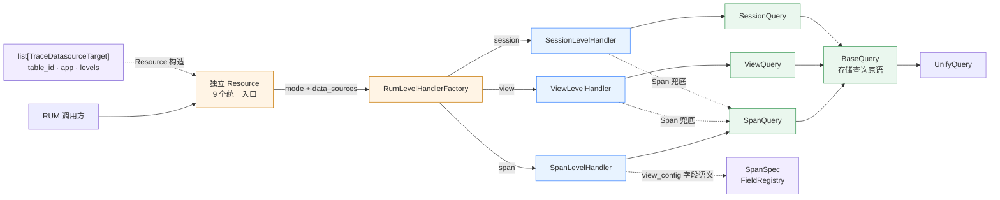
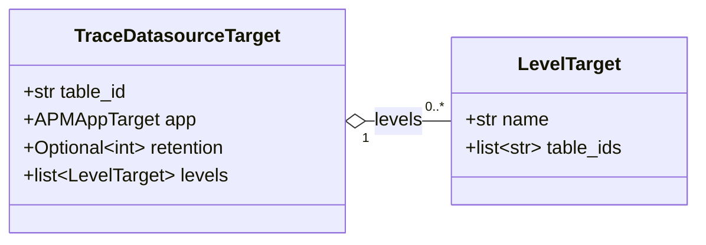
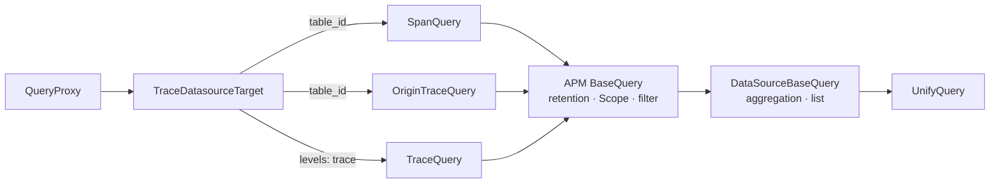
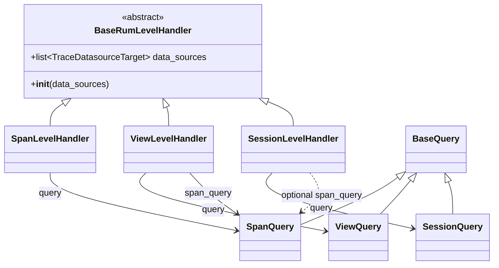

# RUM 分层统一查询 —— 实施方案

## 0x01 方案结论

### a. 目标调用链

```text
Resource
  └── RumLevelHandlerFactory.create(mode, data_sources)
        └── Span / View / Session LevelHandler(data_sources)
              ├── self.query → Span / View / Session Query → BaseQuery
              └── self.span_query → SpanQuery → BaseQuery（可选兜底）
```

| 决策点 | 结论 |
| --- | --- |
| HTTP 入口 | Resource 自行实现 `perform_request()`，不设公共基类 |
| Level 分派 | `RumLevelHandlerFactory` 只维护 `mode → LevelHandler` 映射 |
| 初始化参数 | Factory、Level、Query 均接收 `list[TraceDatasourceTarget]` |
| 结果表承载 | `table_id` 存原始表，`levels` 存 RUM 层级表和 APM 预计算表 |
| 查询职责 | Query 提供原子查询，Level 组合一个或多个 Query |
| 字段语义 | `semconv/rum` 定义原子字段，Trace 命名空间声明结构前缀，`SpanSpec` 统一访问 |
| APM 适配 | `QueryProxy` 统一构造 Target，3 类 Query 复用通用查询原语 |

### b. 方案边界

- 除 `view_config` 外的请求字段、响应字段和错误码。
- View、Session 的预计算链路与数据生产方式。
- View、Session 查询原子的具体实现。
- 各 Level 页面配置和查询参数的业务细节。
- OTLP 编解码和 RUM 上报协议变更。

## 0x02 架构设计

### a. 总体结构



| 层 | 负责 | 不负责 |
| --- | --- | --- |
| Resource | 权限、参数校验、构造 `data_sources`、调用 Level | 选择具体 Level 类或执行存储查询 |
| Factory | 校验 `mode`、构造对应 Level | 解析结果表或实现接口能力 |
| Level | 组合一个或多个 Query，组装接口能力 | 处理 HTTP 或直接访问 UnifyQuery |
| Query | 从 Target 选择层级表、构造并执行存储查询 | 页面配置和 HTTP 返回组装 |
| Semconv | 定义字段语义、声明 Trace 命名空间、按完整路径查找 | 查询存储、决定字段是否实际存在 |

### b. 数据源目标

代码位置：`bkmonitor/data_source/utils/apm.py`。

```python
@dataclass(frozen=True)
class LevelTarget:
    name: str
    table_ids: list[str]


@dataclass(frozen=True)
class TraceDatasourceTarget:
    table_id: str
    app: APMAppTarget
    retention: int | None = None
    levels: list[LevelTarget] = field(default_factory=list)
```



| 查询层级 | 结果表来源 |
| --- | --- |
| Span | `TraceDatasourceTarget.table_id` |
| View | `TraceDatasourceTarget.levels` 中 `name = "view"` 的 `table_ids` |
| Session | `TraceDatasourceTarget.levels` 中 `name = "session"` 的 `table_ids` |
| APM Trace 预计算 | `TraceDatasourceTarget.levels` 中 `name = "trace"` 的 `table_ids` |

补充约束：

- `retention` 和 `levels` 为可选字段，仅提供 `table_id` 的调用方无需调整。
- `QueryProxy` 从 Trace 数据源填充 `retention`，APM Query 只消费 Target。
- `LevelTarget.name` 标识预计算层级，不与 `RumQueryMode` 绑定。

### c. APM 查询适配



`SpanQuery`、`OriginTraceQuery` 和 `TraceQuery` 构造查询配置并返回结果列表，`QueryProxy` 统一包装响应协议。

## 0x03 开发方案

### a. 代码落点

```text
bkmonitor/data_source/utils/
├── query.py                                  # [Keep] BaseQuery
└── apm.py                                    # [Change] LevelTarget、TraceDatasourceTarget.retention / levels

apm/core/handlers/query/
├── base.py                                   # [Change] 继承 APMQueryFilterMixin、DataSourceBaseQuery
├── proxy.py                                  # [Change] 统一构造 TraceDatasourceTarget
├── span_query.py                             # [Change] 使用原始表
├── origin_trace_query.py                     # [Change] 使用原始表
└── trace_query.py                            # [Change] 使用 trace 层级预计算表

packages/rum_web/
├── constants.py                              # [Change] RumQueryMode
├── query/
│   ├── resources.py                          # [Add] 9 个独立 Resource
│   ├── serializers.py                        # [Add] 请求序列化器分层
│   ├── views.py                              # [Add] SearchViewSet
│   └── urls.py                               # [Add] ResourceRouter，生成 search/
├── urls.py                                   # [Change] 在根路径挂载 rum_web.query.urls
└── handlers/
    ├── query/
    │   ├── span.py                           # [Change] SpanQuery
    │   ├── view.py                           # [Reserved] ViewQuery
    │   └── session.py                        # [Reserved] SessionQuery
    └── level/
        ├── base.py                           # [Add] BaseRumLevelHandler
        ├── factory.py                        # [Add] RumLevelHandlerFactory
        ├── span.py                           # [Add] SpanLevelHandler
        ├── view.py                           # [Reserved] ViewLevelHandler
        └── session.py                        # [Reserved] SessionLevelHandler
```

### b. `mode` 与 Factory

```python
class RumQueryMode(CachedEnum):
    SPAN = "span"
    VIEW = "view"
    SESSION = "session"

    @classmethod
    def choices(cls) -> list[tuple[str, str]]:
        """枚举形态承接 choices 生成与取值容错，无需逐个维护选项列表。"""


class RumLevelHandlerFactory:
    HANDLERS = {
        RumQueryMode.SPAN.value: SpanLevelHandler,
    }

    @classmethod
    def create(
        cls,
        mode: str,
        data_sources: list[TraceDatasourceTarget],
    ) -> BaseRumLevelHandler:
        if mode not in cls.HANDLERS:
            raise UnsupportedRumQueryMode(mode)
        return cls.HANDLERS[mode](data_sources)
```

### c. 基础查询层

| 变更点 | 代码位置 |
| --- | --- |
| **[Keep]** `BaseQuery` | `bkmonitor/data_source/utils/query.py` |
| **[Change]** `SpanQuery` | `packages/rum_web/handlers/query/span.py` |
| **[Reserved]** `ViewQuery` | `packages/rum_web/handlers/query/view.py` |
| **[Reserved]** `SessionQuery` | `packages/rum_web/handlers/query/session.py` |
| **[Change]** APM `BaseQuery` | `apm/core/handlers/query/base.py` |
| **[Change]** `TraceQuery` / `OriginTraceQuery` / `SpanQuery` | `apm/core/handlers/query/` |

查询原语：

```text
query_list
query_total
query_field_topk
query_option_values
query_graph_config
query_field_aggregated_value
query_detail
query_fields
```

### d. Level 与 Query 交互



```python
from abc import ABC, abstractmethod
from typing import Any

from bkmonitor.data_source.utils import types


class BaseRumLevelHandler(ABC):
    def __init__(self, data_sources: list[TraceDatasourceTarget]):
        self.data_sources = data_sources

    @abstractmethod
    def view_config(
        self,
        extra_config: dict[str, Any] | None = None,
    ) -> dict[str, Any]:
        ...

    @abstractmethod
    def generate_query_string(
        self,
        filters: list[types.Filter],
        extra_config: dict[str, Any] | None = None,
    ) -> str:
        ...

    @abstractmethod
    def field_topk(
        self,
        start_time: int,
        end_time: int,
        field: str,
        limit: int = 5,
        filters: list[types.Filter] | None = None,
        query_string: str = "",
        extra_config: dict[str, Any] | None = None,
    ) -> list[dict[str, Any]]:
        ...

    @abstractmethod
    def field_statistics_info(
        self,
        start_time: int,
        end_time: int,
        field: dict[str, Any],
        filters: list[types.Filter] | None = None,
        query_string: str = "",
        extra_config: dict[str, Any] | None = None,
    ) -> dict[str, Any]:
        ...

    @abstractmethod
    def field_statistics_graph(
        self,
        start_time: int,
        end_time: int,
        field: dict[str, Any],
        filters: list[types.Filter] | None = None,
        query_string: str = "",
        extra_config: dict[str, Any] | None = None,
    ) -> dict[str, Any]:
        ...

    @abstractmethod
    def download_topk(
        self,
        start_time: int,
        end_time: int,
        field: str,
        limit: int = 5,
        filters: list[types.Filter] | None = None,
        query_string: str = "",
        extra_config: dict[str, Any] | None = None,
    ) -> bytes:
        ...

    @abstractmethod
    def get_fields_option_values(
        self,
        start_time: int,
        end_time: int,
        fields: list[str],
        limit: int = 10,
        filters: list[types.Filter] | None = None,
        query_string: str = "",
        extra_config: dict[str, Any] | None = None,
    ) -> dict[str, list[str]]:
        ...

    @abstractmethod
    def list_records(
        self,
        start_time: int,
        end_time: int,
        offset: int = 0,
        limit: int = 10,
        filters: list[types.Filter] | None = None,
        query_string: str = "",
        sort: list[str] | None = None,
        extra_config: dict[str, Any] | None = None,
    ) -> list[dict[str, Any]]:
        ...

    @abstractmethod
    def record_detail(
        self,
        record_id: str,
        extra_config: dict[str, Any] | None = None,
    ) -> dict[str, Any]:
        ...


class ViewLevelHandler(BaseRumLevelHandler):
    def __init__(self, data_sources: list[TraceDatasourceTarget]):
        super().__init__(data_sources)
        self.query = ViewQuery(data_sources)
        self.span_query = SpanQuery(data_sources)
```

- *[1] `extra_config` 仅承载服务端 Level 差异化配置。*
- *[2] Resource 按 `mode` 构造配置，请求序列化器不对外声明。*
- *[3] Level 只读取白名单字段，并将解析值按参数传给 Query。*
- *[4] `extra_config` 不能覆盖显式参数或 `data_sources`。*

### e. Resource 与 Level 交互

```python
class RumFieldTopKResource(Resource):
    RequestSerializer = RumFieldTopKRequestSerializer

    def perform_request(self, data):
        mode = data.pop("mode")
        application = self.get_authorized_application(data)
        data_sources = [
            TraceDatasourceTarget.build(
                bk_biz_id=application.bk_biz_id,
                app_name=application.app_name,
                table_id=application.span_result_table_id,
            )
        ]

        handler = RumLevelHandlerFactory.create(mode, data_sources)
        return handler.field_topk(
            start_time=data["start_time"],
            end_time=data["end_time"],
            field=data["field"],
            limit=data["limit"],
            filters=data["filters"],
            query_string=data["query_string"],
        )
```

- *[1] Resource 使用已鉴权的 `Application` 构造 `data_sources`，请求参数不能指定结果表。*
- *[2] 除 `generate_query_string` 外，所有 Resource 均按应用实例鉴权。*
- *[3] `generate_query_string` 只转换过滤条件，不查询业务数据，因此沿用 APM 的免实例鉴权规则。*

请求序列化器按「应用上下文 → 时间范围 → 检索条件」单链继承，接口参数只在叶子声明：

```text
FilterSerializer                            # 存储查询侧，value 收敛为字符串
  └── QueryStringFilterSerializer           # 查询串渲染侧，value 保留 JSON 原类型

BaseRumRequestSerializer                    # bk_biz_id、app_name、mode
  ├── RumGenerateQueryStringRequestSerializer
  └── BaseRumTimeRangeSerializer            # start_time、end_time
        ├── RumViewConfigRequestSerializer
        └── BaseRumSearchSerializer         # filters、query_string
              └── 列表类与分析类接口叶子      # offset / limit / sort / fields / field
```

- *[4] `FilterSerializer` 将 `value` 元素转换为字符串，满足 UnifyQuery condition 协议。*
- *[5] `QueryStringFilterSerializer` 保留 JSON 数值和布尔类型，用于渲染查询串。*
- *[6] 分页数量、TopK 数量和枚举值数量语义不同，`limit` 只在叶子声明。*
- *[7] `record_detail` 不需要时间范围，直接继承 `BaseRumRequestSerializer`。*

### f. Resource 接口

| URL                                          | Resource                          | Level 方法                   |
| -------------------------------------------- | --------------------------------- | -------------------------- |
| `GET` /rum/search/view_config/               | `RumViewConfigResource`           | `view_config`              |
| `POST` /rum/search/generate_query_string/    | `RumGenerateQueryStringResource`  | `generate_query_string`    |
| `POST` /rum/search/field_topk/               | `RumFieldTopKResource`            | `field_topk`               |
| `POST` /rum/search/field_statistics_info/    | `RumFieldStatisticsInfoResource`  | `field_statistics_info`    |
| `POST` /rum/search/field_statistics_graph/   | `RumFieldStatisticsGraphResource` | `field_statistics_graph`   |
| `POST` /rum/search/download_topk/            | `RumDownloadTopKResource`         | `download_topk`            |
| `POST` /rum/search/get_fields_option_values/ | `RumFieldsOptionValuesResource`   | `get_fields_option_values` |
| `POST` /rum/search/list_records/             | `RumRecordsResource`              | `list_records`             |
| `POST` /rum/search/record_detail/            | `RumRecordDetailResource`         | `record_detail`            |

### g. semconv

原子字段只定义一次，再由 `Attributes`、`Events` 等复合字段组成 Trace 结构。`SpanSpec` 组织整棵字段树，并支持按完整路径查找。

#### 1）代码结构

```text
bkmonitor/
├── core/
│   └── enum.py                          # CachedEnum
├── semconv/
│   └── rum/
│       ├── field.py                     # FieldSpec
│       ├── registry.py                  # FieldRegistry
│       ├── attributes/
│       │   ├── span_attributes.py       # Span 根字段及 Span 语义字段
│       │   ├── action_attributes.py
│       │   └── *_attributes.py          # 按 view、network 等语义分段
│       ├── metric/
│       └── trace/
│           ├── __init__.py              # SpanSpec
│           ├── resource.py
│           ├── status.py
│           ├── events.py
│           ├── attributes.py
│           └── links.py
└── packages/
    └── rum_web/                         # 消费 SpanSpec
```

依赖方向为 `core <- semconv <- packages`。

#### 2）核心模型

```python
# semconv/rum/field.py
@dataclass(frozen=True, slots=True)
class FieldSpec:
    field_name: str
    field_alias: str = ""
    field_unit: str | None = None
    field_display_type: str | None = None
    option_values: type[CachedEnum] | None = None

    def children(self) -> Iterator["FieldSpec"]:
        return (
            candidate
            for name, candidate in vars(type(self)).items()
            if name.isupper()
        )


# semconv/rum/trace/events.py
class EventAttributes(FieldSpec):
    CODE_LINENO = code_attributes.CODE_LINENO


class Events(FieldSpec):
    NAME = event_attributes.NAME
    ATTRIBUTES = EventAttributes(field_name="attributes")


# semconv/rum/registry.py
class FieldRegistry:
    def __init__(self, root: FieldSpec):
        fields = {}
        self._collect(root, parent_name="", fields=fields)
        self._fields = readonly(fields)

    def _collect(
        self,
        field: FieldSpec,
        parent_name: str,
        fields: dict[str, FieldSpec],
    ) -> None:
        full_name = join(parent_name, field.field_name)
        if full_name:
            add_unique(fields, full_name, field)
        for child in field.children():
            self._collect(
                child,
                parent_name=full_name,
                fields=fields,
            )

    def from_field(self, field_name: str) -> FieldSpec:
        field = self._fields.get(field_name)
        return field if field is not None else FieldSpec(field_name)


# semconv/rum/trace/__init__.py
class SpanSpec(FieldSpec):
    KIND = span_attributes.KIND
    END_TIME = span_attributes.END_TIME

    RESOURCE = Resource(field_name="resource")
    STATUS = Status(field_name="status")
    EVENTS = Events(field_name="events")
    ATTRIBUTES = Attributes(field_name="attributes")
    LINKS = Links(field_name="links[]")

    @classmethod
    def from_field(cls, field_name: str) -> FieldSpec:
        return _SPAN_FIELDS.from_field(field_name)


_SPAN_FIELDS = FieldRegistry(SpanSpec(field_name=""))
```

`from_field()` 返回已注册的共享对象；未注册字段返回仅含输入字段名的 `FieldSpec`。

```python
assert SpanSpec.from_field("kind") is SpanSpec.KIND is span_attributes.KIND
assert SpanSpec.from_field("attributes") is SpanSpec.ATTRIBUTES
assert SpanSpec.from_field("events") is SpanSpec.EVENTS
assert SpanSpec.from_field("events.name") is SpanSpec.EVENTS.NAME
assert (
    SpanSpec.from_field("events.attributes.code.lineno")
    is SpanSpec.EVENTS.ATTRIBUTES.CODE_LINENO
)
assert SpanSpec.from_field("xxx") == FieldSpec("xxx")
```

#### 3）消费边界

**[1] `bkmonitor/data_source/utils/query.py`：**
* 不再承担别名、候选值、单位的渲染。
* 移除  FIELD_ALIAS_MAP_LIST、FIELD_UNITS、ENUM_FIELD_OPTION_VALUES 及相应的消费逻辑。

**[2] rum_web.handlers.query.span.SpanQuery.query_fields：在此消费 SpanSpec。**

## 0x04 核心协议

### a. view_config

```json
{
  "default_sort": ["-end_time"],
  "span_type_display_fields": {
    "view": [
      "span_name",
      "attributes.span_type",
      "end_time",
      "elapsed_time",
      "status.code",
      "attributes.view.url_template",
      "attributes.user.id"
    ],
    "resource": [
      "span_name",
      "attributes.span_type",
      "end_time",
      "elapsed_time",
      "status.code",
      "attributes.view.url_template",
      "attributes.user.id",
      "attributes.resource.type",
      "attributes.http.request.method"
    ]
  },
  "fields": [
    {
      "field_name": "span_name",
      "field_alias": "Span 名称",
      "field_type": "keyword",
      "origin_field": "span_name",
      "is_real": true,
      "is_searchable": true,
      "is_agg": true,
      "is_list": true,
      "supported_operations": []
    },
    {
      "field_name": "end_time",
      "field_alias": "结束时间",
      "field_type": "long",
      "field_unit": "us",
      "field_display_type": "datetime",
      "origin_field": "end_time",
      "is_real": true,
      "is_searchable": true,
      "is_agg": true,
      "is_list": true,
      "supported_operations": []
    },
    {
      "field_name": "elapsed_time",
      "field_alias": "耗时",
      "field_type": "long",
      "field_unit": "us",
      "field_display_type": "duration",
      "origin_field": "elapsed_time",
      "is_real": true,
      "is_searchable": true,
      "is_agg": true,
      "is_list": true,
      "supported_operations": []
    },
    {
      "field_name": "attributes.span_type",
      "field_alias": "Span 类型",
      "field_type": "keyword",
      "origin_field": "attributes",
      "is_real": true,
      "is_searchable": true,
      "is_agg": true,
      "is_list": true,
      "supported_operations": [],
      "option_values": [
        {"value": "view", "alias": "视图"},
        {"value": "resource", "alias": "资源加载"}
      ]
    },
    {
      "field_name": "resource.user_agent.name",
      "field_alias": "代理名称",
      "field_type": "keyword",
      "origin_field": "resource",
      "is_real": true,
      "is_searchable": true,
      "is_agg": true,
      "is_list": true,
      "supported_operations": []
    },
    {
      "field_name": "LCP",
      "field_alias": "最大内容绘制",
      "field_type": "double",
      "field_unit": "ms",
      "field_display_type": "duration",
      "origin_field": "LCP",
      "is_real": false,
      "is_searchable": true,
      "is_agg": true,
      "is_list": false,
      "supported_operations": []
    }
  ],
  "groups": [
    {
      "name": "DEVICE_BROWSER",
      "alias": "终端 & 浏览器",
      "supported_span_types": ["resource", "action"],
      "field_names": [
        "resource.user_agent.name"
      ]
    },
    {
      "name": "WEB_VITALS",
      "alias": "网页指标（Web Vitals）",
      "supported_span_types": ["vital"],
      "field_names": [
        "LCP"
      ]
    }
  ],
  "display_fields": [
    "span_name",
    "attributes.span_type",
    "end_time",
    "elapsed_time",
    "status.code",
    "attributes.view.url_template",
    "attributes.user.id"
  ]
}
```

- *[1] `origin_field` 标识字段在原始记录中的来源，打平字段使用所属顶层对象名。*
- *[2] `is_real` 区分原始字段与计算、虚拟字段。*
- *[3] `field_unit` 是原始字段的可选上报单位，如 `us`、`ms`、`s`。*
- *[4] `field_display_type` 是可选展示类型，支持 `datetime` 和 `duration`；消费方根据 `field_unit` 换算原始值。*
- *[5] `groups[].supported_span_types` 与 `span_type_display_fields` 只在 Span 视图下返回。*
- *[6] `is_list = false` 的字段只用于分析和检索，不进入列表字段。*
- *[7] `option_values` 存在别名时，字段分析和候选值使用 `{alias}（{value}）` 展示，列表使用 `{alias}`。*

## 0x05 验收与验证

查询测试位于 `packages/rum_web/tests/query/`，通用模块测试跟随 `core/` 和 `semconv/`：

| 测试                                     | 核心断言                                                                                                                                                                                                                                                 |
| -------------------------------------- | ---------------------------------------------------------------------------------------------------------------------------------------------------------------------------------------------------------------------------------------------------- |
| `test_datasource_target.py`            | [a] `levels` 默认空列表<br />[b] 现有 `TraceDatasourceTarget.build()` 行为不变<br />[c] 可携带多个层级结果表                                                                                                                                                              |
| `test_level_factory.py`                | [a] 合法 `mode` 返回对应 Level<br />[b] 未注册模式明确失败<br />[c] `data_sources` 原样传入 Level                                                                                                                                                                       |
| `test_query.py`                        | [a] Query 复用 `BaseQuery`<br />[b] 接收 `list[TraceDatasourceTarget]`<br />[c] 具备 8 项原子能力                                                                                                                                                               |
| `core/tests/test_enum.py`              | `CachedEnum` 保持 `from_value()` 缓存、未知值 `label` 和动态属性行为。                                                                                                                                                                                               |
| `semconv/rum/tests/test_span_spec.py`  | [a] 原子字段不含结构前缀，`field_alias` 默认空串<br />[b] 复合字段与叶子字段统一注册，同一 `FieldSpec` 可出现在多个路径<br />[c] `from_field()` 返回原始共享对象<br />[d] 枚举保留 `label` 和 `choices()`<br />[e] 重复路径明确失败，未知路径返回仅含原始字段名的 `FieldSpec`                                                   |
| `test_level_handler.py`                | [a] 基类只保存 `data_sources`<br />[b] 具体 Level 可组合多个 Query<br />[c] TopK 方法只接收单个字段<br />[d] 9 项公共方法声明参数与返回类型<br />[e] 未知配置被拒绝，且不能覆盖公共参数或数据源                                                                                                              |
| `test_query_resources.py`              | [a] 9 个 URL、HTTP 方法、Resource 和 Level 方法一一对应<br />[b] Resource 不依赖公共基类<br />[c] 请求协议不接受 `extra_config`，客户端无法覆盖 Level 配置<br />[d] `view_config` 保留 `origin_field`，顶层维护全量字段，分组通过字段名引用<br />[e] Span 视图返回按类型配置的默认列与分组适用范围<br />[f] semconv 只补充别名、单位和枚举选项 |
| `apm/tests/test_unified_query_base.py` | [a] APM 继承通用基类<br />[b] 3 类 Query 统一接收 Target 列表<br />[c] Proxy 统一构造原始表与预计算层级<br />[d] 列表查询复用 `_query_list()`，Proxy 固定补 `total=0`<br />[e] 查询配置保持列表形态，多 Target 不丢表                                                                                   |

测试门禁：

```bash
pytest core/tests/test_enum.py semconv/rum/tests -q
pytest packages/rum_web/tests/query -q
pytest apm/tests/test_unified_query_base.py apm/tests/test_trace_query_es_batch.py -q
```

## 0x06 实施进展

| 时间 | 结论性进展 |
| --- | --- |
| `2026-08-28 00:00` | `FieldSpec` 与 `view_config` 增加 `field_display_type`，`field_unit` 只标识原始上报单位 |
| `2026-08-26 22:00` | 完成里程碑 3 的后续实现并通过 [TencentBlueKing/bk-monitor #12094](https://github.com/TencentBlueKing/bk-monitor/pull/12094) review：`view_config` 支持省略时间范围，查询层根据 `DataSourceTarget.retention` 补齐缺失边界，RUM 与 APM Query 统一接收数据源列表 |
| `2026-08-24 00:00` | 统一字段语义与 `view_config` 协议：[a] 原子字段与 `Attributes`、`Events` 等复合字段统一使用 `FieldSpec`，由 `SpanSpec` 组成字段树<br />[b] `FieldRegistry` 遍历字段树生成完整路径，未注册字段保留原始字段名<br />[c] `CachedEnum` 只记录代码复制关系，枚举继续使用现有 `label` 和 `choices()` 协议 |
| `2026-08-18 15:00` | [a] 完成里程碑 3 首轮 PR（[#11887](https://github.com/TencentBlueKing/bk-monitor/pull/11887)）review<br />[b] 明确 `extra_config` 为 Level 层扩展位，不进入接口协议<br />[c] 确定请求序列化器单链分层：应用上下文 → 时间范围 → 检索条件，过滤条件按存储查询侧与查询串渲染侧拆分两类 |
| `2026-08-18 10:00` | 确认检索接口返回协议：`view_config` 维护字段元数据与枚举别名；`get_fields_option_values` 返回字段路径到原始值列表 |
| `2026-08-12 09:00` | 里程碑 6 已通过 [TencentBlueKing/bk-monitor #11877](https://github.com/TencentBlueKing/bk-monitor/pull/11877) 合入，统一 APM 查询基类和 `TraceDatasourceTarget` 协议 |
| `2026-08-10 22:00` | 统一 APM 查询继承链与 Target 协议：分析查询下沉到 APM 基类，列表查询由具体 Query 直接构造，所有查询配置保持 `list[QueryConfigBuilder]` 形态 |
| `2026-08-09 09:00` | 统一 Span 接口命名、里程碑和 `/rum/search/{API}/` 路由 |
| `2026-08-08 16:00` | 统一 Level 方法的参数、返回类型、命名和扩展边界 |
| `2026-08-07 19:00` | 完成分层设计：Level 以 `data_sources` 初始化，并可组合主查询与 Span 兜底查询 |

## 0x07 参考

- [<源码> bk-monitor/bkmonitor/data_source/utils](https://github.com/TencentBlueKing/bk-monitor/tree/master/bkmonitor/bkmonitor/data_source/utils)
- [<源码> bk-monitor/apm/core/handlers/query](https://github.com/TencentBlueKing/bk-monitor/tree/master/bkmonitor/apm/core/handlers/query)
- [<源码> bk-monitor/constants](https://github.com/TencentBlueKing/bk-monitor/tree/master/bkmonitor/constants)
- [<源码> bk-monitor/packages/rum_web](https://github.com/TencentBlueKing/bk-monitor/tree/master/bkmonitor/packages/rum_web)
- [<源码> bk-monitor/packages/apm_web/trace](https://github.com/TencentBlueKing/bk-monitor/tree/master/bkmonitor/packages/apm_web/trace)
- [RUM 数据协议](../../articles/2026-07-12-rum-span-data-protocol/README.md)
- [OpenTelemetry Tracing API](https://opentelemetry.io/docs/specs/otel/trace/api/)
- [OpenTelemetry Semantic Attribute Naming](https://opentelemetry.io/docs/specs/semconv/general/naming/)
- [OpenTelemetry Semantic Convention Guidelines](https://opentelemetry.io/docs/specs/semconv/how-to-write-conventions/)

## 0x08 版本锚点

| 状态 | 分支 | 里程碑 | PR |
| --- | --- | --- | --- |
| ✅ | `feat/rum_base_search_module/#1010158081136933145` | 里程碑 1：提供 RUM 基础检索模块 | [TencentBlueKing/bk-monitor #11838](https://github.com/TencentBlueKing/bk-monitor/pull/11838) |
| 🔄 | `feat/rum_base_query_fields/#1010158081136920078` | 里程碑 2：提供 RUM 字段元数据查询（`query_fields`） | [TencentBlueKing/bk-monitor #11840](https://github.com/TencentBlueKing/bk-monitor/pull/11840) |
| ✅ | `feat/rum_span_list_api/#1010158081137033151`<br />`feat/rum_view_config_add_span_type_display_fields/#1010158081137385339`<br />`feat/rum_view_config_api_add_span_type_display_fields/#1010158081137396316` | 里程碑 3：提供 RUM Span 列表类接口（`list_records`、`view_config`、`get_fields_option_values`、`generate_query_string`） *[1]* | [TencentBlueKing/bk-monitor #11887](https://github.com/TencentBlueKing/bk-monitor/pull/11887)<br />[TencentBlueKing/bk-monitor #12086](https://github.com/TencentBlueKing/bk-monitor/pull/12086)<br />[TencentBlueKing/bk-monitor #12094](https://github.com/TencentBlueKing/bk-monitor/pull/12094) |
| 🔄 | `<branch_name>` | 里程碑 4：提供 RUM Span 分析类接口（`field_topk`、`field_statistics_info`、`field_statistics_graph`、`download_topk`） *[1]* | 待创建 |
| 🔄 | `<branch_name>` | 里程碑 5：提供 RUM Span 详情类接口（`record_detail`、`generate_query_string`） *[1]* | 待创建 |
| ✅ | `feat/apm_trace/#1010158081137031784` | 里程碑 6：统一 APM 查询基类和 `TraceDatasourceTarget` 协议 | [TencentBlueKing/bk-monitor #11877](https://github.com/TencentBlueKing/bk-monitor/pull/11877) |
| 🔄 | `<branch_name>` | 里程碑 7：提供 RUM 语义字段目录和 `SpanSpec` 访问入口 | 待创建 |

- *[1] 里程碑 3～5 实施期间，随接口落地逐步补充 `rum_web/docs/api/search.md`。*
