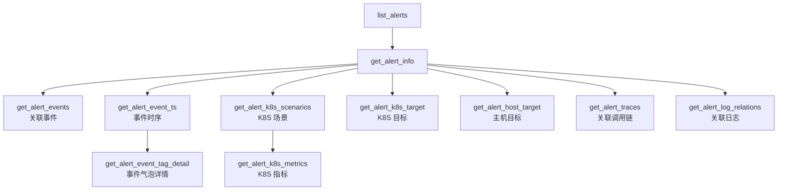

# 告警 & 调用链 MCP 新增 tools —— 实施方案

> 基于 [README.md](./README.md) 制定。

## 0x01 工具设计

### a. 告警关联数据工具（9 个，追加到 `alarm_mcp.yaml`）

所有告警关联工具的 `alert_id` 均来自现有工具 `list_alerts` / `get_alert_info`，形成「告警 → 关联数据钻取」子工作流。

| # | 工具名 | 后端接口 | HTTP | 后端路径 | 核心参数 |
|---|-------|---------|------|---------|---------|
| 1 | `get_alert_events` | `AlertEventsResource` | POST | `/api/v4/alert_v2/alert/events/` | `bk_biz_id`, `alert_id`, `sources[]`, `limit`, `offset` |
| 2 | `get_alert_event_ts` | `AlertEventTSResource` | POST | `/api/v4/alert_v2/alert/event_ts/` | `bk_biz_id`, `alert_id`, `sources[]`, `interval`, `start_time`, `end_time` |
| 3 | `get_alert_event_tag_detail` | `AlertEventTagDetailResource` | POST | `/api/v4/alert_v2/alert/event_tag_detail/` | `bk_biz_id`, `alert_id`, `sources[]`, `interval`, `start_time`, `limit` |
| 4 | `get_alert_k8s_scenarios` | `AlertK8sScenarioListResource` | GET | `/api/v4/alert_v2/alert/k8s_scenario_list/` | `bk_biz_id`, `alert_id` |
| 5 | `get_alert_k8s_metrics` | `AlertK8sMetricListResource` | GET | `/api/v4/alert_v2/alert/k8s_metric_list/` | `bk_biz_id`, `scenario` |
| 6 | `get_alert_k8s_target` | `AlertK8sTargetResource` | GET | `/api/v4/alert_v2/alert/k8s_target/` | `bk_biz_id`, `alert_id` |
| 7 | `get_alert_host_target` | `AlertHostTargetResource` | GET | `/api/v4/alert_v2/alert/host_target/` | `bk_biz_id`, `alert_id` |
| 8 | `get_alert_traces` | `AlertTracesResource` | POST | `/api/v4/alert_v2/alert/traces/` | `bk_biz_id`, `alert_id`, `limit`, `offset` |
| 9 | `get_alert_log_relations` | `AlertLogRelationListResource` | GET | `/api/v4/alert_v2/alert/log_relation_list/` | `bk_biz_id`, `alert_id` |

**HTTP 方法选择依据**：
- GET：参数简单（仅 ID / 字符串），无数组或复杂结构 → #4, #5, #6, #7, #9
- POST：含数组参数（`sources`）或分页参数组合 → #1, #2, #3, #8

### b. 调用分析工具（1 个，追加到 `apm_mcp.yaml`）

| # | 工具名 | 后端接口 | HTTP | 后端路径 |
|---|-------|---------|------|---------|
| 10 | `calculate_by_range` | `CalculateByRangeResource` | POST | `/api/v4/apm_metric_web/calculate_by_range/` |

## 0x02 参数设计

### a. 告警关联事件工具组

#### 1. `get_alert_events`

获取告警关联的事件列表，支持按来源过滤和分页。

| 参数 | 类型 | 必填 | 默认值 | 说明 |
|------|------|------|-------|------|
| `bk_biz_id` | string | 是 | - | 业务 ID |
| `alert_id` | string | 是 | - | 告警 ID，从 `list_alerts` / `get_alert_info` 获取 |
| `sources` | array | 否 | `[]` | 事件来源过滤。可选值：`BCS`（容器）、`HOST`（主机）、`BKCI`（蓝盾）、`DEFAULT`（业务上报）。空数组 = 全部 |
| `limit` | string | 否 | `"10"` | 返回事件的最大数量 |
| `offset` | string | 否 | `"0"` | 分页偏移量 |

#### 2. `get_alert_event_ts`

获取告警关联事件的时序数据，用于绘制事件趋势图。

| 参数 | 类型 | 必填 | 默认值 | 说明 |
|------|------|------|-------|------|
| `bk_biz_id` | string | 是 | - | 业务 ID |
| `alert_id` | string | 是 | - | 告警 ID |
| `sources` | array | 否 | `[]` | 事件来源过滤，同上 |
| `interval` | string | 否 | `"300"` | 时序数据的时间间隔（秒） |
| `start_time` | string | 否 | - | 自定义开始时间戳（秒），不传则使用告警时间范围 |
| `end_time` | string | 否 | - | 自定义结束时间戳（秒），不传则使用告警时间范围 |

#### 3. `get_alert_event_tag_detail`

获取告警关联事件的气泡详情，即指定时间点的事件样本。通常在查看 `get_alert_event_ts` 时序图的某个时间点时调用。

| 参数 | 类型 | 必填 | 默认值 | 说明 |
|------|------|------|-------|------|
| `bk_biz_id` | string | 是 | - | 业务 ID |
| `alert_id` | string | 是 | - | 告警 ID |
| `sources` | array | 否 | `[]` | 事件来源过滤 |
| `interval` | string | 否 | `"60"` | 汇聚周期（秒） |
| `start_time` | string | 是 | - | 查询的开始时间戳（秒），通常从时序图中的数据点获取 |
| `limit` | string | 否 | `"5"` | 返回事件的最大数量 |

### b. 告警关联 K8S 工具组

#### 4. `get_alert_k8s_scenarios`

获取告警关联的 K8S 容器观测场景列表。不同目标类型支持不同场景：Pod/Workload → `performance`/`network`；Node → `capacity`；Service → `network`。

| 参数 | 类型 | 必填 | 说明 |
|------|------|------|------|
| `bk_biz_id` | string | 是 | 业务 ID |
| `alert_id` | string | 是 | 告警 ID |

#### 5. `get_alert_k8s_metrics`

根据场景获取 K8S 容器指标列表。`scenario` 参数从 `get_alert_k8s_scenarios` 获取。

| 参数 | 类型 | 必填 | 说明 |
|------|------|------|------|
| `bk_biz_id` | string | 是 | 业务 ID |
| `scenario` | string | 是 | 观测场景。可选值：`performance`（性能）、`network`（网络）、`capacity`（容量）。从 `get_alert_k8s_scenarios` 获取 |

#### 6. `get_alert_k8s_target`

获取告警关联的 K8S 容器目标对象信息，包括资源类型、目标列表、集群信息。

| 参数 | 类型 | 必填 | 说明 |
|------|------|------|------|
| `bk_biz_id` | string | 是 | 业务 ID |
| `alert_id` | string | 是 | 告警 ID |

### c. 告警关联主机 / 日志 / 调用链

#### 7. `get_alert_host_target`

获取告警关联的主机目标对象信息，包括主机 IP、云区域 ID、拓扑路径。

| 参数 | 类型 | 必填 | 说明 |
|------|------|------|------|
| `bk_biz_id` | string | 是 | 业务 ID |
| `alert_id` | string | 是 | 告警 ID |

#### 8. `get_alert_traces`

获取告警关联的调用链信息。自动发现告警持续时间内可疑的调用链（报错 + 耗时长），支持分页。

| 参数 | 类型 | 必填 | 默认值 | 说明 |
|------|------|------|-------|------|
| `bk_biz_id` | string | 是 | - | 业务 ID |
| `alert_id` | string | 是 | - | 告警 ID |
| `limit` | string | 否 | `"10"` | 返回调用链的最大数量 |
| `offset` | string | 否 | `"0"` | 分页偏移量 |

#### 9. `get_alert_log_relations`

获取告警关联的日志目标列表，包括可查询的日志索引集信息。

| 参数 | 类型 | 必填 | 说明 |
|------|------|------|------|
| `bk_biz_id` | string | 是 | 业务 ID |
| `alert_id` | string | 是 | 告警 ID |

### d. 调用分析工具

#### 10. `calculate_by_range`

按时间范围计算 APM 指标数据，支持多时间点对比分析、分组聚合、增长率和占比计算。用于调用分析场景的汇总数据获取。

| 参数 | 类型 | 必填 | 默认值 | 说明 |
|------|------|------|-------|------|
| `bk_biz_id` | string | 是 | - | 业务 ID |
| `app_name` | string | 是 | - | APM 应用名称，从 `list_apm_applications` 获取 |
| `metric_group_name` | string | 是 | - | 指标组。可选值：`trpc`、`resource` |
| `metric_cal_type` | string | 是 | - | 指标计算类型。可选值：`request_total`（请求量）、`success_rate`（成功率）、`timeout_rate`（超时率）、`exception_rate`（异常率）、`avg_duration`（平均耗时）、`p50_duration`（P50 耗时）、`p95_duration`（P95 耗时）、`p99_duration`（P99 耗时） |
| `start_time` | string | 否 | - | 开始时间（Unix 时间戳，秒） |
| `end_time` | string | 否 | - | 结束时间（Unix 时间戳，秒） |
| `baseline` | string | 否 | `"0s"` | 对比基准时间偏移。格式：`0s`（当前）、`1h`、`1d`、`1w`、`1M` |
| `time_shifts` | array | 否 | `[]` | 时间偏移列表，最多 2 个对比时间点。如 `["0s", "1d"]` |
| `filter_dict` | object | 否 | `{}` | 过滤条件字典 |
| `where` | array | 否 | `[]` | 过滤条件列表，每项含 `key`/`value`/`method`/`condition`，与 `filter_dict` 合并生效 |
| `group_by` | array | 否 | `[]` | 分组字段列表，如 `["callee_method"]` |
| `options` | object | 否 | `{}` | 额外配置。当 `metric_group_name=trpc` 时需传 `options.trpc`，含 `kind`（`caller`/`callee`）和 `temporality`（`cumulative`/`delta`） |

## 0x03 实施步骤

### Step 1：更新 `alarm_mcp.yaml`

在现有的 `get_alert_info` 后追加 9 个工具的网关配置。

**关键约束**：
- 所有 `description` ≤ 512 字符
- ID 字段统一为 `string` 类型
- tag 统一为 `alert_mcp`
- `authConfig` 与现有工具保持一致

**文件**：`网关配置/alarm_mcp.yaml`

### Step 2：更新 `apm_mcp.yaml`

在现有的 `get_span_detail` 后追加 `calculate_by_range` 工具的网关配置。

**关键约束**：
- `description` ≤ 512 字符
- 时间戳参数需包含动态计算提示
- tag 为 `apm_mcp`

**文件**：`网关配置/apm_mcp.yaml`

### Step 3：追加 `告警MCP介绍.md`

在现有文档末尾追加新工具说明，需要更新以下章节：

1. **工作流图**：扩展现有 mermaid 图，加入关联数据钻取子工作流
2. **工具列表表格**：追加 9 行
3. **工具详细说明**：每个工具包含类别、描述、参数表、依赖关系、查询示例

**文件**：`MCP介绍&工具说明/告警MCP介绍.md`

### Step 4：追加 `APM Tracing查询工具介绍.md`

在现有文档末尾追加 `calculate_by_range` 工具说明，需要更新以下章节：

1. **工作流图**：在现有链路追踪工作流旁新增调用分析分支
2. **工具列表表格**：追加 1 行
3. **工具详细说明**：完整的参数表、枚举值说明、请求示例

**文件**：`MCP介绍&工具说明/APM Tracing查询工具介绍.md`

## 0x04 质量检查

按 `bk-mcp-builder` skill 的 Redline 检查清单逐项验证：

- [x] **Redline 1**：所有工具名动词开头（`get_*` / `calculate_*`） ✓ 10/10 PASS
- [x] **Redline 2**：端到端调用链在工具描述中被清晰写出（`alert_id` must be obtained from `list_alerts`） ✓ 10/10 PASS
- [x] **Redline 3**：所有 ID 均为 `string` 类型 ✓ 10/10 PASS
- [x] **Redline 4**：关键字段补全 `required` / `default` / `description` ✓
- [x] **Redline 5**：蓝鲸术语有清晰解释（`bk_biz_id` → Business ID） ✓
- [x] **Redline 6**：`calculate_by_range` 无需时间跨度限制 ✓
- [x] **Redline 7**：`calculate_by_range` 时间戳参数包含动态计算指导 ✓ "MUST calculate dynamically"
- [x] **网关配置**：所有 `description` ≤ 512 字符，YAML 格式正确 ✓ max=463 chars (search_spans)

## 0x05 交付物

| # | 交付物 | 文件路径 |
|---|--------|---------|
| 1 | 告警网关配置（更新） | `网关配置/alarm_mcp.yaml` |
| 2 | APM 网关配置（更新） | `网关配置/apm_mcp.yaml` |
| 3 | 告警 MCP 文档（更新） | `MCP介绍&工具说明/告警MCP介绍.md` |
| 4 | APM MCP 文档（更新） | `MCP介绍&工具说明/APM Tracing查询工具介绍.md` |

---
*制定日期：2026-02-15*
