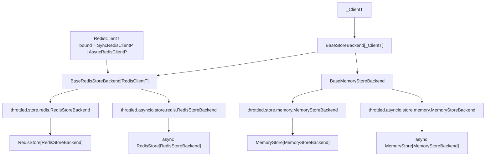
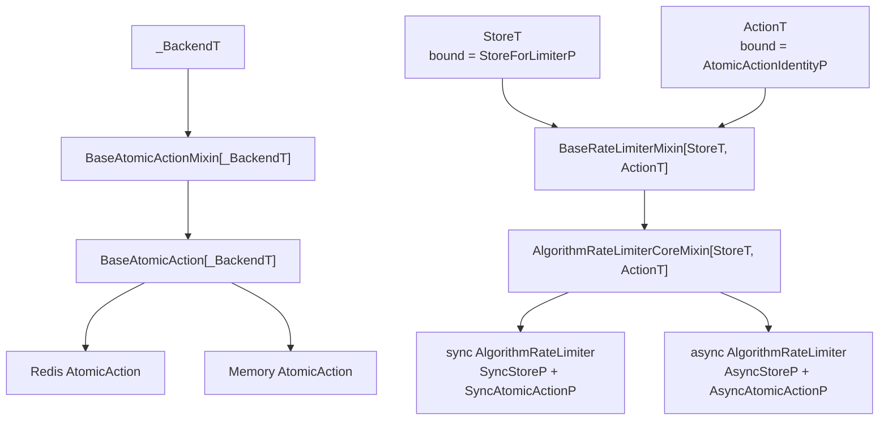

# mypy strict 模式合规改造 —— 最终方案

基于 [README.md](./README.md) 制定。

本文档按 PR [#159](https://github.com/ZhuoZhuoCrayon/throttled-py/pull/159) 的合入结果记录最终方案。

旧版 PLAN 中的旧分支锚点、待落地步骤、`cast` 数量预算、纯 mixin 约束均已移除。

## 0x01 最终结论

PR #159 的核心不是“补齐类型注解”，而是把运行时配对关系放进泛型继承链。

本轮重构的 Before / After：

| 维度 | 一轮后 | PR #159 后 |
|------|--------|------------|
| 类型策略 | 局部属性窄化 + 集中 cast | Store / Action / Limiter 泛型配对 |
| sync / async | 部分 CoreMixin 复用导致边界不清 | 共享纯逻辑，具体执行层分离 |
| 构造链路 | `action_cls` 构造需要绕过类型系统 | `make_atomic()` 保留精确返回类型 |
| 验收口径 | strict 通过为主 | strict 通过 + 架构边界可检查 |

最终方案保留四个设计判断：

- **Store 层**：backend 绑定底层 client 类型，Store 再绑定具体 backend。
- **AtomicAction 层**：Action 绑定 backend，避免构造阶段丢失类型信息。
- **RateLimiter 层**：limiter 只依赖 Store / Action 协议，sync 与 async 在具体类上落定。
- **Throttled 层**：公开 decorator 入口继续用 `ParamSpec` 保留被装饰函数签名。

一轮 PR [#145](https://github.com/ZhuoZhuoCrayon/throttled-py/pull/145) 已证明基础注解能让
`mypy --strict` 检查通过，但留下了 sync / async 配对不清晰的问题。

二轮 PR #159 已于 `2026-04-26` 查询为 `MERGED`。

最终分支为 `refactor/260425_mypy_strict_typing`。

## 0x02 泛型继承链

### a. Store 与 backend

Store 层有两条类型线。

`_ClientT` 描述 backend 里的底层 client。

`_BackendT` 描述 Store 和 AtomicAction 共同绑定的 backend。



结构代码只展示继承链，不等同完整实现。

```python
class BaseStoreBackend(abc.ABC, Generic[_ClientT]):
    def get_client(self) -> _ClientT: ...


class BaseRedisStoreBackend(
    BaseStoreBackend[types.RedisClientT],
    Generic[types.RedisClientT],
):
    ...


# throttled.store.redis
class RedisStoreBackend(BaseRedisStoreBackend[types.SyncRedisClientP]):
    ...


# throttled.asyncio.store.redis
class RedisStoreBackend(BaseRedisStoreBackend[types.AsyncRedisClientP]):
    ...


class BaseStore(BaseStoreMixin, abc.ABC, Generic[_BackendT]):
    _backend: _BackendT

    def make_atomic(self, action_cls: type[_ActionT]) -> _ActionT:
        factory: Callable[..., _ActionT] = action_cls
        return factory(backend=self._backend)
```

关键点：

- `BaseRedisStoreBackend[RedisClientT]` 把 redis-py client 的差异收在 backend 内。
- sync 与 async 的 Redis backend 同名但位于不同模块，各自绑定不同 Redis client 协议。
- `BaseStore.make_atomic()` 使用方法级 `_ActionT`，让 action 构造保持精确返回类型。
- Store 与 Action 的运行时配对仍由 `STORE_TYPE` 过滤，类型系统只表达可安全构造的边界。

### b. AtomicAction 与 RateLimiter

Action 层先绑定 backend。

Limiter 层再绑定 Store / Action 协议。



结构代码只展示 `TokenBucket` 的代表形态。

```python
class BaseAtomicActionMixin(Generic[_BackendT]):
    TYPE: types.AtomicActionTypeT = ""
    STORE_TYPE: str = ""

    def __init__(self, backend: _BackendT) -> None: ...


class BaseAtomicAction(
    BaseAtomicActionMixin[_BackendT],
    abc.ABC,
    Generic[_BackendT],
):
    ...


class BaseRateLimiterMixin(ABC, Generic[types.StoreT, types.ActionT]):
    _store: types.StoreT
    _atomic_actions: dict[types.AtomicActionTypeT, types.ActionT]


class TokenBucketRateLimiterCoreMixin(
    BaseRateLimiterMixin[types.StoreT, types.ActionT],
    Generic[types.StoreT, types.ActionT],
):
    ...


class TokenBucketRateLimiter(
    TokenBucketRateLimiterCoreMixin[types.SyncStoreP, types.SyncAtomicActionP],
    BaseRateLimiter,
):
    ...


# throttled.asyncio.rate_limiter.token_bucket
class TokenBucketRateLimiter(
    TokenBucketRateLimiterCoreMixin[types.AsyncStoreP, types.AsyncAtomicActionP],
    BaseRateLimiter,
):
    ...
```

关键点：

- `ActionT` 只要求 `TYPE` 与 `STORE_TYPE`，因为注册阶段先按身份筛选。
- 具体 limiter 再绑定 `SyncStoreP / SyncAtomicActionP` 或 `AsyncStoreP / AsyncAtomicActionP`。
- 算法 CoreMixin 继承 `BaseRateLimiterMixin`，旧版“必须保持纯 mixin”的结论不再保留。

### c. 同步与异步复用边界

Redis Action 只共享常量，不共享 CoreMixin。

```text
RedisLimitAtomicActionConstants
├── sync RedisLimitAtomicActionCoreMixin
│   └── SyncScript + def do(...)
└── async RedisLimitAtomicActionCoreMixin
    └── AsyncScript + async def do(...)
```

Memory Action 共享纯计算逻辑。

```text
MemoryLimitAtomicActionCoreMixin[_BackendT]
├── _do(backend: MemoryStoreBackendP, ...)
├── sync MemoryLimitAtomicAction
│   └── with SyncLockP
└── async MemoryLimitAtomicAction
    └── async with AsyncLockP
```

这个分工保留了真正可共享的算法逻辑。

需要接触 Redis script、锁或 `def` / `async def` 差异的位置则拆开。

## 0x03 架构边界

本轮方案只在三类边界上允许类型窄化。

| 边界 | 代表位置 | 允许行为 | 约束 |
|------|----------|----------|------|
| 外部库边界 | `import_string()`、redis-py、Lua `Script`、锁对象 | 进入 `throttled/` 时窄化一次 | 不把模糊类型带入业务层 |
| 运行时工厂边界 | `RateLimiterRegistry.get()`、`Throttled` | 注册表取类后做受控窄化 | 不继续向算法层扩散 |
| 算法抽象边界 | `AtomicAction.do()` | 在 `_limit()` / `_peek()` 转成定宽结果 | 只表达结果形状，不替代配对关系 |

这些边界之外不再允许类型绕过：

- 源码内不使用 `cast(Any, ...)` 绕过构造或调用约束。
- `throttled/` 内不用 `# type: ignore` 压制 strict 错误。
- async Action 不继承 sync Redis CoreMixin。
- Store、backend、Action 不靠属性重写制造类型假象。

## 0x04 兼容性决策

本次重构保留常规公共入口，不承诺所有边缘调用都无变化。

| 类别 | 结论 | 说明 |
|------|------|------|
| 公开路径与类名 | 保留 | import 路径、类名和构造方式保持不变。 |
| limiter 调用 | 保留 | `limit()`、`peek()`、context manager 入口保持不变。 |
| decorator 常规调用 | 保留 | `@Throttled(...)` 与 `Throttled(...)(func)` 保持可用。 |
| sync / async registry | 保留隔离 | 两侧继续使用独立 `_RATE_LIMITERS`。 |
| 不传函数的二次调用 | 收紧 | `Throttled(key="k")()` 在 PR #159 中不再兼容。 |
| Memory hash 读取 | 收紧 | 对 hash key 调用 `get()` 会更早抛 `DataError`。 |
| Memory `hset` 参数 | 收紧 | `hset(name, key=...)` 缺少 `value` 会更早抛 `DataError`。 |

这里的取舍是接受更精确的运行时语义。

如果发布口径要求“完全无破坏改动”，需要恢复不传函数的二次调用，或补充 release note。

## 0x05 验收口径

验收只看架构不变量，不再统计 `cast` 数量。

| 不变量 | 验证方式 | 锚点 |
|--------|----------|------|
| 无 `cast(Any, ...)` | 搜索源码中 `cast(Any` | `throttled/` |
| 无 `# type: ignore` | 搜索源码中 `type: ignore` | `throttled/` |
| strict 覆盖源码与测试 | pre-commit 执行 mypy | `.pre-commit-config.yaml`、`pyproject.toml` |
| registry 隔离 | 检查 sync / async 是否共享字典 | `throttled/rate_limiter/base.py` 与 async 镜像 |
| Redis Action 分层 | 检查 async Action 是否继承 sync Redis CoreMixin | `throttled/rate_limiter/*` 与 async 镜像 |
| Memory 复用边界 | 检查 `_do()` 是否只依赖 `MemoryStoreBackendP` | `throttled/types.py` 与 Memory 算法文件 |

PR #159 最终状态：

- 状态：`MERGED`。
- 分支：`refactor/260425_mypy_strict_typing`。
- commits：`94269f9`、`40ebe91`。
- 变更规模：69 files，`+1827 / -1185`。
- GitHub checks：Code Quality、commitlint、Python 3.10-3.14 unittest、Codecov、ReadTheDocs 均通过。

## 0x06 实施进展

| 时间 | 对应设计片段 | 结论调整概要 | 改动 / 验证 |
|------|--------------|--------------|-------------|
| `2026-04-07 00:00` | `0x01` | 一轮 PR #145 以属性窄化、集中读取方法与构造边界 cast 通过 strict 检查，但留下 sync / async 与 backend 配对问题。 | [1] PR [#145](https://github.com/ZhuoZhuoCrayon/throttled-py/pull/145) 已合入<br />[2] 后续方案转向泛型化与边界管理 |
| `2026-04-18 00:00` | `0x02` | 二轮方案确认三条主线：backend 泛型化、sync / async Action 分层、registry 隔离。 | [1] 旧 PLAN 完成设计定稿<br />[2] 该版本中的 `cast` 预算和纯 mixin 约束后续被 PR 实现修正 |
| `2026-04-26 10:00` | `0x01` 至 `0x05` | [1] PR #159 已合入，最终方案改为类型边界集中管理<br />[2] 0x01 与 0x05 职责拆分，0x03 至 0x05 改用小表承载稳定映射 | [1] PR [#159](https://github.com/ZhuoZhuoCrayon/throttled-py/pull/159) 状态为 `MERGED`<br />[2] commit `94269f9`、`40ebe91`<br />[3] GitHub checks 均通过 |

## 0x07 参考

- [排障经验：同步异步共用 Mixin 的泛型类型窄化](../../troubleshooting/generic-mixin-type-narrowing.md)
- [mypy — Protocols and structural subtyping](https://mypy.readthedocs.io/en/stable/protocols.html)
- [PEP 544 — Protocols](https://peps.python.org/pep-0544/)

## 0x08 版本锚点

- 分支：`refactor/260425_mypy_strict_typing`。
- PR：[一轮 #145](https://github.com/ZhuoZhuoCrayon/throttled-py/pull/145)。
- PR：[二轮 #159](https://github.com/ZhuoZhuoCrayon/throttled-py/pull/159)。
