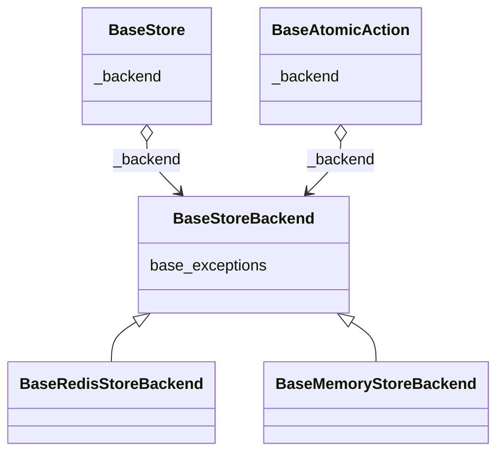
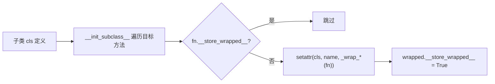
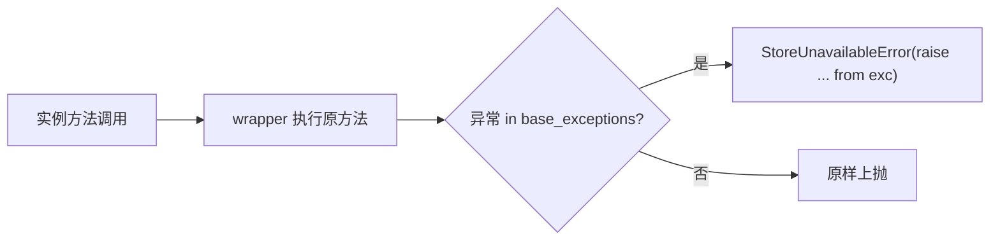

# 优化存储不可用时的异常处理 —— 实施方案

> 基于 [README.md](./README.md) 制定。

## 0x01 调研与约束

### a. 外部仓库对照

| 仓库 | 入口 | 机制 | 启发 |
|------|------|------|------|
| `limits` | `limits/storage/base.py`、`limits/aio/storage/base.py` | `_wrap_errors` + `__init_subclass__` 在基类统一织入 wrapper，按 `instance.base_exceptions` 捕获并包装成 `StorageError` | 统一包装挂在基类，基础异常族由 storage 抽象层声明 |
| `redis_rate` | `redis_rate/rate.go` | `AllowN` / `AllowAtMost` 直接把 Redis 执行错误原样返回 | Go 风格直接返回原始错误，不适合本期"统一 catch 点"诉求 |
| `redis-py` | `redis/exceptions.py` | `RedisError` 覆盖连接、超时、服务端错误，`RedisClusterException` 独立成族 | Redis backend 异常族要同时纳入两类基异常 |

### b. 本期约束

- sync / async 行为对称。
- 统一异常类型使用现有的 `StoreUnavailableError`，不新增第二套公开异常或用户开关（如 `limits` 的 `wrap_exceptions`），避免行为矩阵扩大。
- 通过 `raise ... from exc` 保留原始异常链，不扩展公开字段。
- 不包装 `throttled` 自身的 `DataError` / `SetUpError` 等本地参数 / 配置异常。
- 测试按"每个目标文件只新增一个测试函数"的约束收敛。

## 0x02 架构设计

### a. 核心抽象

- `BaseStoreBackend` 声明 `base_exceptions`，子类按依赖库异常族覆盖。
- `BaseStore` / `BaseAtomicAction` 通过 `_backend` 引用读取异常族。

### b. 三件事

- **异常收敛**：存储不可用统一收敛为 `StoreUnavailableError`，原始异常通过 `__cause__` 保留，上层只需 `except StoreUnavailableError`。
- **wrap 机制**：在 `BaseStore` 与 `BaseAtomicAction` 基类，通过 `__init_subclass__` 一次性挂载 wrapper。
  - 子类无需逐方法显式 `try / except`。
  - wrapper 同时拦截构造期（`__init__`）与执行期（`do()` 与命令调用）。
- **识别范围**：仅识别 `base_exceptions` 中声明的存储相关第三方异常。
  - 本地参数与配置异常（`DataError`、`SetUpError`）照常抛出。
  - hooks 不感知存储异常转换。

## 0x03 开发方案

### a. backend 异常族声明

`throttled/store/base.py`、`throttled/store/redis.py`、`throttled/asyncio/store/redis.py`

| 变更点 | 目标 |
|--------|------|
| **[Class Attr]** `BaseStoreBackend.base_exceptions: tuple[type[BaseException], ...]` | 协议入口，默认 `()` 子类未覆盖则等价于"不识别第三方异常" |
| **[Class Attr]** `BaseRedisStoreBackend.base_exceptions` | 声明为 `(redis.exceptions.RedisError, redis.exceptions.RedisClusterException)`，sync / async 共用同一声明 |
| **[Class Attr]** `BaseMemoryStoreBackend.base_exceptions` | 保持 `()`，命令执行期继续直接抛 `DataError` / `SetUpError` |

补充约束：

- `RedisClusterException` 在 redis-py 中直接继承 `Exception`，不属于 `RedisError` 体系，必须与 `RedisError` 并列声明。
- `base_exceptions` 是协议属性，第三方 backend 只要覆盖该属性即可自动接入同一套包装逻辑，wrap 实现不感知具体异常族。
- Redis 依赖缺失时构造路径仍先走 `ImportError` / `SetUpError`，与 `base_exceptions` 无关。

### b. Store 与 AtomicAction 的 wrap 注入

`throttled/store/base.py`、`throttled/asyncio/store/base.py`

| 变更点 | 目标 |
|--------|------|
| **[Hook]** `BaseStore.__init_subclass__` | 在子类定义阶段对 `cls` 自身的命令方法（`exists` / `ttl` / `expire` / `set` / `get` / `hset` / `hgetall` 等）一次性挂载 wrapper |
| **[Hook]** `BaseAtomicAction.__init_subclass__` | 同时挂载构造期 wrapper（包住 `cls.__init__` 内的 `get_client()` 与 `register_script()`）与执行期 wrapper（包住 `do()`） |
| **[Helper]** `_wrap_method(fn)` | 执行期 wrapper：从 `self._backend.base_exceptions` 读取异常族，命中即 `raise StoreUnavailableError(...) from exc`，未命中原样抛出 |
| **[Helper]** `_wrap_init(fn)` | 构造期 wrapper：从入参 `backend`（`args[0]` 或 `kwargs["backend"]`）读取 `base_exceptions`，因为 `super().__init__(backend)` 之前 `self._backend` 尚未赋值 |
| **[Marker]** `__store_wrapped__` | 替换方法后在函数对象上设置标记，多继承链上的子类再次进入 `__init_subclass__` 时跳过，避免重复包装 |

挂载流程（子类定义阶段）：

执行期判定（实例方法调用阶段）：

补充约束：

- 异常族读取分两条路径，均与具体异常类型解耦。
  - 执行期 wrapper 通过 `self._backend.base_exceptions` 读取。
  - 构造期 wrapper 通过入参 `backend` 读取（`super().__init__` 前 `self._backend` 尚未赋值）。
- sync / async 共享同一挂载策略，wrapper 实现按同 / 异步分支，执行期通过 `inspect.iscoroutinefunction` 选择对应分支。
- 多重继承场景下，`BaseAtomicAction.__init_subclass__` 触发时通过 MRO 解析 `cls.__init__`。
  - 典型链路：`cls.__init__` 解析到 CoreMixin 的 `__init__`。
  - wrap 后仅对 `cls` 本身 `setattr`，不污染上游 mixin。
- `make_atomic()` 不需单独包装：`AtomicAction.__init__` 已在 `__init_subclass__` 阶段被替换，构造期异常自动转译。
- 上层不再补一层 `try / except`，由 wrap 收口。
  - `RateLimiter` 与 `Throttled` 直接透传 `StoreUnavailableError`，hooks 也看到统一异常。
  - `Throttled` 懒初始化语义不变，存储异常在 `limit()` / `peek()` / `__enter__()` / `__aenter__()` 或显式访问 `.limiter` 触发构造时统一抛出。
- AtomicAction 算法落点：

  | 算法 | 构造期 `register_script()` | 执行期 `do()` |
  |------|----------------------------|---------------|
  | `FixedWindow` | 不涉及 | `incrby` / `expire` |
  | `TokenBucket` / `LeakingBucket` / `SlidingWindow` | 注册脚本 | `_script(...)` |
  | `GCRA` | 注册脚本 | `limit` 与 `peek` 两条路径 |

## 0x04 验收与验证

### a. 不变量验收

- 代表性 sync / async store 操作抛 `StoreUnavailableError`。
- sync / async rate limiter 在存储异常时，`limit()` / `peek()` 主路径不泄漏原始 Redis 异常。
- `Throttled.limit()` 与 `async Throttled.limit()` 抛统一异常类型。
- 原始底层异常通过 `__cause__` 链可追溯。
- `DataError` / `SetUpError` 等本地参数 / 配置异常类型保持不变。
- Redis cluster 异常（`RedisClusterException`）能被识别并包装。

### b. 测试布局

| 范围 | 文件 | 方式 |
|------|------|------|
| Store | `tests/store/test_store.py` | 新增 `1` 个测试函数：构造会抛 Redis 基础异常的 store / client stub，验证代表性 store 操作被统一包装。 |
| Store（async） | `tests/asyncio/store/test_store.py` | 新增 `1` 个 async 测试函数：验证 async store 镜像行为。 |
| Throttled | `tests/test_throttled.py` | 新增 `1` 个测试函数：通过 `Throttled.limit()` 公开入口断言上层拿到 `StoreUnavailableError`。 |
| Throttled（async） | `tests/asyncio/test_throttled.py` | 新增 `1` 个 async 测试函数：验证 async 公开入口。 |
| RateLimiter | `tests/rate_limiter/test_store_unavailable.py` | 新增测试文件，仅 `1` 个测试函数，按算法参数化覆盖构造期与执行期两类失败。 |
| RateLimiter（async） | `tests/asyncio/rate_limiter/test_store_unavailable.py` | 新增 async 测试文件，仅 `1` 个 async 测试函数，按算法参数化覆盖。 |

### c. 测试实现约束

- 不依赖真实 Redis 宕机或网络抖动。
- 使用可控的 broken client 或 monkeypatch。
- 让 `register_script()`、`incrby()`、`expire()` 等命令稳定抛出 `redis.exceptions.ConnectionError`。
- 同一测试文件内按算法参数化即可，不为每种算法拆独立测试函数。

### d. 回归口径

按工程既定的全量测试入口执行，不在文档内堆叠具体命令。

## 0x05 实施进展

> 条目按时间倒序，最新进展在最上方。

| 时间 | 对应设计片段 | 结论调整概要 | 改动 / 验证 |
|------|--------------|--------------|-------------|
| `2026-05-04 12:00` | `0x03.b` | 已进行源码分析确认方案无歧义：构造期 wrapper 从入参 `backend` 取 `base_exceptions`，与执行期 `self._backend.base_exceptions` 路径分离。 | 已核对 sync / async store、rate_limiter、`throttled.py` 主路径与 `redis/exceptions.py` 异常体系。 |
| `2026-05-03 00:00` | `0x02.a`、`0x02.b`、`0x03` | [1] 异常泄漏点不止在 `BaseStore`，还包括 AtomicAction `__init__` 与 `do()`，方案确认覆盖构造期与执行期。 [2] 参考 `limits`，采用基类级统一 wrapper，`base_exceptions` 落在 backend 抽象层。 [3] `rate_limiter` 测试单独建文件，按算法覆盖构造期与执行期。 | [1] 已完成 `throttled-py` sync / async store、rate limiter、throttled 源码阅读。 [2] 已完成 `limits`、`redis_rate`、`redis-py` 对照调研。 |

## 0x06 参考

- `throttled/store/base.py`
- `throttled/asyncio/store/base.py`
- `throttled/store/redis.py`
- `throttled/asyncio/store/redis.py`
- `throttled/rate_limiter/fixed_window.py`
- `throttled/rate_limiter/token_bucket.py`
- `throttled/rate_limiter/leaking_bucket.py`
- `throttled/rate_limiter/sliding_window.py`
- `throttled/rate_limiter/gcra.py`
- `throttled/throttled.py`
- `throttled/asyncio/throttled.py`
- [<源码> limits limits/storage/base.py](https://github.com/alisaifee/limits/blob/master/limits/storage/base.py)
- [<源码> limits limits/aio/storage/base.py](https://github.com/alisaifee/limits/blob/master/limits/aio/storage/base.py)
- [<源码> limits limits/storage/redis.py](https://github.com/alisaifee/limits/blob/master/limits/storage/redis.py)
- [<源码> redis_rate rate.go](https://github.com/go-redis/redis_rate/blob/master/rate.go)
- [<源码> redis redis/exceptions.py](https://github.com/redis/redis-py/blob/master/redis/exceptions.py)

## 0x07 版本锚点

- 分支：待创建
- PR：待创建
