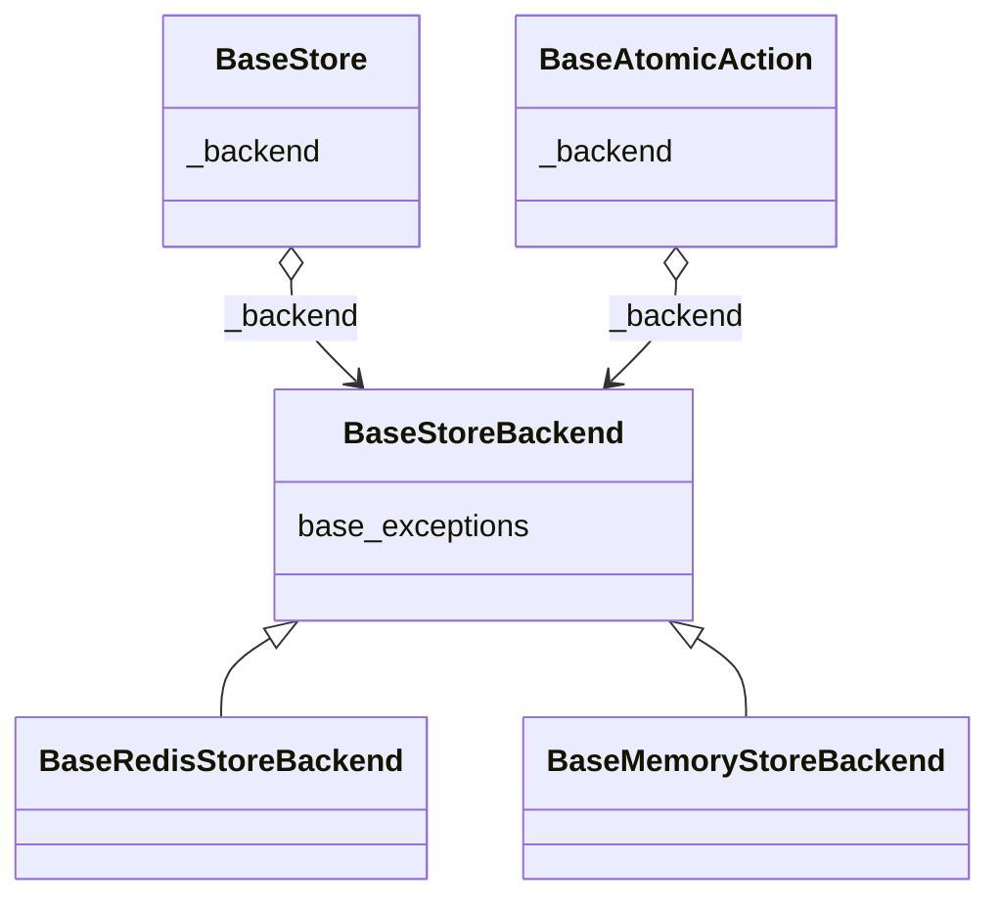
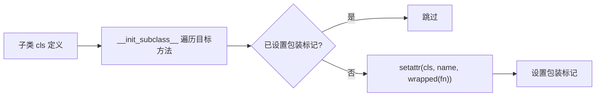
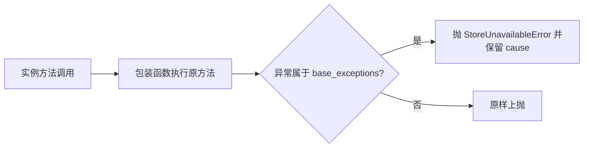

# 优化存储不可用时的异常处理 —— 实施方案

> 本方案只展开存储不可用异常的收敛设计。

## 0x01 调研与约束

### a. 外部仓库对照

| 仓库           | 入口                                                    | 机制                                                                                                  | 启发                               |
|--------------|-------------------------------------------------------|-----------------------------------------------------------------------------------------------------|----------------------------------|
| `limits`     | `limits/storage/base.py`、`limits/aio/storage/base.py` | `_wrap_errors` + `__init_subclass__` 在基类统一织入包装函数，按 `instance.base_exceptions` 捕获并包装成 `StorageError` | 统一包装挂在基类 基础异常族由存储抽象层声明      |
| `redis_rate` | `redis_rate/rate.go`                                  | `AllowN` / `AllowAtMost` 直接把 Redis 执行错误原样返回                                                         | Go 风格偏向原始错误直返 本期需要稳定的异常捕获入口 |
| `redis-py`   | `redis/exceptions.py`                                 | `RedisError` 覆盖连接、超时、服务端错误，`RedisClusterException` 独立成族                                             | Redis 后端异常族需要同时纳入两类基异常           |

### b. 本期约束

- sync / async 入口行为对称。
- 统一异常类型使用现有的 `StoreUnavailableError`。
- 不新增第二套公开异常、异常包装开关或公开字段。
- 通过 `raise ... from exc` 保留原始异常链。
- `DataError` / `SetUpError` 等本地参数 / 配置异常保持原样。
- 测试按入口分层：`Store` / `Throttled` 只覆盖公开入口，`RateLimiter` 按 init / limit / peek 分开覆盖。

## 0x02 架构设计

### a. 核心抽象

`BaseStoreBackend` 是异常族协议入口。

`BaseStore` 与 `BaseAtomicAction` 不感知具体依赖库，只通过 `_backend.base_exceptions` 判断哪些底层异常需要包装。

### b. 当前有效方案

- **异常收敛**：存储不可用统一收敛为 `StoreUnavailableError`，原始异常通过 `__cause__` 保留。
- **异常族声明**：不同存储后端只覆盖 `base_exceptions`，不在 Store 或 RateLimiter 层写死依赖库异常类型。
- **职责分离**：包装函数集中在 `throttled.store._wrapping`，sync / async 共用同一套内部入口。
- **收敛边界**：Store 命令、`make_atomic()` 与 `AtomicAction.do()` 负责转换存储异常。
- **透传边界**：`RateLimiter` 与 `Throttled` 不再补充 `try / except`，只透传统一后的异常。

补充边界：

- `AtomicAction.__init__` 不单独包装，构造期异常由 `BaseStore.make_atomic()` 收敛。
- 钩子函数不感知底层异常转换，只看到 `StoreUnavailableError`。
- Redis 依赖缺失仍按原路径抛 `ImportError` / `SetUpError`。

## 0x03 开发方案

### a. 存储后端异常族声明

| 文件                                 | 入口                                       | 异常列表                                       |
|------------------------------------|------------------------------------------|--------------------------------------------|
| `throttled/store/base.py`          | `BaseStoreBackend.base_exceptions` *[1]* | `()`                                       |
| `throttled/store/redis.py`         | `BaseRedisStoreBackend.base_exceptions`  | `RedisError` `RedisClusterException` *[2]* |
| `throttled/asyncio/store/redis.py` | `BaseRedisStoreBackend.base_exceptions`  | `RedisError` `RedisClusterException`       |

* *[1]* `base_exceptions` 作为协议入口，声明可被包装函数捕获的第三方异常，不得包含 `throttled` 自身异常。
* *[2]* `RedisClusterException` 在 redis-py 中直接继承 `Exception`，不属于 `RedisError` 体系，必须与 `RedisError` 并列声明。

### b. Store 与 AtomicAction 注入

| 文件                                | 入口                                   | 责任                                 |
|-----------------------------------|--------------------------------------|------------------------------------|
| `throttled/store/_wrapping.py`    | `_wrap_method()`                     | 读取异常族并转换命中的底层异常                    |
| `throttled/store/_wrapping.py`    | `__store_unavailable_wrapped__`      | 标记已包装方法，避免重复包装                     |
| `throttled/store/base.py`         | `BaseStore.__init_subclass__`        | 为 Store 命令和 `make_atomic()` 注入包装函数 |
| `throttled/store/base.py`         | `BaseAtomicAction.__init_subclass__` | 为 `do()` 注入包装函数                    |
| `throttled/asyncio/store/base.py` | async 基类注入入口                         | 复用同一内部包装入口 避免依赖 sync 私有导出     |

注入流程：

调用流程：

补充约束：

- `_wrap_method()` 通过 `inspect.iscoroutinefunction` 选择 sync / async 分支。
- `make_atomic()` 是 AtomicAction 的唯一构造来源，脚本注册异常在该入口被转译。
- Store 命令、`make_atomic()` 与 `AtomicAction.do()` 使用同一异常读取路径。

### c. AtomicAction 算法落点

| 算法              | 构造期触发点              | 执行期触发点                |
|-----------------|---------------------|-----------------------|
| `FixedWindow`   | 不涉及脚本注册             | `incrby` / `expire`   |
| `TokenBucket`   | `register_script()` | `_script(...)`        |
| `LeakingBucket` | `register_script()` | `_script(...)`        |
| `SlidingWindow` | `register_script()` | `_script(...)`        |
| `GCRA`          | `register_script()` | `limit` 与 `peek` 两条路径 |

## 0x04 验收与验证

### a. 不变量验收

- 代表性 sync / async Store 操作抛 `StoreUnavailableError`。
- sync / async RateLimiter 在存储异常时，`limit()` / `peek()` 主路径不泄漏原始 Redis 异常。
- `Throttled.limit()` 与 async `Throttled.limit()` 抛统一异常类型。
- 原始底层异常通过 `__cause__` 链可追溯。
- `DataError` / `SetUpError` 等本地参数 / 配置异常类型保持不变。
- Redis cluster 异常（`RedisClusterException`）能被识别并包装。

### b. 测试布局

| 范围                 | 文件                                                | 方式                                            |
|--------------------|---------------------------------------------------|-----------------------------------------------|
| Store              | `tests/store/test_store.py`                       | 新增 `1` 个测试函数，参数化断言 Store 包装入口。                |
| Store（async）       | `tests/asyncio/store/test_store.py`               | 新增 `1` 个 async 测试函数，复用同类后端测试桩。                |
| Throttled          | `tests/test_throttled.py`                         | 新增 `1` 个测试函数，断言公开入口抛 `StoreUnavailableError`。 |
| Throttled（async）   | `tests/asyncio/test_throttled.py`                 | 新增 `1` 个 async 测试函数，断言 async 公开入口。            |
| RateLimiter        | `tests/rate_limiter/test_rate_limiter.py`         | 新增 `3` 个测试函数，覆盖 init / limit / peek。          |
| RateLimiter（async） | `tests/asyncio/rate_limiter/test_rate_limiter.py` | 新增 `3` 个 async 测试函数，按同样入口覆盖。                  |

测试实现约束：

- 不依赖真实 Redis 宕机或网络抖动。
- Store 层使用通用后端测试桩，按当前 store 的 `base_exceptions` 选择底层异常。
- RateLimiter 层使用实现 `SyncStoreP` / `AsyncStoreP` 的存储测试桩，直接抛出 `StoreUnavailableError`。
- 同一测试文件内按算法参数化，不为每种算法拆独立测试函数。

### c. 回归口径

回归命令以项目既有测试入口为准。

## 0x05 实施进展

> 条目按时间倒序，最新进展在最上方。

| 时间                 | 对应设计片段                     | 结论调整概要                                                                                                                                 | 改动 / 验证                                                                                                                                    |
|--------------------|----------------------------|----------------------------------------------------------------------------------------------------------------------------------------|--------------------------------------------------------------------------------------------------------------------------------------------|
| `2026-05-05 00:00` | `0x02.b`、`0x03.b`、`0x04.b` | [1] 最终收敛点为 Store 命令、`make_atomic()` 与 `AtomicAction.do()` [2] 不再包装 `AtomicAction.__init__` [3] 测试桩按 Store / RateLimiter 入口分层 | [1] 已修复 async 导入期私有符号失败与 Redis fixture teardown 污染 [2] 全量测试（`727 passed, 67 skipped`）、目标测试（`254 passed, 16 skipped`）与文件级 `prek` 检查均通过 |
| `2026-05-04 12:00` | `0x03.b`                   | 已确认构造期异常来自 AtomicAction 初始化 该结论后续被 `make_atomic()` 入口收敛方案替代                                                                       | 已核对 sync / async store、rate_limiter、`throttled.py` 主路径与 `redis/exceptions.py` 异常体系。                                                        |
| `2026-05-03 00:00` | `0x02.a`、`0x02.b`、`0x03`   | [1] 初始泄漏点覆盖 `BaseStore` 与 AtomicAction 构造 / 执行阶段 [2] 包装函数挂在基类，`base_exceptions` 落在存储后端抽象层 [3] 测试策略后续收敛为现有文件内按入口覆盖            | [1] 已完成 `throttled-py` sync / async store、rate limiter、throttled 源码阅读 [2] 已完成 `limits`、`redis_rate`、`redis-py` 对照调研                   |

## 0x06 参考

**项目源码**

- `throttled/store/base.py`
- `throttled/store/_wrapping.py`
- `throttled/asyncio/store/base.py`
- `throttled/store/redis.py`
- `throttled/asyncio/store/redis.py`
- `throttled/rate_limiter/fixed_window.py`
- `throttled/rate_limiter/token_bucket.py`
- `throttled/rate_limiter/leaking_bucket.py`
- `throttled/rate_limiter/sliding_window.py`
- `throttled/rate_limiter/gcra.py`
- `throttled/throttled.py`
- `throttled/asyncio/throttled.py`

**外部样本**

- [<源码> limits limits/storage/base.py](https://github.com/alisaifee/limits/blob/master/limits/storage/base.py)
- [<源码> limits limits/aio/storage/base.py](https://github.com/alisaifee/limits/blob/master/limits/aio/storage/base.py)
- [<源码> limits limits/storage/redis.py](https://github.com/alisaifee/limits/blob/master/limits/storage/redis.py)
- [<源码> redis_rate rate.go](https://github.com/go-redis/redis_rate/blob/master/rate.go)
- [<源码> redis redis/exceptions.py](https://github.com/redis/redis-py/blob/master/redis/exceptions.py)

## 0x07 版本锚点

- 分支：待创建
- PR：待创建
