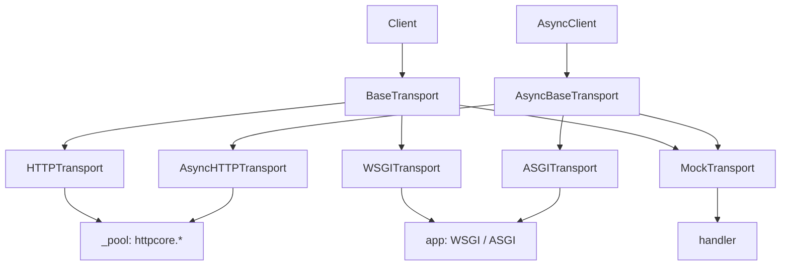
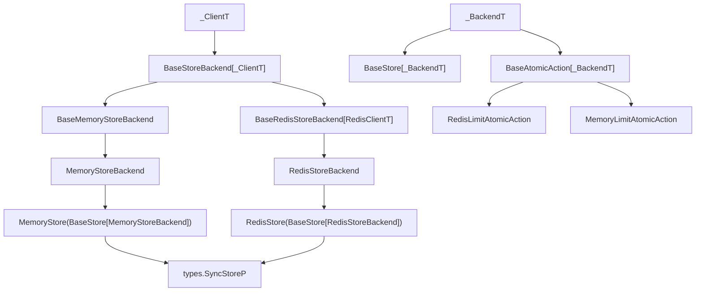
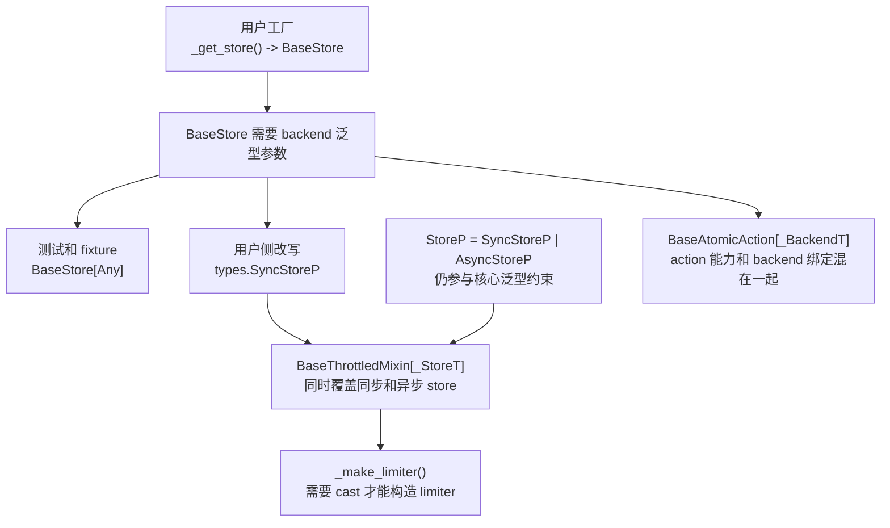
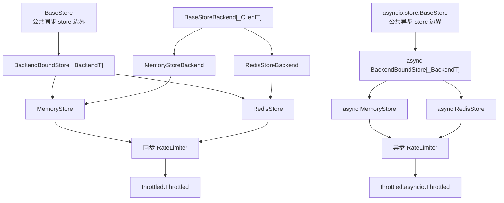
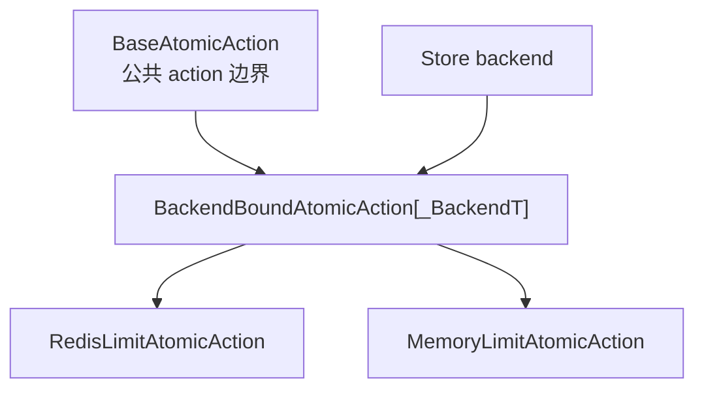
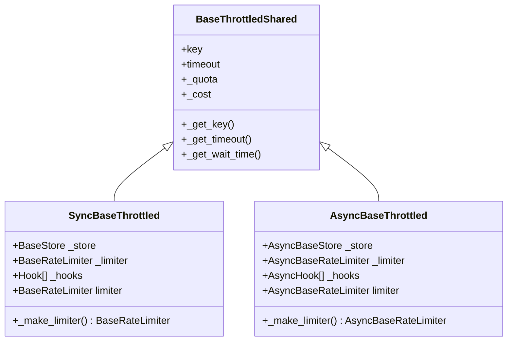

# Store 类型抽象边界优化 —— 实施方案

> 基于 [README.md](./README.md) 制定。

## 0x01 调研与约束

### a. 当前现象

PR #159 把运行时配对关系放进泛型继承链后，`BaseStore` 成为 `BaseStore[_BackendT]`。

这让普通用户想表达"返回一个同步 store"时必须同时回答"这个 store 绑定哪个 backend"。

当前 `mypy --strict` 复现结果：

| 用户写法 | 类型检查结果 | 结论 |
|------|------|------|
| `_get_store() -> BaseStore` | `Missing type arguments for generic type "BaseStore"` | 裸 `BaseStore` 不可用。 |
| `_get_store() -> BaseStore[BaseStoreBackend[object]]` | `RedisStore` / `MemoryStore` 返回值不兼容 | backend 类型泄漏到用户侧。 |
| `_get_store() -> BaseStore[types.StoreBackendP]` | `RedisStore` / `MemoryStore` 返回值不兼容 | backend 协议不能自然代表具体 store。 |
| `_get_store() -> types.SyncStoreP` | 通过 | 能绕过当前报错，但公共 API 语义不直观。 |
| `Throttled(store=store)` | `got Module; expected SyncStoreP` | 示例变量名会掩盖真正的 store 实例边界。 |

这些现象说明：`SyncStoreP` 只是绕过当前类型问题的临时出口。

如果用户侧仍必须理解协议类型，`BaseStore` 就还没有真正回到公共边界。

### b. HTTPX transport 调研

HTTPX 的 transport 设计提供了清晰对照。



关键事实：

- `BaseTransport` 与 `AsyncBaseTransport` 是公共 API，且没有底层 backend 泛型。
- `T` / `A` 只用于 context manager 返回子类自身，不表达 `httpcore` backend 配对。
- `HTTPTransport` 继承 `BaseTransport`，内部根据配置选择 `httpcore.ConnectionPool`、
  `httpcore.HTTPProxy` 或 `httpcore.SOCKSProxy`，这些对象统一藏在 `_pool`。
- `Client.__init__` 接收 `transport: BaseTransport | None`，`mounts` 也是 `Mapping[str, BaseTransport | None]`。
- `WSGITransport` 与 `ASGITransport` 分别继承同步和异步基类，应用协议放在构造参数和实例属性。
- `MockTransport` 同时继承同步和异步基类，因为它显式实现了两套请求方法。

HTTPX 的抽象原则：

```text
公共基类 = 调用方需要的能力边界
具体 transport = 具体运行时适配器
私有属性 = 底层 backend / app / handler
```

对应到 throttled-py，`BaseStore` 不应携带具体 backend 类型参数。

backend 配对应留在实现辅助层或私有属性层。

### c. throttled-py 当前对象链路

当前同步 store 链路：



当前设计把三个层级压在 `BaseStore[_BackendT]` 上：

- **公共能力边界**：用户期待 `BaseStore` 表达"同步 store"。
- **实现继承基类**：`MemoryStore` / `RedisStore` 复用抽象方法、校验和包装机制。
- **backend 配对载体**：`make_atomic()` 用 `_backend: _BackendT` 构造匹配的 AtomicAction。

这三个职责的稳定性不同：公共能力边界应该稳定且简单。

backend 配对是实现细节，应该尽量晚暴露。

### d. 类型绕行点

当前绕行不是单点报错，而是一条从用户注解延伸到内部泛型的链路：



真正要修的是入口语义：`Throttled(store=_get_store())` 应直接接收 `BaseStore`。

`SyncStoreP`、`BaseStore[Any]` 和 `cast()` 都不应该成为用户示例或测试 fixture 的常规写法。

### e. 顶级 Python 库补充对照

只对照 HTTPX 还不够。

顶级 Python 库在 sync / async 抽象上还有更稳定的共识。

| 样本 | 公共类型面 | sync / async 关系 | 内部实现边界 | 对 throttled-py 的启发 |
|------|------------|-------------------|--------------|------------------------|
| `redis-py` | `Redis` / `redis.asyncio.Redis` 是用户直接标注和传递的公共类。 | 两套并列公共类，接口命名尽量对齐。 | `connection_pool`、retry、parser、lock 等都藏在实例内部。 | store 公共基类应是名义类型，不应把 backend client 泛型抬到用户侧。 |
| `SQLAlchemy` | `Engine`、`Connection`、`AsyncEngine`、`AsyncConnection` 是稳定公共类型。 | async 侧不是 `Engine[AsyncDriver]`，而是单独公共类代理 sync engine / connection。 | 驱动、dialect、pool 与 greenlet bridge 都留在内部层。 | sync / async 应在公共类型名义层分叉，不通过一个混合泛型入口覆盖两端。 |
| `elasticsearch-py` | `Elasticsearch` / `AsyncElasticsearch` 是公共 client。 | 两套并列公共类，共享 base client 和 transport 配置模型。 | `Transport` / `AsyncTransport`、node pool、serializer 都是内部组合细节。 | 共享配置层可以复用，但组合层和运行时 transport 选择应在 sync / async 具体类落定。 |
| `openai-python` | `OpenAI` / `AsyncOpenAI` 是公共 client。 | 两套并列公共类，共享 `BaseClient`，资源层也分为 `SyncAPIResource` / `AsyncAPIResource`。 | 真正的 `httpx.Client` / `httpx.AsyncClient` 注入与响应流类型都藏在底层 client。 | 第三方依赖 client 可以存在于内部泛型或组合层，但不应污染公共扩展基类的类型签名。 |

这些样本说明：

- **公共入口优先名义类型**：顶级库让用户记住类名，而不是协议组合或 backend 泛型实参。
- **sync / async 是一等分叉**：两端可以共享底层实现，但不会把用户入口压成一个混合泛型抽象。
- **内部 helper 默认不承诺公开**：代理类、backend 绑定类、transport 选择器通常是内部层，不轻易冻结成公共 API。
- **构造器签名优先稳定**：公开构造尽量直观，避免把仅服务内部配对关系的类型问题转嫁给用户。

这意味着当前方案方向是对的，但还需要再补两条顶级库级别的约束：

- `BackendBoundStore` / `BackendBoundAtomicAction` 默认应视为内部 helper，不进入推荐公共 API。
- `BaseAtomicAction` 的对外扩展口径必须和实际构造模型一致，不能说"只继承 `BaseAtomicAction` 就够了"，如果 action 需要 backend，文档就必须明确其构造约束。

## 0x02 架构设计

### a. 分层模型

目标结构采用 HTTPX 风格：公共基类表达能力边界，backend 绑定辅助层表达实现配对。



这张图只表达职责关系，不代表具体文件改动。

### b. 用户侧类型语义

用户侧 store 工厂只需要表达"返回同步 store"。

它不应该暴露 Redis、Memory 或 backend 类型参数。

目标写法：

```python
def _get_store(use_redis: bool) -> BaseStore:
    if use_redis:
        return store.RedisStore(server="redis://127.0.0.1:6379/0")
    return store.MemoryStore()
```

`Throttled(store=_get_store())` 应直接通过 `BaseStore` 接收，而不是依赖 `BaseStore` 结构上满足 `SyncStoreP`。

这条语义保留一种官方扩展方式：

- 同步自定义 store 继承 `throttled.store.BaseStore`。
- 异步自定义 store 继承 `throttled.asyncio.store.BaseStore`。
- 不继承基类的结构化 store 不再作为推荐扩展路径进入核心 API。

### c. AtomicAction 语义

`BaseAtomicAction` 也应采用同样原则：公共名称表达 action 能力。

backend 配对放到辅助层。



AtomicAction 的关键边界：

- `BaseAtomicAction` 声明 `TYPE`、`STORE_TYPE` 和同步 `do()`。
- `BackendBoundAtomicAction[_BackendT]` 持有 `_backend` 并提供构造器。
- async 侧 `BaseAtomicAction` 声明 async `do()`，同样由 async backend 绑定辅助层持有 `_backend`。
- `SyncAtomicActionP` / `AsyncAtomicActionP` 保留，用于 limiter 内部字典和额外 action 扩展。

因此文档口径应拆成两层：

- 纯能力说明可以引用 `BaseAtomicAction`。
- 需要 backend 的 action 扩展必须继承 `BackendBoundAtomicAction` 或满足等价 `__init__(backend)` 契约。

### d. Throttled 共享边界

`Throttled` 的共享层只承载配置与计算辅助。

Store、Limiter 和 Hook 的模式差异在同步和异步具体层落定。



图中第三方依赖只作为成员类型出现，不再画成独立节点。

`AsyncBaseStore` 指 `throttled.asyncio.store.BaseStore`。

判定点：`_make_limiter()` 和 `limiter` 属于组合边界，不属于共享配置层。

### e. 顶级库级别的公开面约束

为了符合顶级 Python 库的公共 API 设计，这次改造还需要满足以下不变量：

- `BaseStore` / async `BaseStore` 才是文档、示例、类型注解和构造参数里的主语。
- backend 绑定 helper 默认使用内部定位，不承诺在顶层导出，也不作为推荐扩展入口写进 quickstart。
- sync / async 的共享只发生在私有 helper、纯算法函数或共享配置层，不发生在用户侧主类型名上。
- 公共 API 不要求用户理解 `StoreBackendP`、`_BackendT`、registry 返回类型或 `cast` 补丁。
- 如果某个扩展点需要 backend 构造参数，文档必须明确它是"backend-aware 扩展点"，不能包装成纯能力基类。

## 0x03 开发方案

### a. Store 公共边界

Store 公共边界负责"用户和 limiter 能调用什么"。

它只声明命令、`TYPE` 和 `make_atomic()`，不持有 `_backend`。

**（1）代码入口**

| 主题 | 处理方式 |
|------|----------|
| 声明位置 | [1] 同步声明在 `throttled/store/base.py` 的 `BaseStore`<br />[2] 异步声明在 `throttled/asyncio/store/base.py` 的 `BaseStore` |
| 使用方 | [1] 用户、文档和 store 工厂使用 `BaseStore`<br />[2] `Throttled` 和 sync limiter 通过同步 `BaseStore` 接收能力<br />[3] async `Throttled` 和 async limiter 通过 async `BaseStore` 接收能力 |
| 处理方式 | `BaseStore` 只保留抽象方法，backend 绑定下沉到 backend 绑定辅助层。 |

**（2）最小结构**

```python
class BaseStore(BaseStoreMixin, abc.ABC):
    TYPE: str = ""

    @abc.abstractmethod
    def exists(self, key: types.KeyT) -> bool: ...

    @abc.abstractmethod
    def make_atomic(self, action_cls: type[_ActionT]) -> _ActionT: ...
```

async 侧保持同构，但命令方法使用 `async def`。

**（3）实现约束**

- 不把 `_BackendT` 改成 `Any` 后继续挂在 `BaseStore`。
- 不要求用户写 `BaseStore[Any]` 或 `BaseStore[StoreBackendP]`。
- 不通过 `cast("BaseStore", ...)` 修复示例。
- 不把同步和异步 store 合并成同一个 `BaseStore`。
- 不再新增 `SyncStoreP` 或 `AsyncStoreP` 引用。
- 不把 backend helper 作为新的顶层公开心智模型写进 quickstart 或主 API 文档。

### b. Backend 绑定实现层

Backend 绑定实现层负责"内建 store 如何构造匹配 action"。

这层可以是公共 helper，也可以用下划线前缀表达内部用途。

按顶级库口径，这层默认应视为内部 helper。

除非后续确认第三方确实需要名义继承它，否则不建议把它提升为推荐公共 API。

**（1）代码入口**

| 主题 | 处理方式 |
|------|----------|
| 声明位置 | [1] 同步 helper 位于 `throttled/store/base.py`<br />[2] 异步 helper 位于 `throttled/asyncio/store/base.py` |
| 使用方 | `MemoryStore` 和 `RedisStore` 继承 helper，普通用户不需要直接标注 helper 类型，也不需要在文档中感知它。 |
| 处理方式 | 默认 `make_atomic()` 只在 helper 中实现，统一从 `_backend` 构造 action。 |

**（2）最小结构**

```python
class BackendBoundStore(BaseStore, Generic[_BackendT]):
    _backend: _BackendT

    def make_atomic(self, action_cls: type[_ActionT]) -> _ActionT:
        factory: Callable[..., _ActionT] = action_cls
        return factory(backend=self._backend)
```

**（3）迁移规则**

| 对象 | 当前继承 | 目标继承 | 说明 |
|------|----------|----------|------|
| `MemoryStore` | `BaseStore[MemoryStoreBackend]` | `BackendBoundStore[MemoryStoreBackend]` | 保留锁、LRU 与过期语义。 |
| `RedisStore` | `BaseStore[RedisStoreBackend]` | `BackendBoundStore[RedisStoreBackend]` | 保留连接工厂与 Redis 命令转换。 |
| 异步 `MemoryStore` | 异步 `BaseStore[MemoryStoreBackend]` | 异步 `BackendBoundStore[MemoryStoreBackend]` | 保留异步锁语义。 |
| 异步 `RedisStore` | 异步 `BaseStore[RedisStoreBackend]` | 异步 `BackendBoundStore[RedisStoreBackend]` | 保留异步 Redis client 协议。 |

**（4）包装机制约束**

`BaseStoreMixin._WRAPPED_METHOD_NAMES` 继续声明 `make_atomic()` 是包装边界。

如果包装逻辑依赖 `__init_subclass__`，需要确认 helper 和具体 store 的继承顺序不会导致重复包装或漏包装。

### c. AtomicAction 边界

AtomicAction 边界负责"limiter 可以调用什么 action"。

`BackendBoundAtomicAction` 负责"action 构造后持有什么 backend"。

这里要比 Store 更谨慎。

当前源码里的 Redis / Memory action 都直接依赖 `_backend`，而且部分 Redis action 在 `__init__` 就会 `register_script()`。

所以"只继承 `BaseAtomicAction` 并实现 `do()`"并不能覆盖真实扩展需求。

**（1）代码入口**

| 主题 | 处理方式 |
|------|----------|
| 声明位置 | [1] 同步 `BaseAtomicAction` 与 `BackendBoundAtomicAction` 位于 `throttled/store/base.py`<br />[2] async 对应声明位于 `throttled/asyncio/store/base.py` |
| 使用方 | [1] limiter 字典继续使用 `SyncAtomicActionP` 和 `AsyncAtomicActionP`<br />[2] backend-aware 自定义 action 继承 `BackendBoundAtomicAction` 或实现等价 `__init__(backend)` 契约<br />[3] `BaseAtomicAction` 只作为能力边界与文档入口，不再单独宣称足够承载 backend-aware action |
| 处理方式 | `_backend` 和构造器只放在 backend 绑定辅助层中，算法文件按具体 backend 继承 helper。 |

**（2）落点关系**

| 场景 | 处理方式 | 影响 |
|------|----------|------|
| Redis action | 继承 `BackendBoundAtomicAction[RedisStoreBackend]` 或等价底层 helper。 | `register_script()` 仍拿到精确 Redis backend。 |
| Memory action | 共享 `_do(backend: MemoryStoreBackendP, ...)` 的纯计算逻辑。 | 同步和异步只在锁和 `do()` 形态上分叉。 |
| 额外 action | 保持 `TYPE` / `STORE_TYPE` 身份筛选。 | 第三方不必在用户注解里暴露 backend 泛型，但如果要由 store 构造，仍需满足 backend 构造契约。 |

**（3）实现约束**

- action 的 `TYPE` / `STORE_TYPE` 是注册身份，不是 backend 类型替代品。
- backend 类型只在 action 构造与执行内部使用。
- limiter 字典仍以 `SyncAtomicActionP` / `AsyncAtomicActionP` 保存能力。
- 不把 Redis action 的脚本类型抽象成同步和异步混合 union。
- 不让异步 Redis action 继承同步 Redis 执行 core。
- 不再把"继承 `BaseAtomicAction` 并实现 `do()`"写成 backend-aware action 的唯一官方扩展口径。

### d. Throttled 构造拆分

Throttled 层的核心问题不是泛型数量，而是一个共享 `__init__` 同时做了两类事：

```text
配置初始化：key / timeout / quota / cost
组合初始化：using 查出 limiter 类、store 保存到 _store、hooks 保存到 _hooks
```

配置初始化可以共享。

组合初始化必须在同步和异步具体层完成。

**（1）构造参数策略**

当前公开构造允许位置参数。

公开参数顺序继续保持为 `key, timeout, using, quota, store, cost, hooks`。

方案需要保留公开参数顺序，只在内部调用共享层时改成关键字传参。

| 参数 | 归属 | 处理方式 |
|------|------|----------|
| `key` | 共享层 | 保存为实例 key。 |
| `timeout` | 共享层 | 解析并校验等待策略。 |
| `quota` | 共享层 | 解析为 `Quota`。 |
| `cost` | 共享层 | 校验并保存默认 cost。 |
| `using` | 同步和异步 | 通过对应 `RateLimiterRegistry.get()` 取 limiter 类。 |
| `store` | 同步和异步 | 类型分别是同步 `BaseStore` 和异步 `BaseStore`。 |
| `hooks` | 同步和异步 | 类型分别是 `Hook` 和 `AsyncHook`。 |

结果：公开构造签名不变，共享层不再接触 `store`、`using` 和 `hooks`。

**（2）优雅骨架**

```python
class BaseThrottledShared:
    __slots__ = ("key", "timeout", "_quota", "_cost")

    def __init__(
        self,
        *,
        key: KeyT | None = None,
        timeout: float | None = None,
        quota: Quota | str | None = None,
        cost: int = 1,
    ) -> None:
        self.key = key
        self.timeout = self._NON_BLOCKING if timeout is None else timeout
        self._validate_timeout(self.timeout)
        self._quota = self._parse_quota(quota)
        self._validate_cost(cost)
        self._cost = cost


class BaseThrottled(BaseThrottledShared):
    __slots__ = ("_store", "_limiter_cls", "_limiter", "_lock", "_hooks")

    _DEFAULT_GLOBAL_STORE: store.BaseStore = store.MemoryStore()

    def __init__(
        self,
        key: KeyT | None = None,
        timeout: float | None = None,
        using: RateLimiterTypeT | None = None,
        quota: Quota | str | None = None,
        store: store.BaseStore | None = None,
        cost: int = 1,
        hooks: Sequence[Hook] | None = None,
    ) -> None:
        super().__init__(key=key, timeout=timeout, quota=quota, cost=cost)
        self._store = self._resolve_store(store)
        self._limiter_cls = self._resolve_limiter_cls(using)
        self._limiter = None
        self._lock = self._get_lock()
        self._hooks = self._validate_hooks(hooks)

    def _make_limiter(self) -> BaseRateLimiter:
        return self._limiter_cls(self._quota, self._store)
```

async 侧复制公开参数顺序，只替换 `store`、`hooks`、`_limiter_cls` 和返回类型。

不要用 `*args` / `**kwargs` 转发这些参数。

显式签名能保留 IDE 补全、文档生成和 mypy 错误位置。

**（3）Limiter 类解析与构造**

`_make_limiter()` 的构造路径应直接走名义 Store 基类：

```text
sync:  store.BaseStore -> BaseRateLimiter.__init__ -> BaseRateLimiter
async: asyncio.store.BaseStore -> asyncio.BaseRateLimiter.__init__ -> asyncio.BaseRateLimiter
```

对应落点：

| 落点 | 处理方式 |
|------|----------|
| 同步 `BaseRateLimiter.__init__` | 接收 `store.BaseStore`。 |
| 异步 `BaseRateLimiter.__init__` | 接收 `asyncio.store.BaseStore`。 |
| `_resolve_limiter_cls(using)` | 调用对应 `RateLimiterRegistry.get()`，把 `using` 转成 limiter 类。 |
| `_make_limiter()` | 只执行 `self._limiter_cls(self._quota, self._store)`。 |

现状说明：`RateLimiterRegistry.get()` 目前不能让 mypy 判断返回的是同步还是异步 limiter 类。

若本轮不改它的签名，`_resolve_limiter_cls()` 可以保留一次 `cast`。

`_make_limiter()` 不再做类型转换。

**（4）迁移顺序**

1. 先把同步和异步 `BaseRateLimiter` 的 store 参数切到对应 `BaseStore`。
2. 再拆 `BaseThrottledShared` 和同步、异步 `BaseThrottled.__init__`。
3. 最后废弃 `StoreP`，并清理它在核心泛型约束中的使用。

**（5）实现边界**

- 公开构造签名保留当前位置参数顺序。
- 共享层只接收关键字参数，避免后续新增参数时错位。
- `_store`、`_limiter_cls`、`_limiter`、`_hooks`、`_make_limiter()` 和 `limiter` 不进入共享层。
- 同步和异步可以重复少量组合代码，不重复 quota、timeout 和 cost 解析。
- `cast` 不进入用户 API、测试 fixture 或 `_make_limiter()`。

结论：共享配置，不共享组合。

## 0x04 验收与验证

验收只证明一件事：用户侧和测试侧直接使用 `BaseStore`，不再依赖协议、`Any` 或 `cast()` 绕过类型检查。

| 场景 | 验收点 |
|------|--------|
| 同步 store 工厂 | `_get_store() -> BaseStore` 可返回 `MemoryStore` 或 `RedisStore`，并可传给 `Throttled(store=...)`。 |
| 异步 store 工厂 | `_get_store() -> asyncio.store.BaseStore` 可返回异步 `MemoryStore` 或异步 `RedisStore`。 |
| Throttled 构造 | 同步和异步 `Throttled` 的现有位置参数顺序保持可用。 |
| limiter 懒加载 | 同步和异步 `limiter` 构造后使用传入的名义 `BaseStore` 实例。 |
| hook 校验 | 同步和异步 hooks 仍按各自类型校验，错误 hook 类型仍报错。 |
| 测试 fixture | `tests/conftest.py` 不再使用 `BaseStore[Any]`、`SyncStoreP`、`AsyncStoreP` 或用户侧 `cast()`。 |
| 测试桩 | rate limiter 测试中的 store stub 继承对应 `BaseStore`。 |
| 文档示例 | quickstart 不再写 `store=store`，改用 `store=_get_store()` 或具体 store 实例。 |
| API 文档 | Sphinx docs 和 docstring 中的 `store` 参数说明与真实签名一致。 |
| 兼容约束 | `StoreP` 不再作为核心泛型约束，也不出现在公开构造签名中。 |
| helper 暴露 | backend 绑定 helper 不进入顶层推荐导出，也不要求用户显式标注。 |
| action 扩展 | backend-aware action 文档明确要求 backend 构造契约，不再把 `BaseAtomicAction` 单独描述成充分条件。 |
| 禁止形态 | 不新增 `BaseStore[Any]`、`type: ignore` 或面向用户 API 的 `cast()`。 |

## 0x05 实施进展

| 时间 | 对应设计片段 | 结论调整概要 | 改动 / 验证 |
|------|--------------|--------------|-------------|
| `2026-05-06 00:00 ~ 12:00` | `0x01` 至 `0x04` | [1] 确认 HTTPX 分层模型，补充 `redis-py` / `SQLAlchemy` / `elasticsearch-py` / `openai-python` 对照，形成 `BaseStore` / `BackendBoundStore[_BackendT]` 拆分方案。<br />[2] 架构设计收敛为分层模型、用户侧类型语义、AtomicAction 边界、Throttled 共享边界四部分。<br />[3] 开发方案按责任边界拆分为 Store 公共边界、Backend 绑定实现层、AtomicAction 边界、Throttled 构造拆分，补齐代码入口、迁移规则和禁止形态。<br />[4] 类型绕行点改为链路图，文档与测试验收并入验收表，Throttled 共享边界改用 Mermaid 类图。<br />[5] 明确公开构造签名不变，共享层只接收关键字参数，补充位置参数兼容骨架与迁移顺序。 | [1] 已核对 HTTPX 与 throttled-py 源码，复现 `BaseStore` 裸用失败。<br />[2] 已核对上述顶级库 sync / async 主入口，确认公共类型面不暴露 backend 泛型。<br />[3] 已将 `BaseStore[Any]`、`SyncStoreP`、`AsyncStoreP`、`cast()` 清理点收束到验收表。<br />[4] 已用 `classDiagram` 表达 `BaseThrottledShared` 继承关系，基于当前 `__init__` 位置参数顺序重写构造方案。 |

## 0x06 参考

- [HTTPX Transports 文档](https://www.python-httpx.org/advanced/transports/)
- [HTTPX `BaseTransport` 源码](https://github.com/encode/httpx/blob/master/httpx/_transports/base.py)
- [HTTPX `HTTPTransport` 源码][httpx-http-transport]
- [HTTPX `MockTransport` 源码][httpx-mock-transport]
- [HTTPX `WSGITransport` 源码][httpx-wsgi-transport]
- [HTTPX `ASGITransport` 源码][httpx-asgi-transport]
- [HTTPX `Client` 源码][httpx-client]
- [redis-py `Redis` 源码][redis-py-redis]
- [redis-py async `Redis` 源码][redis-py-async-redis]
- [SQLAlchemy `Connection` / `Engine` 源码][sqlalchemy-connection]
- [SQLAlchemy `AsyncConnection` / `AsyncEngine` 源码][sqlalchemy-async-connection]
- [elasticsearch-py `Elasticsearch` 源码][es-py-elasticsearch]
- [elasticsearch-py `AsyncElasticsearch` 源码][es-py-async-elasticsearch]
- [openai-python `OpenAI` / `AsyncOpenAI` 源码][openai-python-client]
- [openai-python `BaseClient` 源码][openai-python-base-client]
- [mypy strict 模式合规改造方案](../2026-04-06-mypy-strict-compliance/PLAN.md)
- [优化存储不可用时的异常处理方案](../2026-05-03-store-unavailable-error-handling/PLAN.md)

[httpx-http-transport]: https://github.com/encode/httpx/blob/master/httpx/_transports/default.py
[httpx-mock-transport]: https://github.com/encode/httpx/blob/master/httpx/_transports/mock.py
[httpx-wsgi-transport]: https://github.com/encode/httpx/blob/master/httpx/_transports/wsgi.py
[httpx-asgi-transport]: https://github.com/encode/httpx/blob/master/httpx/_transports/asgi.py
[httpx-client]: https://github.com/encode/httpx/blob/master/httpx/_client.py
[redis-py-redis]: https://github.com/redis/redis-py/blob/master/redis/client.py
[redis-py-async-redis]: https://github.com/redis/redis-py/blob/master/redis/asyncio/client.py
[sqlalchemy-connection]: https://github.com/sqlalchemy/sqlalchemy/blob/main/lib/sqlalchemy/engine/base.py
[sqlalchemy-async-connection]: https://github.com/sqlalchemy/sqlalchemy/blob/main/lib/sqlalchemy/ext/asyncio/engine.py
[es-py-elasticsearch]: https://github.com/elastic/elasticsearch-py/blob/main/elasticsearch/_sync/client/__init__.py
[es-py-async-elasticsearch]: https://github.com/elastic/elasticsearch-py/blob/main/elasticsearch/_async/client/__init__.py
[openai-python-client]: https://github.com/openai/openai-python/blob/main/src/openai/_client.py
[openai-python-base-client]: https://github.com/openai/openai-python/blob/main/src/openai/_base_client.py

## 0x07 版本锚点

- 建议分支：`refactor/260506_store_typing_boundary`
- PR：待创建。
