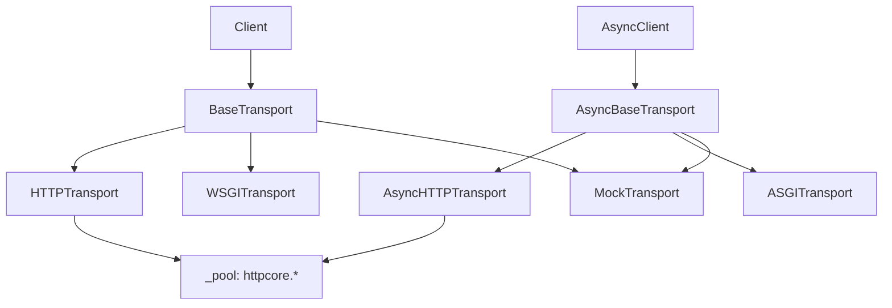
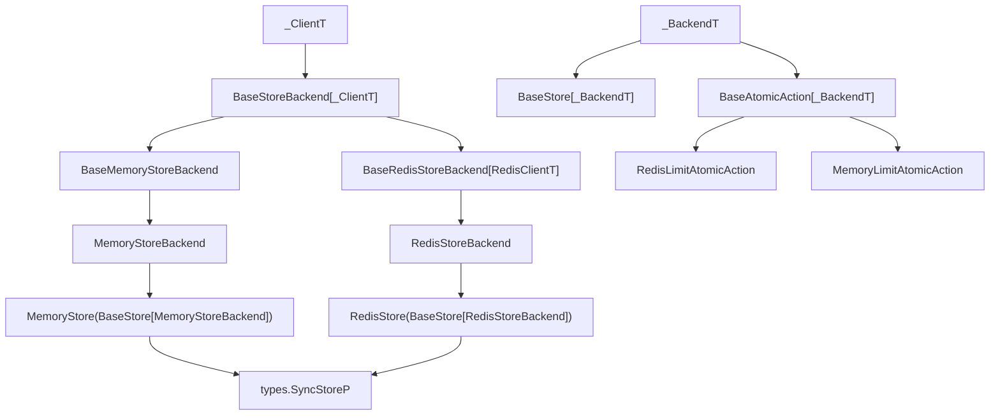
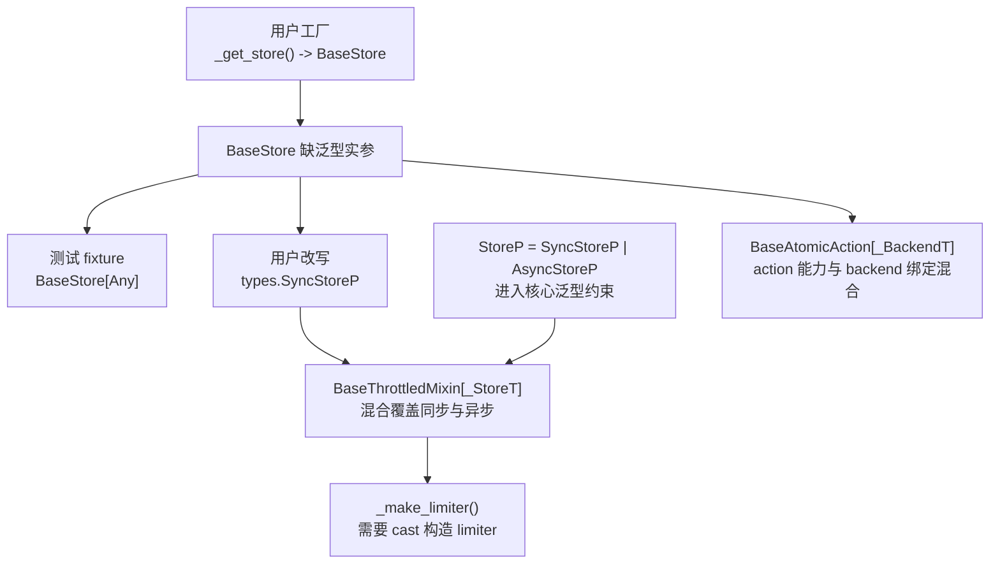
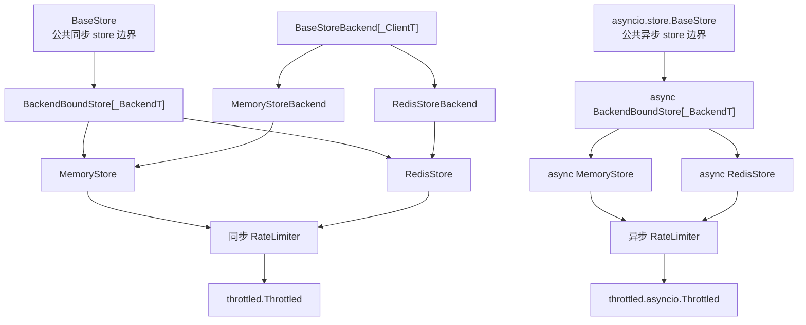
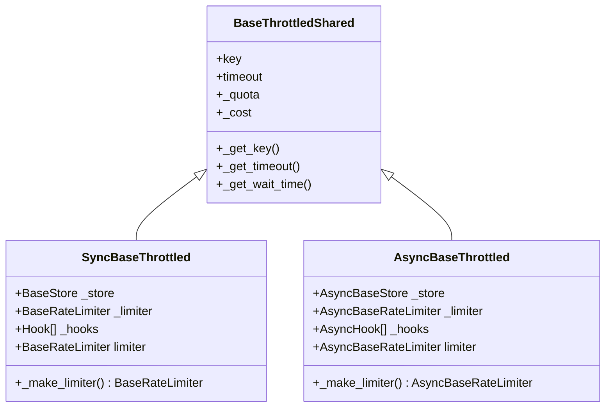

# Store 类型抽象边界优化 —— 实施方案

> 基于 [README.md](./README.md) 制定。

## 0x01 调研与约束

### a. 当前现象

PR #159 把运行时配对关系放进泛型继承链后，`BaseStore` 变成 `BaseStore[_BackendT]`。

用户在表达"返回一个同步 store"时被迫同时回答"这个 store 绑定哪个 backend"。

`mypy --strict` 下的写法对比：

| 用户写法 | 结果 | 问题 |
|----------|------|------|
| `_get_store() -> BaseStore` | 不通过 | 裸 `BaseStore` 缺泛型实参 |
| `_get_store() -> BaseStore[BaseStoreBackend[object]]` | 不通过 | 具体 store 返回值不兼容 |
| `_get_store() -> BaseStore[types.StoreBackendP]` | 不通过 | backend 协议不能代表具体 store |
| `_get_store() -> types.SyncStoreP` | 通过 | 公共 API 语义绕，用户需要理解协议类型 |

`SyncStoreP` 只是临时绕开类型报错的出口，没有让 `BaseStore` 回到真正的公共边界。

### b. HTTPX transport 结构图

HTTPX 是同步与异步分叉、backend 完全私有化的典型样本：



`BaseTransport` 不带 backend 泛型，`Client.__init__` 与 `mounts` 都接收它，具体的 `httpcore` 连接池与代理统一藏在私有属性 `_pool`。

更系统的对照在 `0x01.e`，本节只用结构图说明同步、异步基类分叉的形态。

### c. throttled-py 当前对象链路

当前同步 store 链路：



`BaseStore[_BackendT]` 同时承担三个职责，稳定性不一致：

| 职责 | 稳定性诉求 | 现状问题 |
|------|------------|----------|
| 公共类型 | 稳定且简单，让用户记住一个名字 | 被泛型实参污染 |
| 实现基类 | 给具体 store 复用抽象方法、校验、包装机制 | 与公共类型耦合 |
| backend 持有 | `make_atomic()` 通过 `_backend` 构造匹配的 action | 把内部细节抬到公共类型 |

### d. 类型绕行链路

当前绕行从用户注解一路延伸到内部泛型：



入口语义才是要修的根：`Throttled(store=_get_store())` 应直接接收 `BaseStore`，而不是依赖协议、`Any` 或 `cast()` 绕开。

### e. 主流库同步与异步抽象对照

五个样本横向对照：

| 样本 | 公共类型 | 同步与异步表达 | backend 与泛型隐藏方式 |
|------|----------|-----------------|--------------------------|
| `HTTPX` | `BaseTransport`、`AsyncBaseTransport` | 两套基类并列 | `httpcore` 的 pool 与 proxy 藏在私有属性 `_pool` |
| `redis-py` | `Redis`、`redis.asyncio.Redis` | 两套并列具体类 | `connection_pool`、retry、parser 藏在实例内部，公共类零泛型 |
| `SQLAlchemy` | `Engine`、`Connection`、`AsyncEngine`、`AsyncConnection` | 各命名一组公共类 | 驱动、dialect、pool 与 greenlet bridge 留在内部模块 |
| `elasticsearch-py` | `Elasticsearch`、`AsyncElasticsearch` | 两套并列具体类，共享配置模型 | `Transport`、`AsyncTransport` 与 node pool 都是组合细节 |
| `openai-python` | `OpenAI`、`AsyncOpenAI` | 两套并列具体类 | 见下方三层模板 |

`openai-python` 的三层最贴近本次方案，泛型在子类继承时填死，公共类零剩余泛型：

```python
class BaseClient(Generic[_HttpxClientT, _DefaultStreamT]):  # _base_client.py，私有泛型基类
    ...

class SyncAPIClient(BaseClient[httpx.Client, Stream[Any]]):  # 把泛型实参填死的同步子类
    ...

class OpenAI(SyncAPIClient):  # _client.py，公共类零泛型
    ...
```

两道导入隔离让"helper 仅供内部使用"在工程上成立：

- `BaseClient` 放在 `_base_client.py`（下划线模块）。
- `openai/__init__.py` 的 `__all__` 只导出 `OpenAI`、`AsyncOpenAI`、`Client`、`AsyncClient`，不含 `BaseClient` 与 `SyncAPIClient`。

五个样本共同的三条原则与对应到 throttled-py 的处理：

| 原则 | 主流库做法 | throttled-py 处理 |
|------|------------|--------------------|
| 公共类型零泛型 | 用户只记类名，不填 backend 类型实参 | `BaseStore` 不带泛型 |
| 同步与异步分叉 | 两端不共用同一个泛型入口 | 同步与异步 `BaseStore` 在不同模块独立 |
| 导入隔离 | 下划线模块名 + `__all__` 控制可见性 | helper 放进 `_backend_bound.py` 且不进 `__all__` |

## 0x02 架构设计

### a. 分层模型

目标结构沿用 HTTPX 与 openai-python 共同的三层：

- 公共基类 `BaseStore` 只表达命令，零泛型。
- 内部 helper `BackendBoundStore[_BackendT]` 持有 backend，提供 `make_atomic()`。
- 具体 store 在 helper 上把 backend 类型实参填死。



### b. 用户侧类型语义

用户工厂只需要表达"返回同步 store"，不应感知 Redis、Memory 或 backend 类型参数。

```python
def _get_store(use_redis: bool) -> BaseStore:
    if use_redis:
        return store.RedisStore(server="redis://127.0.0.1:6379/0")
    return store.MemoryStore()
```

官方扩展路径只有一条：自定义 store 继承对应模块的 `BaseStore`：

- 同步：`throttled.store.BaseStore`。
- 异步：`throttled.asyncio.store.BaseStore`。

不继承基类的结构化 store 不再作为推荐扩展入口。

### c. AtomicAction 语义

AtomicAction 沿用同一两层结构，并多一层与 limiter 字典对接的协议：

| 层 | 职责 |
|----|------|
| `BaseAtomicAction` | 声明 `TYPE`、`STORE_TYPE` 和 `do()` |
| `BackendBoundAtomicAction[_BackendT]` | 持有 `_backend`，提供 `__init__(backend)` |
| `SyncAtomicActionP` / `AsyncAtomicActionP` | limiter 内部字典与第三方扩展的结构化协议 |

具体扩展契约见 `0x03.c`。

### d. Throttled 共享边界

`Throttled` 共享层只承载配置与计算辅助，Store、Limiter、Hook 的差异在同步与异步具体层落定。



`AsyncBaseStore` 指 `throttled.asyncio.store.BaseStore`，`_make_limiter()` 与 `limiter` 属于组合边界，不进入共享层。

### e. 公共 API 导入隔离

让"helper 仅供内部使用"在工程上成立，需要一组围绕模块与 `__all__` 的硬约束：

| 项 | 约束 |
|----|------|
| 模块位置 | helper 放在 `throttled/store/_backend_bound.py` 与 `throttled/asyncio/store/_backend_bound.py`（下划线模块） |
| 公共导出 | 对应 `__init__.py` 的 `__all__` 不包含 helper |
| 类型注解 | 文档、示例、构造签名中的 store 主语只用 `BaseStore`，不出现 helper 名称 |
| 扩展契约 | 需要 backend 的 action 扩展必须显式声明 `__init__(backend)`，不能写成"继承 `BaseAtomicAction` 即可" |
| 用户语义 | 公共 API 不要求用户理解 `StoreBackendP`、`_BackendT`、registry 返回类型或 `cast` 补丁 |

## 0x03 开发方案

### a. Store 公共边界

`BaseStore` 只声明命令、`TYPE` 和 `make_atomic()`，不持有 `_backend`。

**（1）代码入口**

| 主题 | 处理方式 |
|------|----------|
| 声明位置 | 同步：`throttled/store/base.py`<br />异步：`throttled/asyncio/store/base.py` |
| 使用方 | 用户、文档、`Throttled` 与同步、异步 limiter 都通过对应 `BaseStore` 接收能力 |
| 处理方式 | 只保留抽象方法，backend 绑定下沉到 helper 模块 |

**（2）最小结构**

```python
class BaseStore(BaseStoreMixin, abc.ABC):
    TYPE: str = ""

    @abc.abstractmethod
    def exists(self, key: types.KeyT) -> bool: ...

    @abc.abstractmethod
    def make_atomic(self, action_cls: type[_ActionT]) -> _ActionT: ...
```

异步侧保持同构，命令方法使用 `async def`。

**（3）禁止形态**

- 不再保留 `BaseStore[_BackendT]`、`BaseStore[Any]` 或 `BaseStore[StoreBackendP]` 形式。
- 不通过 `cast("BaseStore", ...)` 修复示例。
- 不合并同步与异步 `BaseStore`。
- 不在公共 API 中新增 `SyncStoreP` / `AsyncStoreP` 引用。

### b. Backend 绑定 helper

helper 持有 `_backend` 并在 `make_atomic()` 中构造匹配的 action，`MemoryStore` 与 `RedisStore` 继承 helper 把泛型实参化封死，普通用户不需要感知 helper。

**（1）代码入口**

| 主题 | 处理方式 |
|------|----------|
| 声明位置 | 同步：`throttled/store/_backend_bound.py`<br />异步：`throttled/asyncio/store/_backend_bound.py` |
| 公共导出 | 不出现在对应 `__init__.py` 的 `__all__` 中 |
| 使用方 | 仅 `MemoryStore` / `RedisStore` 与对应异步类继承 |

**（2）最小结构**

```python
class BackendBoundStore(BaseStore, Generic[_BackendT]):
    _backend: _BackendT

    def make_atomic(self, action_cls: type[_ActionT]) -> _ActionT:
        # 经 Callable 中转一次，避免 mypy 把抽象 type[_ActionT] 视作不可调用。
        factory: Callable[..., _ActionT] = action_cls
        return factory(backend=self._backend)
```

**（3）迁移规则**

| 对象 | 当前继承 | 目标继承 |
|------|----------|----------|
| `MemoryStore` | `BaseStore[MemoryStoreBackend]` | `BackendBoundStore[MemoryStoreBackend]` |
| `RedisStore` | `BaseStore[RedisStoreBackend]` | `BackendBoundStore[RedisStoreBackend]` |
| 异步 `MemoryStore` | 异步 `BaseStore[MemoryStoreBackend]` | 异步 `BackendBoundStore[MemoryStoreBackend]` |
| 异步 `RedisStore` | 异步 `BaseStore[RedisStoreBackend]` | 异步 `BackendBoundStore[RedisStoreBackend]` |

四类 store 的锁、LRU、连接工厂、Redis 命令转换、异步 client 协议等语义不变。

**（4）包装机制**

`BaseStoreMixin._WRAPPED_METHOD_NAMES` 继续把 `make_atomic()` 列为包装边界。

引入 helper 后需复核 `__init_subclass__` 的触发顺序，确保 `BaseStore → BackendBoundStore → MemoryStore` 链路上不会重复包装或漏包装。

### c. AtomicAction 边界

`BaseAtomicAction` 表达 action 能力，`BackendBoundAtomicAction` 持有 backend。

Redis 与 Memory 内建 action 都依赖 `_backend`，部分 Redis action 还会在 `__init__` 中 `register_script()`，因此扩展时必须显式承认 backend 构造契约。

**（1）代码入口**

| 主题 | 处理方式 |
|------|----------|
| 声明位置 | `BaseAtomicAction` 仍在 `throttled/store/base.py` 与 `throttled/asyncio/store/base.py`<br />`BackendBoundAtomicAction` 与 store helper 同模块（`_backend_bound.py`） |
| 公共导出 | helper 不进入 `__init__.py` 的 `__all__` |
| 内建实现 | Redis action 继承 `BackendBoundAtomicAction[RedisStoreBackend]`，Memory action 共享 `_do(backend, ...)` 纯计算函数 |
| 第三方扩展 | 继承 `BackendBoundAtomicAction` 或实现等价 `__init__(backend)` 契约 |
| limiter 内部 | 字典继续使用 `SyncAtomicActionP` / `AsyncAtomicActionP` 保存能力 |

**（2）禁止形态**

- `TYPE` / `STORE_TYPE` 仅作为注册身份，不替代 backend 类型。
- backend 类型只在 action 构造与执行内部使用，不抬到公共 `do()` 签名。
- 不把 Redis action 的同步与异步脚本类型抽象成混合 union。
- 不让异步 Redis action 继承同步 Redis 执行核心。
- 文档不再把"只继承 `BaseAtomicAction`"作为持有 backend 的 action 的官方扩展口径。

### d. Throttled 构造拆分

`Throttled.__init__` 当前同时做两类事：

- **配置初始化**：`key`、`timeout`、`quota`、`cost` —— 与同步、异步无关。
- **组合初始化**：`using` 查出 limiter 类、`store` 保存到 `_store`、`hooks` 保存到 `_hooks` —— 同步、异步类型不同。

配置初始化共享，组合初始化在具体层完成。

**（1）构造参数归属**

公开构造保留 `key, timeout, using, quota, store, cost, hooks` 顺序与位置参数能力，内部调用共享层时改成关键字传参。

| 归属 | 参数 |
|------|------|
| 共享层 | `key`、`timeout`、`quota`、`cost` |
| 同步、异步具体层 | `using`、`store`、`hooks` |

同步与异步公开签名除 `store` / `hooks` 类型外逐项一致：参数名、默认值、可选性、关键字或位置约束都对齐。

**（2）骨架**

```python
class BaseThrottledShared:
    def __init__(
        self,
        *,
        key: KeyT | None = None,
        timeout: float | None = None,
        quota: Quota | str | None = None,
        cost: int = 1,
    ) -> None:
        self.key = key
        self.timeout = self._resolve_timeout(timeout)
        self._quota = self._parse_quota(quota)
        self._cost = self._validate_cost(cost)


class BaseThrottled(BaseThrottledShared):
    def __init__(
        self,
        key: KeyT | None = None,
        timeout: float | None = None,
        using: RateLimiterTypeT | None = None,
        quota: Quota | str | None = None,
        store: store.BaseStore | None = None,
        cost: int = 1,
        hooks: Sequence[Hook] | None = None,
    ) -> None:
        super().__init__(key=key, timeout=timeout, quota=quota, cost=cost)
        self._store = self._resolve_store(store)
        self._limiter_cls = self._resolve_limiter_cls(using)
        self._hooks = self._validate_hooks(hooks)
        self._limiter = None

    def _make_limiter(self) -> BaseRateLimiter:
        return self._limiter_cls(self._quota, self._store)
```

`__slots__`、`_DEFAULT_GLOBAL_STORE`、锁初始化等与本次拆分无关的细节按现状保留，不在骨架展示。

异步侧复制公开参数顺序，只替换 `store`、`hooks`、`_limiter_cls` 和返回类型。

不用 `*args` / `**kwargs` 转发，避免丢失 IDE 补全、文档生成与 mypy 错误位置。

**（3）Limiter 解析与构造**

| 位置 | 处理方式 |
|------|----------|
| 同步 `BaseRateLimiter.__init__` | 接收 `store.BaseStore` |
| 异步 `BaseRateLimiter.__init__` | 接收 `asyncio.store.BaseStore` |
| `_resolve_limiter_cls(using)` | 调用对应 `RateLimiterRegistry.get()` 把 `using` 转成 limiter 类 |
| `_make_limiter()` | 只执行 `self._limiter_cls(self._quota, self._store)`，不做类型转换 |

`RateLimiterRegistry.get()` 暂不调签名，`_resolve_limiter_cls()` 可保留一次 `cast`，`_make_limiter()` 不引入额外 `cast`。

**（4）迁移顺序**

1. 把同步、异步 `BaseRateLimiter` 的 store 参数切到对应 `BaseStore`。
2. 拆出 `BaseThrottledShared` 与同步、异步 `BaseThrottled.__init__`。
3. 废弃 `StoreP`，清理核心泛型约束中的使用点。

**（5）禁止形态**

- 共享层接触 `_store`、`_limiter_cls`、`_limiter`、`_hooks`、`_make_limiter()` 或 `limiter`。
- 同步、异步重复 `quota` / `timeout` / `cost` 解析逻辑。
- `cast` 出现在用户 API、测试 fixture 或 `_make_limiter()`。

## 0x04 验收与验证

验收只证明一件事：用户、测试、文档全部直接使用 `BaseStore`，不再依赖 `Any`、协议或 `cast()` 绕过类型检查。

| 维度 | 验收点 |
|------|--------|
| 用户类型流 | [1] 同步 `_get_store() -> BaseStore` 与异步 `_get_store() -> asyncio.store.BaseStore` 都可返回对应的 `MemoryStore` 与 `RedisStore`，并能直接传给同步、异步 `Throttled`<br />[2] `limiter` 懒加载后持有传入实例，hooks 仍按各自类型校验 |
| 公共签名对齐 | 同步、异步 `Throttled.__init__` 除 `store` 与 `hooks` 类型外的参数名、默认值、可选性、关键字或位置约束逐项一致 |
| 导入隔离 | [1] `from throttled.store import BackendBoundStore` 不可达，仅 `throttled.store._backend_bound` 等内部模块可达<br />[2] 异步侧对称<br />[3] helper 不出现在 quickstart 与 API 文档中 |
| AtomicAction 扩展 | 持有 backend 的 action 文档明确要求 `__init__(backend)` 契约，不再把"只继承 `BaseAtomicAction`"写成充分条件 |
| 测试与文档 | [1] `tests/conftest.py` 与 limiter 测试桩不再出现 `BaseStore[Any]`、`SyncStoreP` 与 `AsyncStoreP`、用户侧 `cast()`<br />[2] quickstart 与 Sphinx docstring 中的 `store` 写法与真实签名一致 |
| 禁止形态 | [1] 公共 API 不出现 `BaseStore[Any]`、`type: ignore`、用户侧 `cast()`<br />[2] `StoreP` 不再作为核心泛型约束或公开构造签名的一部分 |

## 0x05 实施进展

| 时间 | 对应设计片段 | 结论调整概要 | 改动 / 验证 |
|------|--------------|--------------|-------------|
| `2026-05-06 ~ 2026-05-07` | `0x01` 至 `0x04` | [1] 形成 `BaseStore` + `BackendBoundStore[_BackendT]` 两层方案，对照样本由 HTTPX 扩展到 `redis-py`、`SQLAlchemy`、`elasticsearch-py`、`openai-python`<br />[2] helper 通过 `_backend_bound.py` 模块与 `__all__` 双重导入隔离<br />[3] 同步与异步 `Throttled.__init__` 公开签名逐项对齐，共享层只承载 `key` / `timeout` / `quota` / `cost`<br />[4] 验收收敛为 6 条，按用户类型流、公共签名对齐、导入隔离、AtomicAction 扩展、测试与文档、禁止形态分层 | [1] 已核对 HTTPX `BaseTransport` 与 openai `_base_client.py` / `_client.py` / `__init__.py` 源码<br />[2] 已复现 `BaseStore` 裸用失败与 `OpenAI(SyncAPIClient)` 公共类零泛型<br />[3] 已核对 `throttled/store/__init__.py` 导出，确认 helper 迁移不破坏内建导入 |

## 0x06 参考

- [HTTPX Transports 文档](https://www.python-httpx.org/advanced/transports/)
- [HTTPX `BaseTransport` 源码](https://github.com/encode/httpx/blob/master/httpx/_transports/base.py)
- [HTTPX `HTTPTransport` 源码][httpx-http-transport]
- [HTTPX `MockTransport` 源码][httpx-mock-transport]
- [HTTPX `WSGITransport` 源码][httpx-wsgi-transport]
- [HTTPX `ASGITransport` 源码][httpx-asgi-transport]
- [HTTPX `Client` 源码][httpx-client]
- [redis-py `Redis` 源码][redis-py-redis]
- [redis-py async `Redis` 源码][redis-py-async-redis]
- [SQLAlchemy `Connection` / `Engine` 源码][sqlalchemy-connection]
- [SQLAlchemy `AsyncConnection` / `AsyncEngine` 源码][sqlalchemy-async-connection]
- [elasticsearch-py `Elasticsearch` 源码][es-py-elasticsearch]
- [elasticsearch-py `AsyncElasticsearch` 源码][es-py-async-elasticsearch]
- [openai-python `OpenAI` / `AsyncOpenAI` 源码][openai-python-client]
- [openai-python `BaseClient` 源码][openai-python-base-client]
- [mypy strict 模式合规改造方案](../2026-04-06-mypy-strict-compliance/PLAN.md)
- [优化存储不可用时的异常处理方案](../2026-05-03-store-unavailable-error-handling/PLAN.md)

[httpx-http-transport]: https://github.com/encode/httpx/blob/master/httpx/_transports/default.py
[httpx-mock-transport]: https://github.com/encode/httpx/blob/master/httpx/_transports/mock.py
[httpx-wsgi-transport]: https://github.com/encode/httpx/blob/master/httpx/_transports/wsgi.py
[httpx-asgi-transport]: https://github.com/encode/httpx/blob/master/httpx/_transports/asgi.py
[httpx-client]: https://github.com/encode/httpx/blob/master/httpx/_client.py
[redis-py-redis]: https://github.com/redis/redis-py/blob/master/redis/client.py
[redis-py-async-redis]: https://github.com/redis/redis-py/blob/master/redis/asyncio/client.py
[sqlalchemy-connection]: https://github.com/sqlalchemy/sqlalchemy/blob/main/lib/sqlalchemy/engine/base.py
[sqlalchemy-async-connection]: https://github.com/sqlalchemy/sqlalchemy/blob/main/lib/sqlalchemy/ext/asyncio/engine.py
[es-py-elasticsearch]: https://github.com/elastic/elasticsearch-py/blob/main/elasticsearch/_sync/client/__init__.py
[es-py-async-elasticsearch]: https://github.com/elastic/elasticsearch-py/blob/main/elasticsearch/_async/client/__init__.py
[openai-python-client]: https://github.com/openai/openai-python/blob/main/src/openai/_client.py
[openai-python-base-client]: https://github.com/openai/openai-python/blob/main/src/openai/_base_client.py

## 0x07 版本锚点

- 建议分支：`refactor/260506_store_typing_boundary`
- PR：待创建。
