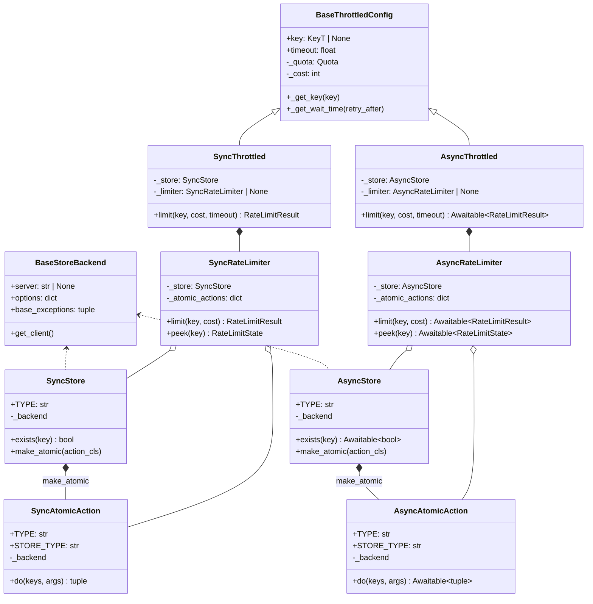
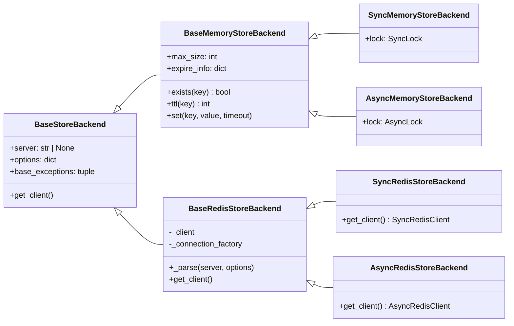
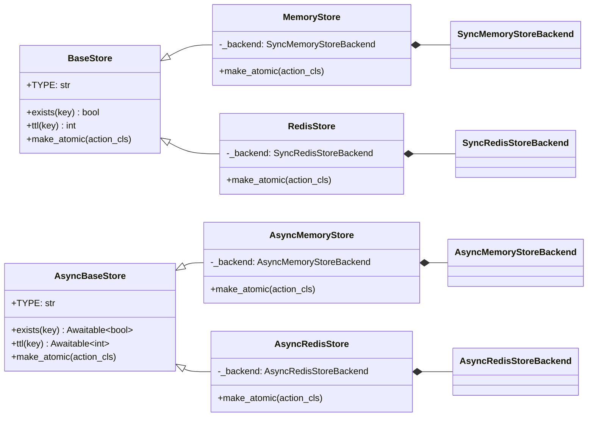
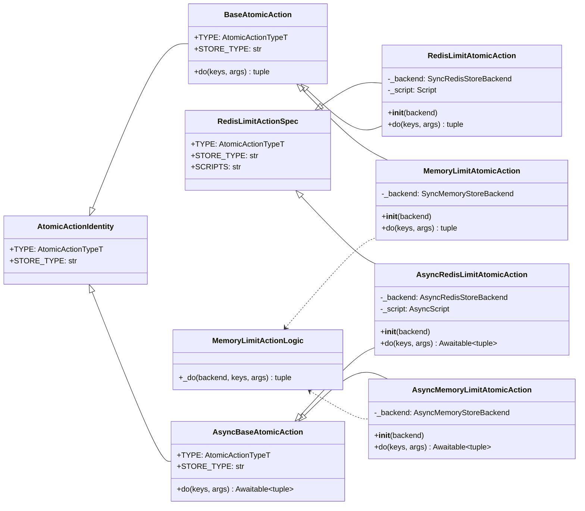
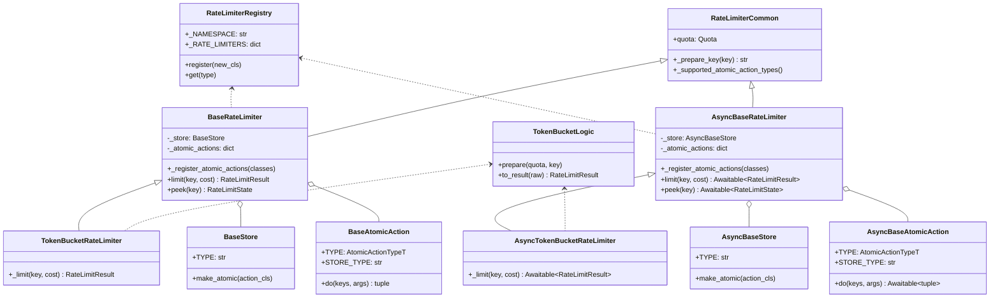
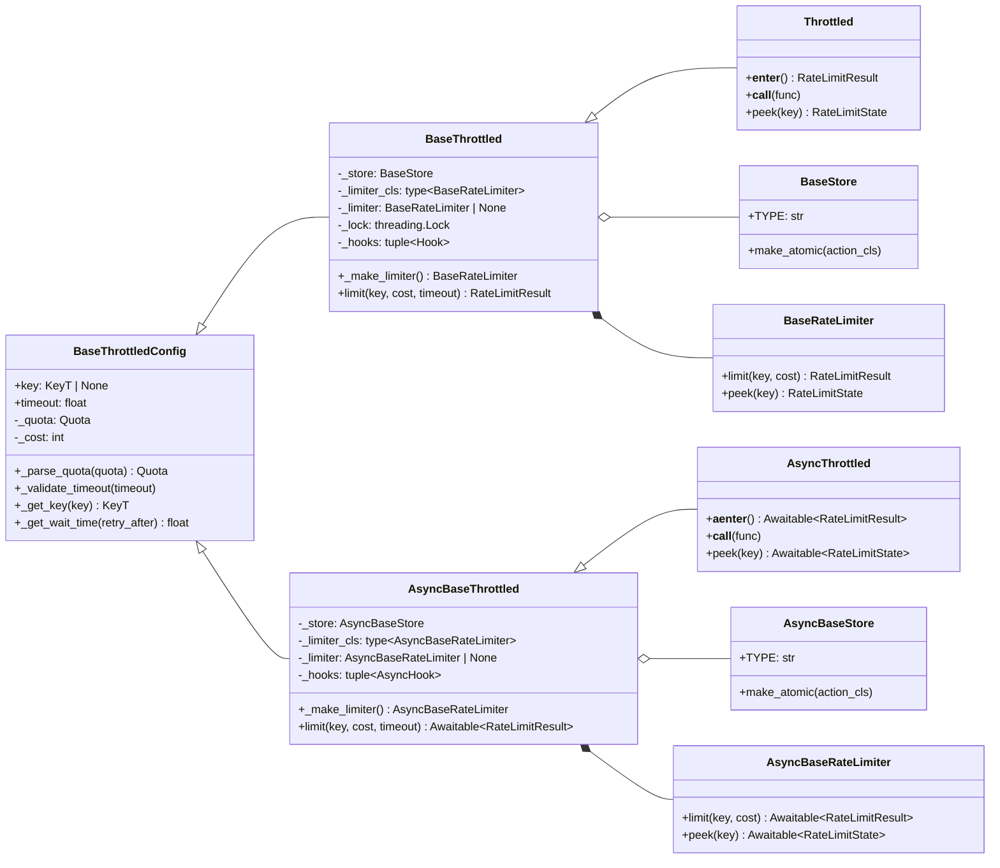

# Store 类型抽象边界优化 —— 实施方案

> 基于 [README.md](./README.md) 制定。

## 0x01 调研与约束

### a. 当前结论

本轮不再把问题收敛为「让 `BaseStore` 不带泛型」。

更根本的结论是：当前复杂度来自跨执行模型复用抽象，`Store`、`AtomicAction`、`RateLimiter` 与
`Throttled` 共享了 sync / async 不该共享的类型边界，只能用泛型、协议和 `cast` 把差异补回来。

新的设计原则：

> 复用只发生在无 I/O 形态差异的纯逻辑层：凡是出现 `def` / `async def`、锁、Redis script、client 协议或构造生命周期差异，就分叉。

### b. 复杂度来源

PR #159 把运行时配对关系放进泛型继承链后，`BaseStore` 变成 `BaseStore[_BackendT]`。

用户在表达「返回一个同步 store」时被迫回答「这个 store 绑定哪个 backend」：

| 用户写法 | 结果 | 问题 |
| --- | --- | --- |
| `_get_store() -> BaseStore` | 不通过 | 裸 `BaseStore` 缺泛型实参。 |
| `_get_store() -> BaseStore[BaseStoreBackend[object]]` | 不通过 | 具体 store 返回值类型不匹配。 |
| `_get_store() -> BaseStore[types.StoreBackendP]` | 不通过 | backend 协议不能代表具体 store。 |
| `_get_store() -> types.SyncStoreP` | 通过 | 用户需要理解内部协议类型。 |

这个现象只是入口症状。真正被揉在一起的是 `3` 条变化轴：

| 变化轴 | 当前形态 | 问题 |
| --- | --- | --- |
| sync / async 执行模型 | `SyncStoreP` / `AsyncStoreP`、`SyncAtomicActionP` / `AsyncAtomicActionP` 与 `BaseThrottledMixin` 泛型化。 | 执行模型差异扩散到核心泛型。 |
| 公共 API 能力边界 | `BaseStore[_BackendT]` 同时作为用户注解和实现基类。 | 内部 backend 类型泄漏到用户侧。 |
| backend / action 配对 | `BaseStore.make_atomic()` 与 `BaseAtomicAction[_BackendT]` 绑定同一个 backend 类型。 | 配对关系真实存在，但位置过高。 |

### c. 复用判定

可共享内容必须满足 `2` 个条件：

1. 不区分 `def` / `async def`。
2. 不直接持有锁、Redis script、客户端协议或懒加载资源。

按这个标准重新划分：

| 层 | 可以共享 | 必须分叉 |
| --- | --- | --- |
| Backend | URL 解析、options 归一化、异常族声明。 | sync / async Redis client 协议和连接默认值。 |
| AtomicAction | Redis Lua 脚本常量、Memory 纯计算函数。 | `Script` / `AsyncScript`、`do()` / `async do()`、锁进入方式。 |
| Store | 命令名称、参数校验、异常包装规则。 | 公共基类、`make_atomic()` 构造、sync / async 方法签名。 |
| RateLimiter | quota 结构、key 生成、结果解释纯函数。 | `limit()` / `peek()` 执行入口、store / action 类型、await 边界。 |
| Throttled | quota 解析、timeout / cost 校验、等待时间计算。 | limiter 懒加载、hooks、context manager、装饰器执行形态。 |

## 0x02 架构设计

### a. 改造后架构

目标结构从底向上分为「backend 资源层」「store / action 执行层」「limiter 组合层」和「throttled 用户入口层」。

核心变化：`Base*` 只表达公共能力，具体类自己持有 `_backend`。

`BackendBoundStore` 与 `BackendBoundAtomicAction` 不进入目标结构。



结构不变量：

- `BaseStore` 与 `asyncio.store.BaseStore` 都是公共零泛型边界。
- 具体 store 拥有 `_backend`、`_BACKEND_CLASS` 与 `make_atomic()`。
- 具体 action 拥有 `_backend` 与构造函数。
- sync limiter 只接收 sync store / action，async limiter 只接收 async store / action。
- 共享层不能访问 `_backend`、锁、script、`await` 或 registry 返回类。

执行端命名规则：

- 源码里的 sync 与 async 类采用同名规则，通过模块路径区分执行端。
- 本文后续写 `MemoryStoreBackend`、`BaseStore` 或 `BaseRateLimiter` 时，默认指当前执行端的同名类。
- 类图同时展示两端时，可以使用 `Sync*` / `Async*` 作为图内别名，不表示源码类名带该前缀。

本文抽象命名约定：

| 名称 | 含义 | 使用边界 |
| --- | --- | --- |
| `Base*` | 对外可继承或可注解的能力边界。 | 不能携带 backend 泛型进入普通用户签名。 |
| `*Common` | 跨 sync / async 共享的纯逻辑。 | 不能访问 I/O、锁、script、registry 或生命周期状态。 |
| `*Spec` / `*Logic` | 常量、Lua 脚本声明或纯计算函数。 | 只能被执行层调用，不能反向依赖 store / limiter。 |

## 0x03 开发方案

开发从资源层往用户入口推进：Backend 固定资源形态，Store 固定公共能力与 backend 所有权，AtomicAction 固定原子执行入口，RateLimiter 固定组合关系，Throttled 固定用户生命周期。

### a. Backend 改造

Backend 层只处理资源接入。

它可以共享 URL 解析、options 归一化、异常族声明和 Memory 数据结构。

它不能替 Store 或 AtomicAction 表达 sync / async 执行能力，也不能把 Redis client 协议继续向上游透出。



职责分配：

| 责任 | 所属对象 | 上层看到什么 |
| --- | --- | --- |
| backend 通用配置 | `BaseStoreBackend` | `server`、`options`、`base_exceptions` 和 `get_client()`。 |
| Memory 数据结构 | `BaseMemoryStoreBackend` | `exists()`、`ttl()`、`set()` 等无 I/O 形态差异的操作。 |
| Memory 锁 | `MemoryStoreBackend` | 具体 store 和 action 拿到本端锁，不通过公共协议判断。 |
| Redis 连接解析 | `BaseRedisStoreBackend` | URL、options 和异常族在 Redis backend 内部收敛。 |
| Redis client | `RedisStoreBackend` | 具体 store 和 action 只接收本端 client。 |

取用路径：

1. Store 和 AtomicAction 直接持有具体 backend。
2. 异常包装读取 backend 声明的异常族，不再绕一层 `StoreBackendP`。

收敛结果：

- `StoreBackendP` 移除，公共异常包装依赖 `BaseStoreBackend` 或私有局部协议。
- `MemoryStoreBackendP` 移除，Memory 纯逻辑直接接收 `BaseMemoryStoreBackend`。
- Redis client 结构类型退出公共 `types.py` 的 `*P` 命名体系。
- Redis client 若仍需结构化约束，只能放在私有类型模块或具体 backend 内部。

### b. Store 改造

Store 是用户、Throttled、RateLimiter 共同依赖的能力边界。

它表达「一个 store 能做什么」，不表达「这个 store 绑定哪种 backend」。

`BaseStore` 可以代表 sync Redis / Memory store：上层只需要命令签名、`TYPE` 和 `make_atomic()`。

backend 类型由 `MemoryStore`、`RedisStore` 这类具体 store 自己持有。



职责分配：

| 责任 | 所属对象 | 设计约束 |
| --- | --- | --- |
| 公共 store 能力 | `BaseStore` | 只声明本端命令、`TYPE` 和 `make_atomic()`，不带 backend 泛型。 |
| backend 所有权 | `MemoryStore`、`RedisStore` 及 async 对应类 | 声明并初始化自己的 `_backend`，不把 `_backend` 类型提升到基类。 |
| action 构造 | 具体 store 的 `make_atomic()` | 把自己的 backend 传给本端 action，构造期异常在本层收敛。 |
| 校验与包装 | 私有函数或具体 store 显式调用 | 参数校验和异常包装不再通过 mixin 注入。 |

取用路径：

1. 用户代码、Throttled 和 RateLimiter 只把 store 看成对应执行端的 `BaseStore`。
2. 运行时落到 `MemoryStore` 或 `RedisStore` 后，具体 store 使用自己的 `_backend` 完成命令和 action 构造。
3. RateLimiter 通过 `store.make_atomic(action_cls)` 获得本端 action，不直接读取 backend。

收敛结果：

| 移除对象 | 移除原因 | 替代边界 |
| --- | --- | --- |
| `BackendBoundStore` | 它把 backend 绑定重新抽成中间层，抵消具体 store 自己定义 `__init__` 的收益。 | 具体 store 直接持有 `_backend`。 |
| `BaseStoreMixin` | mixin 隐藏了基类对 `_backend` 的假设。 | 私有函数或具体 store 显式调用。 |
| `SyncStoreP` / `AsyncStoreP` / `StoreP` | 公共 `BaseStore` 已经能表达上层需要的 store 能力。 | `BaseStore`。 |

### c. AtomicAction 改造

AtomicAction 是 backend 配对真正发生的地方。

Store 负责把自己的 backend 交给 action，action 负责把一次原子操作执行完。

这一层只能共享身份字段、Redis Lua 脚本常量和 Memory 纯计算。

`do()`、Redis script 对象、锁进入方式和异常包装都属于具体执行端。



职责分配：

| 责任 | 所属对象 | 设计约束 |
| --- | --- | --- |
| action 身份 | `AtomicActionIdentity` | 只放 `TYPE` 与 `STORE_TYPE`，不声明 `do()`。 |
| sync 执行能力 | `BaseAtomicAction` | 声明 `def do(...)`，只被 sync RateLimiter 消费。 |
| async 执行能力 | `BaseAtomicAction` | 声明 `async def do(...)`，只被 async RateLimiter 消费。 |
| Redis 脚本声明 | `RedisLimitActionSpec` 等 `*Spec` | 只放 identity 与脚本常量，不持有 script 实例。 |
| Memory 纯逻辑 | `MemoryLimitActionLogic` 等 `*Logic` | 只执行与锁无关的纯计算。 |
| backend 与包装 | 具体 action | 自己声明 `__init__(backend)`、`_backend`、script 实例和异常包装。 |

取用路径：

1. Store 在 `make_atomic()` 中选择 action 类并注入 backend。
2. RateLimiter 只保存 action 实例，只调用本端 `do()`。

收敛结果：

| 移除对象 | 移除原因 | 替代边界 |
| --- | --- | --- |
| `BackendBoundAtomicAction` | 具体 action 已经需要声明本端 backend、script 和 `do()`，中间类只会制造第二层构造协议。 | 具体 action 直接定义构造函数。 |
| `BaseAtomicActionMixin` | mixin 同时承担身份和包装，容易把 `_backend` 假设塞回公共层。 | identity 基类、`*Spec`、`*Logic` 分别承载。 |
| `SyncAtomicActionP` / `AsyncAtomicActionP` | 本端 `BaseAtomicAction` 已经表达执行能力。 | `BaseAtomicAction`。 |

### d. RateLimiter 改造

RateLimiter 负责把 store、action 和算法组合起来。

它可以共享算法准备和结果解释，但不能共享执行入口。

sync limiter 只接收 sync store 和 sync action。

async limiter 只接收 async store 和 async action。



职责分配：

| 责任 | 所属对象 | 设计约束 |
| --- | --- | --- |
| 注册表能力 | `RateLimiterRegistry` | 只处理 limiter 类型注册和查找，不关心执行端。 |
| 算法公共部分 | `RateLimiterCommon` 与 `*Logic` | 只放 quota、key 准备、结果构造和脚本结果解释。 |
| sync 组合 | `BaseRateLimiter` | 持有 sync store 和 sync action，声明 `def limit()` / `def peek()`。 |
| async 组合 | `BaseRateLimiter` | 持有 async store 和 async action，声明 `async def limit()` / `async def peek()`。 |
| action 注册 | sync / async limiter 基类 | 各自通过本端 store 构造 action，允许少量重复。 |

取用路径：

1. Throttled 从本端 registry 取 limiter 类。
2. limiter 初始化时接收本端 store。
3. limiter 通过 `store.make_atomic()` 得到本端 action。
4. 算法执行只调用本端 action，不再跨端泛型分派。

收敛结果：

| 移除对象 | 移除原因 | 替代边界 |
| --- | --- | --- |
| `BaseRateLimiterMixin` | 它把 sync / async store、action 和执行入口压进同一个泛型模板。 | `BaseRateLimiter` 各自声明组合状态。 |
| `StoreForLimiterP` | limiter 不需要通过协议猜测 store 能力。 | 对应执行端的 `BaseStore`。 |
| `StoreT` / `ActionT` | 跨端 TypeVar 只为复用 mixin 服务。 | 本端字段类型和本端 action 基类。 |

### e. Throttled 改造

Throttled 是用户入口。

它可以共享配置解析，但不能共享 limiter 懒加载、hook 执行、context manager 和装饰器调用形态。

这一层只消费下层已经收好的边界：sync 入口拿 sync store 与 sync limiter，async 入口拿 async store 与 async limiter。



职责分配：

| 责任 | 所属对象 | 设计约束 |
| --- | --- | --- |
| 配置解析 | `BaseThrottledConfig` | 只处理 quota、cost、key、timeout 和等待时间计算。 |
| sync 组合状态 | `BaseThrottled` | 持有 sync store、limiter 类、limiter 实例、锁和 sync hook。 |
| async 组合状态 | `BaseThrottled` | 持有 async store、limiter 类、limiter 实例和 async hook。 |
| 用户入口 | `Throttled` | 保持公开调用路径，执行形态在本端完成。 |

取用路径：

1. 用户仍实例化 `Throttled` 或 `throttled.asyncio.Throttled`。
2. 构造期只接受本端 store，`_make_limiter()` 只返回本端 limiter。

收敛结果：

| 移除对象 | 移除原因 | 替代边界 |
| --- | --- | --- |
| `BaseThrottledMixin` | 它把 store、limiter、hook 和生命周期状态统一成跨端泛型。 | `BaseThrottledConfig` 只共享配置，组合状态在本端基类。 |
| `_make_limiter()` 跨端 cast | limiter 类和 store 已在本端确定，不需要通过 TypeVar 找回类型。 | 两端 `_make_limiter()` 各自返回本端 limiter。 |
| `types.StoreP` 默认 store 类型 | 默认 store 只属于本端入口。 | sync / async 构造签名各自使用本端 `BaseStore`。 |

## 0x04 验收与验证

验收证明两件事：用户公共 API 变简单，内部 sync / async 分界变清楚。

| 维度 | 验收点 |
| --- | --- |
| 用户类型流 | 同步 `_get_store() -> BaseStore` 与异步 `_get_store() -> asyncio.store.BaseStore` 都能返回 `MemoryStore` 或 `RedisStore`。 |
| Throttled 组合 | `Throttled(store=_get_store())` 与 async `Throttled(store=...)` 在 mypy strict 下通过。 |
| Store 边界 | 公共 `BaseStore` 可代表 Redis / Memory store，不带泛型，不持有 `_backend`，不新增 `BackendBoundStore`。 |
| AtomicAction 边界 | Redis action 不共享执行 core，Memory action 只共享 `_do()` 纯逻辑。 |
| RateLimiter 边界 | sync limiter 不依赖 async 协议，async limiter 不依赖 sync 协议，核心实现不再使用 `StoreP` 或 `StoreForLimiterP`。 |
| Throttled 边界 | `_make_limiter()` 不再需要跨端泛型 cast，hooks 和 limiter 懒加载在各自执行层完成。 |
| 类型清理 | 公共 `*P` 协议、跨端泛型 TypeVar 与 `*Mixin` 不再出现在核心实现和推荐文档中。 |
| 包装机制 | 拥有 `_backend` 的内建 store / action 仍统一抛 `StoreUnavailableError`，公共基类不隐式要求 `_backend`。 |
| 回归 | 项目既有测试入口、mypy strict、文档中涉及公共 API 的示例通过。 |

建议新增独立类型验收文件，只覆盖公共 API 类型流。

类型验收文件放在 `typing_checks/` 这类非 `tests.*` 包下。

原因：

- 项目 `pyproject.toml` 已对 `tests.*` 放宽 mypy strict 规则。
- 公共 API 的类型验收必须避开该覆盖配置。

同步验收：

```python
# typing_checks/store_boundary_sync.py
from throttled import BaseStore, MemoryStore, RedisStore, Throttled


def get_store(use_redis: bool) -> BaseStore:
    if use_redis:
        return RedisStore(server="redis://127.0.0.1:6379/0")
    return MemoryStore()


throttled = Throttled(store=get_store(False))
```

异步验收：

```python
# typing_checks/store_boundary_async.py
from throttled.asyncio import BaseStore, MemoryStore, RedisStore, Throttled


def get_store(use_redis: bool) -> BaseStore:
    if use_redis:
        return RedisStore(server="redis://127.0.0.1:6379/0")
    return MemoryStore()


throttled = Throttled(store=get_store(False))
```

类型检查入口：

```bash
uv run --no-sync mypy throttled typing_checks
```

## 0x05 实施进展

| 时间 | 对应设计片段 | 结论调整概要 | 改动 / 验证 |
| --- | --- | --- | --- |
| `2026-05-10 20:00` | `0x01` 至 `0x04` | [1] 推倒旧的 `BaseStore` 局部止血方案<br />[2] 新方案改为自底向上重画 sync / async 分界<br />[3] 架构设计只保留整体改造类图和不变量<br />[4] 开发方案按 Backend、Store、AtomicAction、RateLimiter、Throttled 对象分层<br />[5] 每层改为「责任分配、取用路径、收敛结果」的方案结构<br />[6] 明确 sync / async 采用同名类，通过模块路径区分执行端<br />[7] 判定 `BackendBoundStore` 与 `BackendBoundAtomicAction` 不进入目标结构<br />[8] 公共 `*P` 协议、跨端泛型 TypeVar 与 `*Mixin` 均从目标结构移除 | [1] 已重新核对当前 Store、AtomicAction、RateLimiter、Throttled 继承链<br />[2] 已删除开发方案开头的阅读说明式空话<br />[3] 已把协议、mixin、异常包装和类型清理约束下沉到对应对象层级<br />[4] 已补充执行端命名规则，类图保留 `Sync*` / `Async*` 图内别名<br />[5] `pre-commit run --files` 通过<br />[6] `git diff --check` 通过 |
| `2026-05-06 00:00` | `0x01` 至 `0x04` | [1] 旧方案形成 `BaseStore` + `BackendBoundStore[_BackendT]` 两层结构<br />[2] 该方案后续被判定为局部止血，不能覆盖 RateLimiter / AtomicAction 的复用边界问题 | [1] 已核对 HTTPX `BaseTransport` 与 openai `_base_client.py` / `_client.py` / `__init__.py` 源码<br />[2] 已复现 `BaseStore` 裸用失败与公共类零泛型需求 |

## 0x06 参考

- [mypy strict 模式合规改造方案](../2026-04-06-mypy-strict-compliance/PLAN.md)
- [优化存储不可用时的异常处理方案](../2026-05-03-store-unavailable-error-handling/PLAN.md)
- [同步异步共用 Mixin 的泛型类型窄化](../../troubleshooting/generic-mixin-type-narrowing.md)
- [HTTPX Transports 文档](https://www.python-httpx.org/advanced/transports/)
- [HTTPX `BaseTransport` 源码](https://github.com/encode/httpx/blob/master/httpx/_transports/base.py)
- [HTTPX `Client` 源码](https://github.com/encode/httpx/blob/master/httpx/_client.py)
- [openai-python `OpenAI` / `AsyncOpenAI` 源码](https://github.com/openai/openai-python/blob/main/src/openai/_client.py)
- [openai-python `BaseClient` 源码](https://github.com/openai/openai-python/blob/main/src/openai/_base_client.py)

## 0x07 版本锚点

- 建议分支：`refactor/260510_sync_async_boundary`
- PR：待创建。
