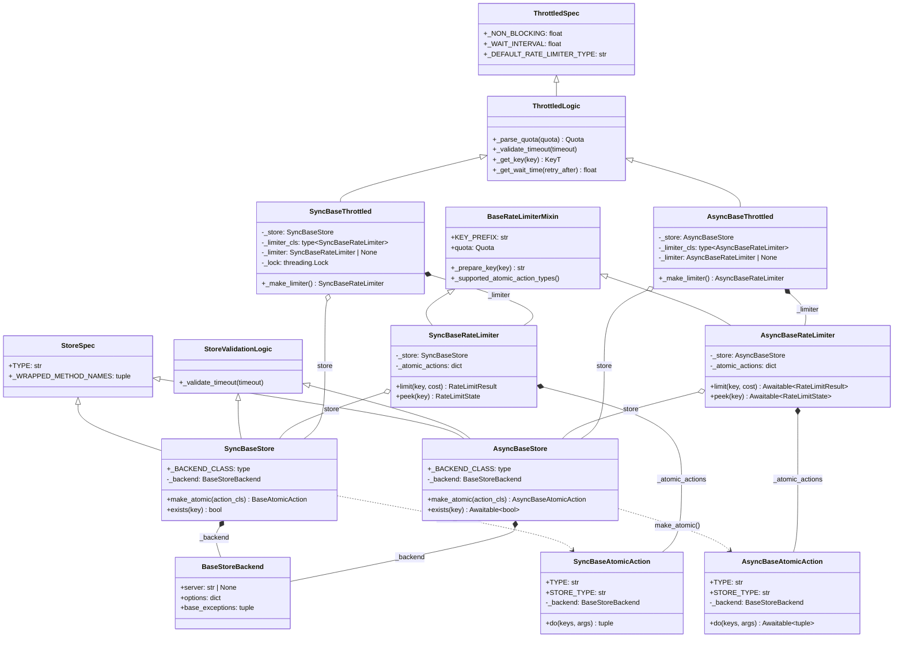
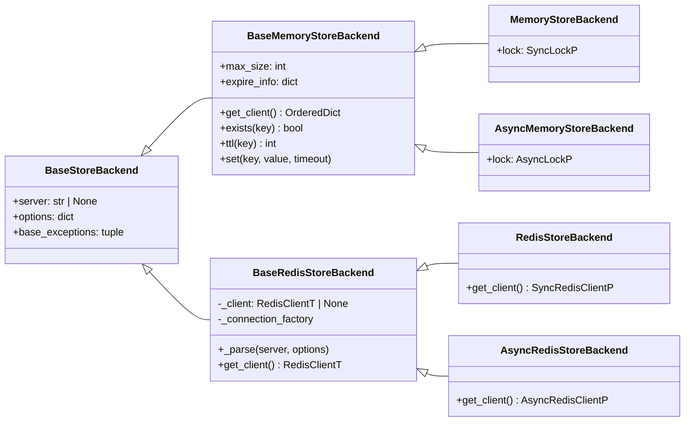
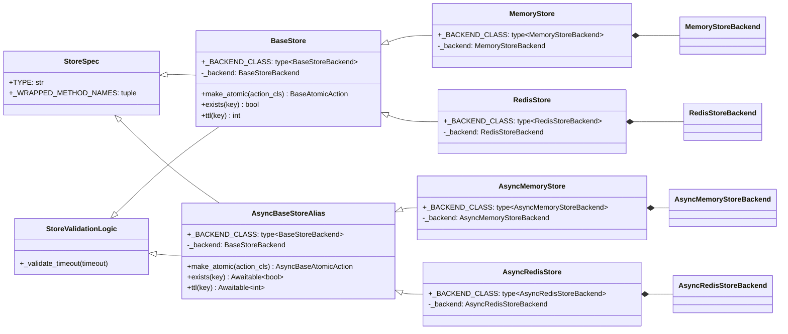
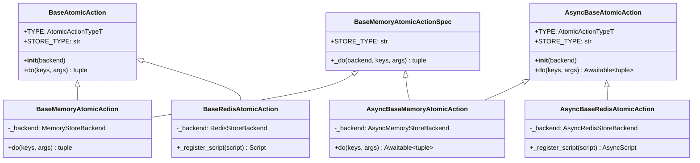
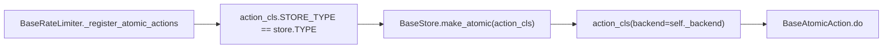
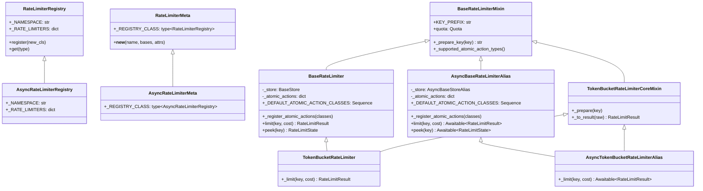
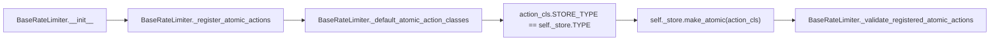
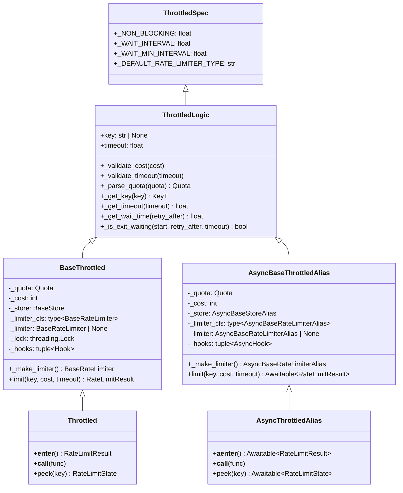

# Store 类型抽象边界优化 —— 实施方案

本版沿用原方案的写作骨架，以当前分支实现回填结论、边界与架构图。

当前代码基线为 `refactor/260511_mypy_strict_typing_new` 相对 `main`。

仓库本地没有 `master` ref，本文按 `main` / `origin/main` 作为主干基线。

本文只沉淀当前有效方案，不追加阶段日志。

## 0x01 调研与约束

### a. 症状

`mypy strict` 改造后，`BaseStore` 曾从零泛型公共边界变为 `BaseStore[_BackendT]`。

用户在表达“返回一个同步 Store”时，被迫回答内部 backend 类型：

| 用户写法 | 原阻断 | 当前目标 |
| --- | --- | --- |
| `_get_store() -> BaseStore` | 裸 `BaseStore` 缺泛型实参。 | 作为用户侧标准写法。 |
| `_get_store() -> BaseStore[BaseStoreBackend[object]]` | 具体 `Store` 返回类型不匹配。 | 不再需要写 backend 实参。 |
| `_get_store() -> BaseStore[types.StoreBackendP]` | 协议不能代表具体 `Store`。 | 不再暴露 `StoreBackendP`。 |
| `_get_store() -> types.SyncStoreP` | 需要用户理解内部协议。 | 删除 Store 侧 public 协议绕路。 |

当前有效问题不是“如何给 `BaseStore` 找到一个更宽的泛型实参”。

真实问题是：`StoreBackend` 与 `AtomicAction` 的配对关系存在，但它不应进入公共 API。

### b. 复杂度来源

入口症状由 `3` 条复用轴在公共边界交叉造成：

| 复用轴 | 原形态 | 当前收敛 |
| --- | --- | --- |
| sync 与 async 执行模型 | Store、AtomicAction、Throttled 通过跨端协议和泛型复用。 | 只共享纯逻辑，执行端各自声明生命周期。 |
| 公共 API 能力边界 | `BaseStore[_BackendT]` 同时充当用户注解与实现基类。 | `BaseStore` 回到零泛型公共边界。 |
| backend 与 action 配对 | `BaseStore.make_atomic()` 与 `BaseAtomicAction[_BackendT]` 共享类型变量。 | 配对下沉到具体 `Store` 与具体 action base。 |

结论从“让 `BaseStore` 不带泛型”的局部止血，升级为自底向上重画 sync / async 分界。

### c. 复用判定

复用原则：

- 仅在无 I/O 形态差异的纯逻辑层复用。
- 出现 `def` / `async def`、锁、Redis script、client 协议或构造生命周期差异时拆回两端。

满足共享需同时具备 `2` 个条件：

1. 不区分 `def` / `async def`。
2. 不直接持有锁、Redis script、client 协议或懒加载资源。

按此标准对每层重新划分：

| 层 | 可共享 | 必须分叉 |
| --- | --- | --- |
| `StoreBackend` | server、options、异常族、Redis URL 解析、Memory 数据结构。 | sync 与 async Redis client 协议、Memory 锁。 |
| `AtomicAction` | `TYPE`、`STORE_TYPE`、Lua 脚本常量、Memory 纯计算。 | `Script`、`AsyncScript`、`do()`、`async do()`、锁进入方式。 |
| `Store` | `TYPE`、包装方法声明、timeout 校验。 | 公共基类、命令签名、`make_atomic()` 返回类型。 |
| `RateLimiter` | `Quota`、结果对象、key 准备、算法纯计算。 | store/action 字段、注册表命名空间、`limit()`、`peek()`。 |
| `Throttled` | 默认常量、quota 解析、参数校验、等待时间计算。 | limiter 懒加载、hook、锁、context manager、装饰器。 |

## 0x02 架构设计

目标结构按“资源层 → 执行层 → 组合层 → 用户入口层”自底向上分层：

1. `StoreBackend` 固定资源形态。
2. `Store` 与 `AtomicAction` 固定执行入口。
3. `RateLimiter` 组合本端 Store 与 action。
4. `Throttled` 只消费下层已收口的本端对象。

核心约束：

- `Base*` 只表达公共能力，不能携带 `StoreBackend` 泛型进入用户签名。
- 具体类自持 `_backend`，不再引入 `BackendBoundStore` 或 `BackendBoundAtomicAction`。
- 共享层只能放 spec 与 logic，不承载生命周期。

### a. 整体类图



### b. 不变量

| 维度 | 不变量 |
| --- | --- |
| 公共边界 | sync / async 两端的 `BaseStore` 都是零泛型公共边界。 |
| backend 所有权 | 具体 `Store` 拥有 `_BACKEND_CLASS` 与窄化后的 `_backend`。 |
| action 所有权 | 具体 action base 拥有 backend 窄化、锁进入方式和 script 实例。 |
| limiter 配对 | `RateLimiter` 只消费本端 `BaseStore` 与本端 `BaseAtomicAction`。 |
| Throttled 共享层 | `ThrottledLogic` 不持有 `_store`、`_limiter`、hook 或锁。 |
| 文档入口 | sync / async `BaseThrottled.__init__` 各自保留完整 docstring。 |

### c. 命名约定

执行端命名：

| 项 | 约定 |
| --- | --- |
| 源码类名 | sync / async 同名，通过模块路径区分。 |
| 文中称呼 | 默认指当前执行端的同名类。 |
| 类图别名 | 同时展示两端时使用 `Sync*` / `Async*`，不代表源码类名带该前缀。 |

类图关系：

| 符号 | 关系 | 含义 |
| --- | --- | --- |
| `<|--` | 继承 | 子类直接继承父类能力边界。 |
| `*--` | 组合 | 左侧持有右侧，且右侧生命周期由左侧收口。 |
| `o--` | 关联 | 右侧由外部注入或独立存在，左侧长期持有引用。 |
| `..>` | 依赖 | 左侧只在工厂、注册或纯逻辑调用中使用右侧。 |

抽象命名：

| 名称 | 含义 | 使用边界 |
| --- | --- | --- |
| `Base*` | 对外可继承或可注解的能力边界。 | 不能携带 backend 泛型进入用户签名。 |
| `*Spec` | 常量、身份字段、脚本声明或静态规格。 | 不能持有执行期状态。 |
| `*Logic` | 校验、解析、计算和结果转换。 | 不能访问 I/O、锁、script 或 registry 生命周期。 |
| `*Mixin` | 已存在的局部复用形态。 | 只在收益明确时保留，不能重新引入跨端泛型。 |

## 0x03 开发方案

自底向上推进，每层一个责任。

每层先用架构图表达主结构。

架构图已经表达清楚的继承、组合和依赖关系，正文不再逐项复述。

存在稳定协议骨架时，先写协议骨架，再用改造点清单承接图外差异和对象去留。

协议骨架只展示当前小节所属对象。

上下游对象只以类型标注或流程图节点出现，不在骨架中展开。

| 层 | 责任 |
| --- | --- |
| `StoreBackend` | 固定资源形态。 |
| `Store` | 固定公共能力与 backend 所有权。 |
| `AtomicAction` | 固定原子执行入口。 |
| `RateLimiter` | 固定 store 与 action 的组合关系。 |
| `Throttled` | 固定用户入口和生命周期。 |

### a. `StoreBackend` 改造

`StoreBackend` 的目标是把资源接入从执行能力里剥离出来：

- 公共层只保留配置和异常族。
- Memory 层共享数据结构，本端 backend 只补锁。
- Redis 层共享解析与连接工厂，本端 backend 只补 client 协议。



**协议骨架**

协议骨架只展示 backend 层对象。

```python
class BaseStoreBackend:
    base_exceptions: tuple[type[Exception], ...] = ()

    def __init__(
        self,
        server: str | None = None,
        options: dict[str, Any] | None = None,
    ) -> None: ...


class BaseMemoryStoreBackend(BaseStoreBackend):
    max_size: int
    expire_info: dict[str, float]
    _client: OrderedDict[KeyT, StoreBucketValueT]

    def get_client(self) -> OrderedDict[KeyT, StoreBucketValueT]: ...
    def exists(self, key: KeyT) -> bool: ...
    def ttl(self, key: KeyT) -> int: ...
    def set(self, key: KeyT, value: StoreValueT, timeout: int) -> None: ...


class MemoryStoreBackend(BaseMemoryStoreBackend):
    lock: SyncLockP


class AsyncMemoryStoreBackend(BaseMemoryStoreBackend):
    lock: AsyncLockP


class BaseRedisStoreBackend(BaseStoreBackend, Generic[RedisClientT]):
    base_exceptions: tuple[type[Exception], ...]
    _client: RedisClientT | None
    _connection_factory: BaseConnectionFactory

    @classmethod
    def _parse(
        cls,
        server: str | None = None,
        options: dict[str, Any] | None = None,
    ) -> tuple[str | None, dict[str, Any]]: ...

    def get_client(self) -> RedisClientT: ...


class RedisStoreBackend(BaseRedisStoreBackend[SyncRedisClientP]): ...


class AsyncRedisStoreBackend(BaseRedisStoreBackend[AsyncRedisClientP]): ...
```

**改造点清单**

| 变更点 | 目标 |
| --- | --- |
| **[Keep]** `BaseStoreBackend` | 只保留 `server`、`options`、`base_exceptions`，不声明 `get_client()` |
| **[Keep]** `BaseMemoryStoreBackend` | 承载 LRU、TTL、hash 等 Memory 纯数据结构逻辑 |
| **[Keep]** sync / async `MemoryStoreBackend` | 只补本端锁，避免公共层判断锁形态 |
| **[Keep]** `BaseRedisStoreBackend` | 统一处理 URL、options、sentinel、cluster 与连接工厂 |
| **[Keep]** `SyncRedisClientP` / `AsyncRedisClientP` | 仅表达 Redis client 边界，由 `types.RedisClientT` 绑定 Redis backend |
| **[Keep]** `SyncLockP` / `AsyncLockP` | 仅表达 Memory 锁边界，由具体 Memory backend 字段使用 |
| **[Delete]** `types.StoreBackendP` | 公共异常包装只需要异常族，不再需要 backend 协议 |
| **[Delete]** `types.MemoryStoreBackendP` | Memory 纯逻辑直接接收 `BaseMemoryStoreBackend` |

**边界备注**

- `Store` 与 action 直接持有具体 backend，不再绕公共 backend 协议。
- Redis client 只从 Redis backend 取用，不进入 Store 公共 API。

### b. `Store` 改造

`Store` 是用户、`Throttled`、`RateLimiter` 共同依赖的能力边界。

改造后的分层：

- `BaseStore` 只表达“能做什么”，不携带 backend 泛型进入用户签名。
- `BaseStore` 持有 `_backend: BaseStoreBackend`，用于包装与统一构造。
- 具体 `Store` 声明 `_BACKEND_CLASS`，并把 `_backend` 窄化为本端具体 backend。
- `StoreSpec` 与 `StoreValidationLogic` 承担共享声明和共享校验。
- sync / async `BaseStore` 各自声明方法签名和 `make_atomic()` 返回类型。



**协议骨架**

协议骨架只展示 Store 层对象。

```python
class StoreSpec:
    TYPE: str
    _WRAPPED_METHOD_NAMES: tuple[str, ...]


class StoreValidationLogic:
    @classmethod
    def _validate_timeout(cls, timeout: int) -> None: ...


class BaseStore(StoreSpec, StoreValidationLogic):
    _BACKEND_CLASS: type[BaseStoreBackend] = BaseStoreBackend
    _backend: BaseStoreBackend

    def __init__(
        self,
        server: str | None = None,
        options: dict[str, Any] | None = None,
    ) -> None: ...

    def make_atomic(
        self,
        action_cls: type[BaseAtomicAction],
    ) -> BaseAtomicAction:
        # Store 只注入当前 backend，不表达 action 计算逻辑。
        return action_cls(backend=self._backend)

    def exists(self, key: KeyT) -> bool: ...
    def ttl(self, key: KeyT) -> int: ...


class MemoryStore(BaseStore):
    TYPE: str
    _BACKEND_CLASS: type[MemoryStoreBackend]
    _backend: MemoryStoreBackend


class RedisStore(BaseStore):
    TYPE: str
    _BACKEND_CLASS: type[RedisStoreBackend]
    _backend: RedisStoreBackend
```

async 端只改命令形态和 action 返回类型：

```python
class AsyncBaseStore(StoreSpec, StoreValidationLogic):
    _BACKEND_CLASS: type[BaseStoreBackend] = BaseStoreBackend
    _backend: BaseStoreBackend

    def make_atomic(
        self,
        action_cls: type[AsyncBaseAtomicAction],
    ) -> AsyncBaseAtomicAction: ...

    async def exists(self, key: KeyT) -> bool: ...
    async def ttl(self, key: KeyT) -> int: ...
```

**改造点清单**

| 变更点 | 目标 |
| --- | --- |
| **[Keep]** sync / async `BaseStore` | 作为用户与上层组合对象共同使用的零泛型注解边界 |
| **[Split]** `BaseStoreMixin` | 拆为 `StoreSpec` 与 `StoreValidationLogic`，分离声明、校验和生命周期 |
| **[Keep]** `_BACKEND_CLASS` / `_backend` | 由具体 `Store` 创建并窄化 backend，不成为新的公共协议 |
| **[Keep]** `make_atomic()` | 作为 Store / action 配对唯一入口，向 action 注入当前 `_backend` |
| **[No]** `BackendBoundStore` | 中间层会稀释具体 Store 的 backend 所有权，不进入方案 |
| **[Delete]** `types.SyncStoreP` / `types.AsyncStoreP` | 本端 `BaseStore` 已表达用户所需能力 |
| **[Delete]** `types.StoreP` | 跨端 Store 联合协议会把执行模型泄回用户侧 |

**边界备注**

- 具体 `Store` 无额外构造副作用时，不覆写 `__init__`。
- 具体 `Store` 需要更窄 backend 类型时，通过类属性重新声明 `_backend`。

### c. `AtomicAction` 改造

`AtomicAction` 有两条结构线：

- 继承链：`BaseAtomicAction` 如何分到 Memory / Redis。
- 初始化链：`RateLimiter` 如何通过 `Store.make_atomic()` 绑定当前 backend。

**继承链**



**初始化链**



**协议骨架**

协议骨架只展示 `AtomicAction` 层对象。

```python
class BaseAtomicAction:
    TYPE: AtomicActionTypeT
    STORE_TYPE: str
    _backend: BaseStoreBackend

    def __init__(self, backend: BaseStoreBackend) -> None: ...

    def do(
        self,
        keys: Sequence[KeyT],
        args: Sequence[StoreValueT] | None,
    ) -> tuple[int | float, ...]: ...


class BaseMemoryAtomicAction(BaseMemoryAtomicActionSpec, BaseAtomicAction):
    _backend: MemoryStoreBackend

    def do(
        self,
        keys: Sequence[KeyT],
        args: Sequence[StoreValueT] | None,
    ) -> tuple[int | float, ...]:
        # Memory 只共享 _do，锁进入方式留在本端 do / async do。
        ...


class BaseRedisAtomicAction(BaseAtomicAction):
    STORE_TYPE: str
    _backend: RedisStoreBackend

    def _register_script(self, scripts: str) -> Script:
        # Redis 只共享脚本常量，Script / AsyncScript 实例留在本端 action。
        ...
```

async 端只改执行形态和 backend 窄化，不重复列完整骨架：

```python
class AsyncBaseAtomicAction:
    async def do(
        self,
        keys: Sequence[KeyT],
        args: Sequence[StoreValueT] | None,
    ) -> tuple[int | float, ...]: ...


class AsyncBaseMemoryAtomicAction(
    BaseMemoryAtomicActionSpec,
    AsyncBaseAtomicAction,
):
    _backend: AsyncMemoryStoreBackend
```

**改造点清单**

| 变更点 | 目标 |
| --- | --- |
| **[Refine]** `BaseAtomicAction` | 去掉 backend 泛型，只保留身份、backend 注入和本端执行入口 |
| **[Add]** `BaseMemoryAtomicAction` | 收敛 Memory backend 窄化与锁进入方式 |
| **[Add]** `BaseRedisAtomicAction` | 收敛 Redis backend 窄化与 script 注册 |
| **[Keep]** `BaseMemoryAtomicActionSpec` | 继续共享 Memory 纯计算 |
| **[Keep]** `Redis*AtomActionSpec` | 继续共享 Redis Lua 脚本常量 |
| **[Delete]** `BaseAtomicActionMixin` | 避免把 `_backend` 假设重新抬到公共层 |
| **[Delete]** 单点 `*AtomicActionCoreMixin` | 单一子类复用收益不足，改由 `*AtomActionSpec` 或 `*ActionLogic` 表达 |
| **[Delete]** `types.SyncAtomicActionP` / `types.AsyncAtomicActionP` | 本端 `BaseAtomicAction` 已表达执行能力 |
| **[No]** `BackendBoundAtomicAction` | 继承链已表达 backend 绑定，不再引入中间层 |

### d. `RateLimiter` 改造

`RateLimiter` 有三条结构线：

- 继承链：registry、base 与算法 core 如何复用。
- 初始化链：limiter 如何用当前 store 注册 action。
- 执行链：sync / async 只在 `_limit()`、`_peek()` 与公共入口形态上分叉。

**继承链**



**初始化链**



**协议骨架**

协议骨架只展示 `RateLimiter` 层对象。

```python
class RateLimiterRegistry:
    _NAMESPACE: str
    _RATE_LIMITERS: dict[RateLimiterTypeT, type[Any]]

    @classmethod
    def get_register_key(cls, _type: str) -> str: ...

    @classmethod
    def register(cls, new_cls: type[Any]) -> None: ...

    @classmethod
    def get(cls, _type: RateLimiterTypeT) -> type[Any]: ...


class BaseRateLimiterMixin:
    KEY_PREFIX: str
    quota: Quota

    class Meta:
        type: RateLimiterTypeT

    @classmethod
    def _supported_atomic_action_types(cls) -> Sequence[AtomicActionTypeT]: ...

    def _prepare_key(self, key: str) -> str: ...


class BaseRateLimiter(BaseRateLimiterMixin):
    _store: BaseStore
    _atomic_actions: dict[AtomicActionTypeT, BaseAtomicAction]
    _DEFAULT_ATOMIC_ACTION_CLASSES: Sequence[type[BaseAtomicAction]]

    def __init__(
        self,
        quota: Quota,
        store: BaseStore,
        additional_atomic_actions: Sequence[type[BaseAtomicAction]] | None = None,
    ) -> None: ...

    def _register_atomic_actions(
        self,
        classes: Sequence[type[BaseAtomicAction]],
    ) -> None:
        # action 配对只经过当前 store，不引入跨端 StoreT / ActionT。
        ...

    def _limit(self, key: str, cost: int) -> RateLimitResult: ...
    def _peek(self, key: str) -> RateLimitState: ...
    def limit(self, key: str, cost: int = 1) -> RateLimitResult: ...
    def peek(self, key: str) -> RateLimitState: ...
```

async 端只改执行入口形态和本端类型：

```python
class AsyncRateLimiterRegistry(RateLimiterRegistry):
    _NAMESPACE: str
    _RATE_LIMITERS: dict[str, type[Any]]


class AsyncBaseRateLimiter(BaseRateLimiterMixin):
    _store: AsyncBaseStore
    _atomic_actions: dict[AtomicActionTypeT, AsyncBaseAtomicAction]

    async def _limit(self, key: str, cost: int) -> RateLimitResult: ...
    async def _peek(self, key: str) -> RateLimitState: ...
    async def limit(self, key: str, cost: int = 1) -> RateLimitResult: ...
    async def peek(self, key: str) -> RateLimitState: ...
```

**改造点清单**

| 变更点 | 目标 |
| --- | --- |
| **[Refine]** `BaseRateLimiterMixin` | 收窄为纯算法公共层，不再承载 store/action 字段 |
| **[Refine]** `BaseRateLimiter` | 分别持有本端 store、action 字典和执行入口 |
| **[Refine]** `RateLimiterRegistry` | 通过 `_NAMESPACE` 隔离 sync / async 同名算法 |
| **[Refine]** 算法 `*CoreMixin` | 只共享参数准备和结果转换，供两端算法类继承 |
| **[Keep]** `_DEFAULT_ATOMIC_ACTION_CLASSES` | 每个 limiter 自声明所需 action，不引入全局 action 注册表 |
| **[Delete]** `types.StoreForLimiterP` | limiter 不再通过协议猜测 store 能力 |
| **[Delete]** `types.StoreT` / `types.ActionT` | 跨端类型变量只服务旧 mixin |
| **[No]** 跨端 registry 表 | sync 与 async 必须隔离注册命名空间 |

### e. `Throttled` 改造

`Throttled` 的继承链已经能表达本节结构：

- `_throttled_common.py` 只承载 `ThrottledSpec` 与 `ThrottledLogic`。
- sync / async `BaseThrottled` 各自持有 store、limiter、hook 和执行生命周期。

**继承链**



**改造点清单**

| 变更点 | 目标 |
| --- | --- |
| **[Add]** `throttled/_throttled_common.py` | 只放 `ThrottledSpec` 与 `ThrottledLogic` |
| **[Add]** `ThrottledSpec` | 只声明默认限流器类型、非阻塞常量和等待间隔 |
| **[Add]** `ThrottledLogic` | 只承载 quota 解析、参数校验、key 解析和等待计算 |
| **[Refine]** `BaseThrottled` | 分别持有 store、limiter、hook、锁或 async 生命周期 |
| **[Keep]** sync / async `BaseThrottled.__init__` docstring | 文档生成依赖完整内容，禁止删减或调整换行 |
| **[Delete]** `BaseThrottledMixin` | 避免把 store、limiter、hook 与生命周期压进跨端泛型 |
| **[No]** `BaseThrottledConfig` | 避免混合校验、公共变量和生命周期 |
| **[Delete]** `_make_limiter()` 跨端 `cast` | 本端 registry 与 store 已能确定 limiter 类型 |
| **[Delete]** `types.StoreP` 默认 store 类型 | 默认 store 只属于本端入口，构造签名使用本端 `BaseStore` |

## 0x04 验收与验证

### a. 外部契约

只列方案对外可观测的契约，内部不变量见 `0x02.b`。

| 维度 | 契约 |
| --- | --- |
| 用户类型流 | `_get_store() -> BaseStore` 可返回 `MemoryStore` 或 `RedisStore`。 |
| async 用户类型流 | async `_get_store() -> BaseStore` 可返回 async `MemoryStore` 或 async `RedisStore`。 |
| `Throttled` 组合 | `Throttled(store=_get_store())` 在 mypy strict 下通过。 |
| async 组合 | `throttled.asyncio.Throttled(store=...)` 在 mypy strict 下通过。 |
| 异常透出 | 内建 Store 与 action 仍统一包装 backend 异常。 |
| 文档生成 | sync / async `BaseThrottled.__init__` docstring 保持完整。 |

### b. 类型验收用例

类型验收文件放在 `typing_checks/` 下。

该目录不属于 `tests.*` 包，能避开测试目录的 mypy 放宽配置。

同步用例：

```python
# typing_checks/store_boundary_sync.py
from throttled import BaseStore, MemoryStore, RedisStore, Throttled


def _get_store(use_redis: bool) -> BaseStore:
    if use_redis:
        return RedisStore(server="redis://127.0.0.1:6379/0")
    return MemoryStore()


_throttled = Throttled(store=_get_store(False))
```

异步用例：

```python
# typing_checks/store_boundary_async.py
from throttled.asyncio import BaseStore, MemoryStore, RedisStore, Throttled


def _get_store(use_redis: bool) -> BaseStore:
    if use_redis:
        return RedisStore(server="redis://127.0.0.1:6379/0")
    return MemoryStore()


_throttled = Throttled(store=_get_store(False))
```

### c. 回归口径

验证方案成立需覆盖 `4` 类入口：

1. `mypy strict` 覆盖 `throttled` 与 `typing_checks`。
2. ruff check 覆盖源码、类型验收和相关测试。
3. ruff format check 覆盖同一组文件。
4. pytest 覆盖完整 `tests/` 回归。

推荐命令：

```bash
uv run --no-sync mypy throttled typing_checks
uv run --no-sync ruff check throttled typing_checks tests/test_throttled.py tests/asyncio/test_throttled.py
uv run --no-sync ruff format --check throttled typing_checks tests/test_throttled.py tests/asyncio/test_throttled.py
uv run --no-sync pytest -n auto tests/ -q
```

## 0x05 参考

- [mypy strict 模式合规改造方案](../2026-04-06-mypy-strict-compliance/PLAN.md)
- [优化存储不可用时的异常处理方案](../2026-05-03-store-unavailable-error-handling/PLAN.md)
- [同步异步共用 Mixin 的泛型类型窄化](../../troubleshooting/generic-mixin-type-narrowing.md)
- [HTTPX Transports 文档](https://www.python-httpx.org/advanced/transports/)
- [HTTPX `BaseTransport` 源码](https://github.com/encode/httpx/blob/master/httpx/_transports/base.py)
- [HTTPX `Client` 源码](https://github.com/encode/httpx/blob/master/httpx/_client.py)
- [openai-python `OpenAI` / `AsyncOpenAI` 源码](https://github.com/openai/openai-python/blob/main/src/openai/_client.py)
- [openai-python `BaseClient` 源码](https://github.com/openai/openai-python/blob/main/src/openai/_base_client.py)

## 0x06 版本锚点

- 分支：`refactor/260511_mypy_strict_typing_new`
- PR：待创建。
