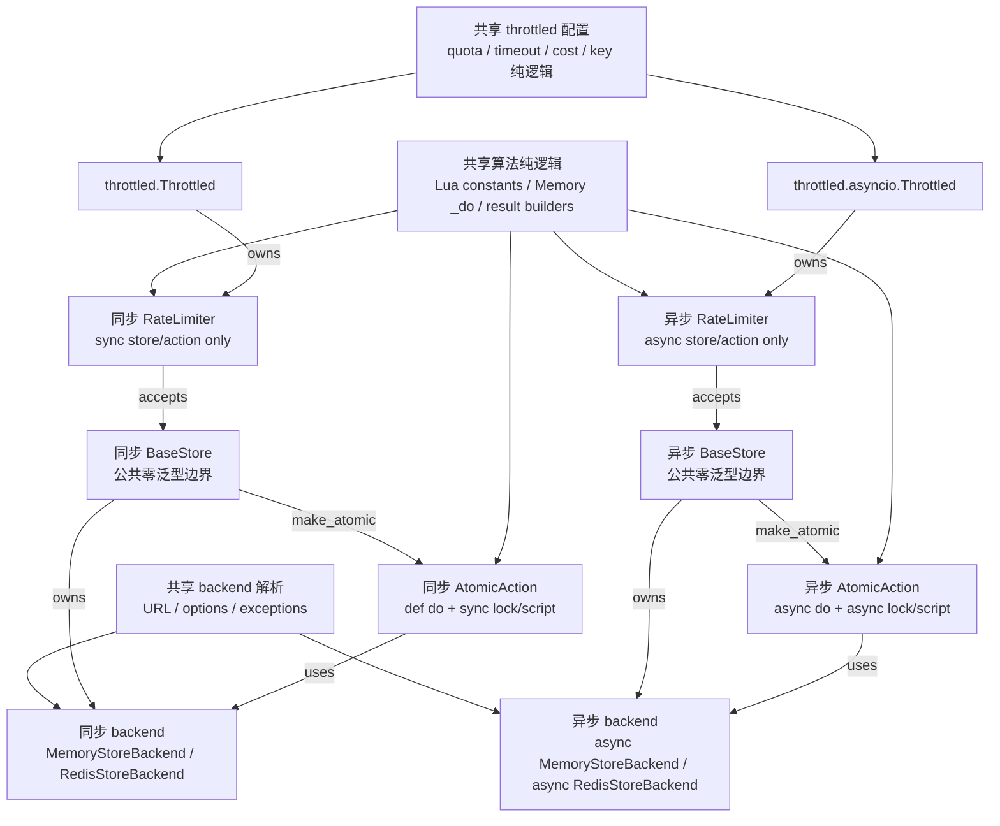

# Store 类型抽象边界优化 —— 实施方案

> 基于 [README.md](./README.md) 制定。

## 0x01 调研与约束

### a. 当前结论

本轮不再把问题收敛为「让 `BaseStore` 不带泛型」。

更根本的结论是：当前复杂度来自跨执行模型复用抽象，`Store`、`AtomicAction`、`RateLimiter` 与
`Throttled` 共享了 sync / async 不该共享的类型边界，只能用泛型、协议和 `cast` 把差异补回来。

新的设计原则：

> 复用只发生在无 I/O 形态差异的纯逻辑层：凡是出现 `def` / `async def`、锁、Redis script、client 协议或构造生命周期差异，就分叉。

### b. 复杂度来源

PR #159 把运行时配对关系放进泛型继承链后，`BaseStore` 变成 `BaseStore[_BackendT]`。

用户在表达「返回一个同步 store」时被迫回答「这个 store 绑定哪个 backend」：

| 用户写法 | 结果 | 问题 |
| --- | --- | --- |
| `_get_store() -> BaseStore` | 不通过 | 裸 `BaseStore` 缺泛型实参。 |
| `_get_store() -> BaseStore[BaseStoreBackend[object]]` | 不通过 | 具体 store 返回值不兼容。 |
| `_get_store() -> BaseStore[types.StoreBackendP]` | 不通过 | backend 协议不能代表具体 store。 |
| `_get_store() -> types.SyncStoreP` | 通过 | 用户需要理解内部协议类型。 |

这个现象只是入口症状。真正被揉在一起的是 `3` 条变化轴：

| 变化轴 | 当前形态 | 问题 |
| --- | --- | --- |
| sync / async 执行模型 | `SyncStoreP` / `AsyncStoreP`、`SyncAtomicActionP` / `AsyncAtomicActionP` 与 `BaseThrottledMixin` 泛型化。 | 执行模型差异扩散到核心泛型。 |
| 公共 API 能力边界 | `BaseStore[_BackendT]` 同时作为用户注解和实现基类。 | 内部 backend 类型泄漏到用户侧。 |
| backend / action 配对 | `BaseStore.make_atomic()` 与 `BaseAtomicAction[_BackendT]` 绑定同一个 backend 类型。 | 配对关系真实存在，但位置过高。 |

### c. 复用判定

可共享内容必须满足 `2` 个条件：

1. 不区分 `def` / `async def`。
2. 不直接持有锁、Redis script、客户端协议或懒加载资源。

按这个标准重新划分：

| 层 | 可以共享 | 必须分叉 |
| --- | --- | --- |
| Backend | URL 解析、options 归一化、异常族声明。 | sync / async Redis client 协议和连接默认值。 |
| AtomicAction | Redis Lua 脚本常量、Memory 纯计算函数。 | `Script` / `AsyncScript`、`do()` / `async do()`、锁进入方式。 |
| Store | 命令名称、参数校验、异常包装规则。 | 公共基类、`make_atomic()` 构造、sync / async 方法签名。 |
| RateLimiter | quota 结构、key 生成、结果解释纯函数。 | `limit()` / `peek()` 执行入口、store / action 类型、await 边界。 |
| Throttled | quota 解析、timeout / cost 校验、等待时间计算。 | limiter 懒加载、hooks、context manager、装饰器执行形态。 |

## 0x02 架构设计

### a. 自底向上分层

目标结构从底向上分为「共享纯逻辑层」和「sync / async 执行层」。



结构不变量：

- `BaseStore` 与 `asyncio.store.BaseStore` 都是公共零泛型边界。
- backend 精确配对只存在于内部执行层，不进入用户注解。
- sync limiter 只接收 sync store / action，async limiter 只接收 async store / action。
- 共享层不能访问 `_backend`、锁、script、`await` 或 registry 返回类。

本文命名约定：

| 名称 | 含义 | 使用边界 |
| --- | --- | --- |
| `Base*` | 对外可继承或可注解的能力边界。 | 不能携带 backend 泛型进入普通用户签名。 |
| `*Common` | 跨 sync / async 共享的纯逻辑。 | 不能访问 I/O、锁、script、registry 或生命周期状态。 |
| `BackendBound*` | 内建实现复用的 backend 绑定辅助类。 | 默认放在下划线模块，不作为稳定公共 API。 |
| `*Spec` / `*Logic` | 常量、Lua 脚本声明或纯计算函数。 | 只能被执行层调用，不能反向依赖 store / limiter。 |

### b. Store 边界

`BaseStore` 只表达同步 store 能力。

异步侧使用 `throttled.asyncio.store.BaseStore`。

用户工厂的目标形态：

```python
def _get_store(use_redis: bool) -> BaseStore:
    if use_redis:
        return store.RedisStore(server="redis://127.0.0.1:6379/0")
    return store.MemoryStore()
```

内部配对通过执行层辅助类承担：

```text
BaseStore
└── BackendBoundStore[MemoryStoreBackend | RedisStoreBackend]
    ├── MemoryStore
    └── RedisStore

asyncio.store.BaseStore
└── BackendBoundStore[AsyncMemoryStoreBackend | AsyncRedisStoreBackend]
    ├── async MemoryStore
    └── async RedisStore
```

`BaseStore` 仍声明 `make_atomic()`，因为 limiter 需要通过公共 store 能力创建 action。

但 `BaseStore` 不持有 `_backend`。

内建 store 通过 `BackendBoundStore` 实现 `make_atomic()`。

第三方 store 可以继承 `BaseStore` 并自行实现 `make_atomic()`。

### c. AtomicAction 边界

`AtomicAction` 的执行模型必须分叉，公共层只保留 identity。

公共 identity 只包含 `TYPE` 与 `STORE_TYPE`，不声明 `do()`。

执行基类分成两条：

| 基类 | 声明位置 | 执行入口 |
| --- | --- | --- |
| `BaseAtomicAction` | `throttled/store/base.py` | `def do(...)` |
| `BaseAtomicAction` | `throttled/asyncio/store/base.py` | `async def do(...)` |

Redis action 只共享 identity 与 Lua 脚本常量：

```text
RedisLimitActionSpec
├── TYPE / STORE_TYPE
└── SCRIPTS

Sync RedisLimitAtomicAction
├── _script: Script
└── def do(...)

Async RedisLimitAtomicAction
├── _script: AsyncScript
└── async def do(...)
```

Memory action 只共享纯计算函数：

```text
MemoryLimitActionLogic._do(backend, keys, args)
├── Sync MemoryLimitAtomicAction: with backend.lock
└── Async MemoryLimitAtomicAction: async with backend.lock
```

`BackendBoundAtomicAction[_BackendT]` 也按 sync / async 分叉。

它仅用于内建实现和结构化扩展。它可以放在下划线模块，但文档必须说明：

- 普通扩展继承 `BaseAtomicAction` 并实现完整构造。
- 需要复用 backend 构造协议时，可选择引用内部辅助类，但不把该辅助类作为稳定公共 API 承诺。

### d. RateLimiter 边界

RateLimiter 不再通过一个泛型 `BaseRateLimiterMixin[StoreT, ActionT]` 同时承载 sync 和 async。

新的边界：

| 层 | 声明位置 | 职责 |
| --- | --- | --- |
| `RateLimiterRegistry` 基础能力 | `throttled/rate_limiter/base.py` | 注册表键、注册、查找和错误收敛。 |
| `RateLimiterCommon` | `throttled/rate_limiter/_common.py` | `Quota`、`Rate`、`RateLimitState`、`RateLimitResult` 与 `_prepare_key()`。 |
| `BaseRateLimiter` | `throttled/rate_limiter/base.py` | sync store、sync action 注册、`def limit()` 和 `def peek()`。 |
| `BaseRateLimiter` | `throttled/asyncio/rate_limiter/base.py` | async store、async action 注册、`async def limit()` 和 `async def peek()`。 |
| 算法纯逻辑 | `throttled/rate_limiter/<algorithm>.py` | 参数准备、Lua 结果解释与 `RateLimitResult` 构造。 |

算法类仍按现有模块分布落地，但不要用继承级泛型强行共享执行入口。

例如 Token Bucket：

```text
TokenBucketLogic
├── prepare(quota, key)
├── refill_sec(...)
└── to_result(...)

Sync TokenBucketRateLimiter(SyncBaseRateLimiter)
└── def _limit(...) -> RateLimitResult

Async TokenBucketRateLimiter(AsyncBaseRateLimiter)
└── async def _limit(...) -> RateLimitResult
```

### e. Throttled 边界

`Throttled` 是最后迁移层，不先动它来掩盖下层问题。

共享层只保留配置和纯计算：

- `key`、`timeout`、`quota`、`cost` 初始化。
- `_validate_timeout()`、`_validate_cost()`、`_parse_quota()`。
- `_get_key()`、`_get_timeout()`、`_get_wait_time()`、`_is_exit_waiting()`。

执行层分叉：

| sync `Throttled` | async `Throttled` |
| --- | --- |
| `_store: store.BaseStore` | `_store: asyncio.store.BaseStore` |
| `_limiter: BaseRateLimiter | None` | `_limiter: asyncio.BaseRateLimiter | None` |
| `threading.Lock` | `asyncio.Lock` 或无需跨 event loop 共享的懒加载策略 |
| `def limit()` / `def peek()` | `async def limit()` / `async def peek()` |
| sync hooks | async hooks |

`_make_limiter()` 不再承载跨 sync / async 的泛型推导。

## 0x03 开发方案

### a. Backend 改造

Backend 层先收紧 client 类型边界，再向上支撑 store 和 action。

| 对象 | 声明位置 | 上层取用 | 收敛方式 |
| --- | --- | --- | --- |
| `BaseStoreBackend[_ClientT]` | `throttled/store/base.py` | sync / async backend 继承它。 | 只承载 `server`、`options`、`base_exceptions` 和 `get_client()`。 |
| `BaseRedisStoreBackend[_ClientT]` | `throttled/store/redis.py` | sync / async Redis backend 继承它。 | 只共享 URL 解析、options 归一化和异常族声明。 |
| `RedisStoreBackend` | `throttled/store/redis.py` | sync `RedisStore` 和 sync Redis action 使用。 | 绑定 `SyncRedisClientP`。 |
| `RedisStoreBackend` | `throttled/asyncio/store/redis.py` | async `RedisStore` 和 async Redis action 使用。 | 绑定 `AsyncRedisClientP`。 |
| `BaseMemoryStoreBackend` | `throttled/store/memory.py` | sync / async Memory backend 继承它。 | 共享 LRU / TTL 数据结构，不持有锁类型。 |
| `MemoryStoreBackend` | sync / async memory 模块 | 对应 Memory store 和 Memory action 使用。 | 只在具体 backend 初始化 sync lock 或 async lock。 |

禁止形态：

- 不把 `RedisP = SyncRedisClientP | AsyncRedisClientP` 继续向 store、action 或 limiter 扩散。
- 不通过 union client 在执行层判断是否需要 `await`。

### b. AtomicAction 改造

先拆 action，再拆 limiter：action 是 sync / async 差异最密集的层。

| 对象 | 声明位置 | 上层取用 | 收敛方式 |
| --- | --- | --- | --- |
| `AtomicActionIdentityP` | `throttled/types.py` | limiter 字典和注册筛选使用。 | 只声明 `TYPE` 与 `STORE_TYPE`。 |
| sync `BaseAtomicAction` | `throttled/store/base.py` | sync action 继承它。 | 只声明 `def do(...)`，不持有 backend 泛型。 |
| async `BaseAtomicAction` | `throttled/asyncio/store/base.py` | async action 继承它。 | 只声明 `async def do(...)`，不持有 backend 泛型。 |
| sync `BackendBoundAtomicAction[_BackendT]` | `throttled/store/_backend_bound.py` | 内建 sync action 继承它。 | 持有 `_backend`，并承担 `do()` 包装。 |
| async `BackendBoundAtomicAction[_BackendT]` | `throttled/asyncio/store/_backend_bound.py` | 内建 async action 继承它。 | 持有 `_backend`，并承担 async `do()` 包装。 |
| Redis action spec | 各算法模块的共享常量类 | sync / async Redis action 继承或组合它。 | 只共享 identity 与 Lua 脚本常量。 |
| Memory action logic | 各算法模块的纯函数或逻辑类 | sync / async Memory action 调用它。 | 只共享 `_do()`，锁和入口分叉。 |

包装机制跟随 backend-bound 辅助类下沉：

- 需要捕获 backend 异常的对象必须实现 `_backend: StoreBackendP`。
- `BaseAtomicAction` 本身不自动假设 `_backend` 存在。
- action 构造期异常仍由 store 的 `make_atomic()` 收敛。

### c. Store 改造

Store 层先恢复公共 API，再保留内建 backend 绑定。

| 对象 | 声明位置 | 上层取用 | 收敛方式 |
| --- | --- | --- | --- |
| sync `BaseStore` | `throttled/store/base.py` | 用户、sync limiter 和文档使用。 | 移除泛型，只声明 sync 命令和 `make_atomic()`。 |
| async `BaseStore` | `throttled/asyncio/store/base.py` | 用户、async limiter 和文档使用。 | 移除泛型，只声明 async 命令和 `make_atomic()`。 |
| sync `BackendBoundStore[_BackendT]` | `throttled/store/_backend_bound.py` | 内建 sync store 继承它。 | 持有 `_backend`，实现 `make_atomic()`。 |
| async `BackendBoundStore[_BackendT]` | `throttled/asyncio/store/_backend_bound.py` | 内建 async store 继承它。 | 持有 `_backend`，实现 `make_atomic()`。 |
| `MemoryStore` / `RedisStore` | sync / async store 模块 | limiter 和用户代码实例化它们。 | 继承对应 backend-bound 辅助类，并填死 backend 类型。 |
| 第三方 store | 用户代码 | 推荐继承对应 `BaseStore`。 | 自行决定是否持有 backend，并自行实现 `make_atomic()`。 |

包装机制要拆出 `BackendBoundStore` 的责任：

- `BaseStore` 不再因为 wrapper 隐式要求 `_backend`。
- 内建辅助类负责把 store 命令、`make_atomic()` 和 backend 异常包装关联起来。
- 第三方 store 若不使用辅助类，需要自行把底层异常转换为 `StoreUnavailableError`。

### d. RateLimiter 改造

RateLimiter 层按执行模型拆开，算法纯逻辑用函数或小辅助对象共享。

| 对象 | 声明位置 | 上层取用 | 收敛方式 |
| --- | --- | --- | --- |
| `RateLimiterRegistry` 基础能力 | `throttled/rate_limiter/base.py` | sync / async registry 继承。 | 共享注册表键、注册、查找和错误收敛。 |
| `RateLimiterCommon` | `throttled/rate_limiter/_common.py` | sync / async limiter 组合或继承。 | 只放 `Quota`、`RateLimitResult` 和 `_prepare_key()` 这类纯逻辑。 |
| sync `BaseRateLimiter` | `throttled/rate_limiter/base.py` | sync 算法 limiter 继承。 | 持有 `store.BaseStore` 与 `SyncAtomicActionP`。 |
| async `BaseRateLimiter` | `throttled/asyncio/rate_limiter/base.py` | async 算法 limiter 继承。 | 持有 `asyncio.store.BaseStore` 与 `AsyncAtomicActionP`。 |
| 算法纯逻辑 | `throttled/rate_limiter/<algorithm>.py` | sync / async 算法 limiter 调用。 | 只处理参数准备、返回值解释和 `RateLimitResult` 构造。 |
| action 注册 | sync / async limiter 基类 | 各自注册本端 action。 | 允许少量重复，避免 `StoreT` / `ActionT` 跨端传播。 |

`SyncStoreP` / `AsyncStoreP` 的定位调整：

- 不再作为内建 limiter 的主约束。
- 可保留为高级结构化类型文档入口。
- `StoreP` 作为 sync / async union alias 应废弃并从核心实现移除。

### e. Throttled 改造

Throttled 在下层完成后再收口。

| 对象 | 声明位置 | 上层取用 | 收敛方式 |
| --- | --- | --- | --- |
| `BaseThrottledConfig` | `throttled/throttled.py` | sync / async throttled 继承或组合。 | 只处理 `key`、`timeout`、`quota` 和 `cost`。 |
| sync `BaseThrottled` | `throttled/throttled.py` | sync `Throttled` 继承。 | 解析 sync registry、sync store、sync hooks 和 sync limiter。 |
| async `BaseThrottled` | `throttled/asyncio/throttled.py` | async `Throttled` 继承。 | 解析 async registry、async store、async hooks 和 async limiter。 |
| 构造签名 | sync / async 公开类 | 用户代码调用。 | 参数顺序保持一致，只有 `store` 与 `hooks` 类型不同。 |
| limiter 懒加载 | sync / async 具体层 | `limit()`、`peek()` 和 hook 上下文使用。 | `_make_limiter()` 直接返回本端 limiter，不做跨端 cast。 |

禁止形态：

- 共享层接触 `_store`、`_limiter_cls`、`_limiter`、`_hooks` 或 registry。
- 通过 `types.StoreP` 表达默认 store。
- 在 `_make_limiter()` 继续保留 `Callable[[Quota, _StoreT], _LimiterT]` 形式的 cast。

### f. 兼容策略

本次接受类型层面的破坏性变化，但保持常规运行时入口稳定。

| 影响面 | 策略 | 说明 |
| --- | --- | --- |
| `BaseStore[...]` 类型标注 | 作为类型层破坏性变化处理。 | 不加 `__class_getitem__` 兼容层，避免保留错误抽象。 |
| `BaseAtomicAction[...]` 类型标注 | 作为类型层破坏性变化处理。 | sync / async 执行基类分叉后，不再承诺统一泛型入口。 |
| `SyncStoreP` / `AsyncStoreP` | 保留公开协议。 | 只用于高级结构化扩展，不作为普通文档推荐写法。 |
| `StoreP` | 从核心实现移除，公开别名保留一个小版本。 | 版本说明中标注为已废弃的兼容别名。 |
| 下划线辅助类 | 不承诺公共稳定性。 | 文档可说明高级用法，但不放入 `__all__`。 |
| 构造参数与导入路径 | 保持稳定。 | `MemoryStore`、`RedisStore`、`Throttled` 常规调用方式不变。 |

### g. 迁移顺序

迁移必须自底向上，避免上层先用 cast 掩盖下层边界。

1. 收紧 Backend 的 sync / async client 协议和异常族入口。
2. 拆 AtomicAction 的 identity、sync 执行基类、async 执行基类和 backend-bound 辅助类。
3. 拆 Store 的公共零泛型边界与 backend-bound 辅助类。
4. 拆 RateLimiter 的 sync / async 基类，保留算法纯辅助对象。
5. 清理 `types.StoreP` 和核心实现中的 store union。
6. 拆 Throttled 的组合初始化，只共享配置和纯计算。
7. 更新文档、示例、测试夹具、类型验收和版本说明。

## 0x04 验收与验证

验收证明两件事：用户公共 API 变简单，内部 sync / async 分界变清楚。

| 维度 | 验收点 |
| --- | --- |
| 用户类型流 | 同步 `_get_store() -> BaseStore` 与异步 `_get_store() -> asyncio.store.BaseStore` 都能返回 `MemoryStore` 或 `RedisStore`。 |
| Throttled 组合 | `Throttled(store=_get_store())` 与 async `Throttled(store=...)` 在 mypy strict 下通过。 |
| Store 边界 | 公共 `BaseStore` 不带泛型，不持有 `_backend`，测试和文档不再出现 `BaseStore[Any]`。 |
| AtomicAction 边界 | Redis action 不共享执行 core，Memory action 只共享 `_do()` 纯逻辑。 |
| RateLimiter 边界 | sync limiter 不依赖 async 协议，async limiter 不依赖 sync 协议，核心实现不再使用 `StoreP`。 |
| Throttled 边界 | `_make_limiter()` 不再需要跨端泛型 cast，hooks 和 limiter 懒加载在各自执行层完成。 |
| 包装机制 | 使用内建 backend-bound 辅助类的 store / action 仍统一抛 `StoreUnavailableError`，第三方 store 边界写清楚。 |
| 回归 | 项目既有测试入口、mypy strict、文档中涉及 public API 的示例通过。 |

建议新增独立类型验收文件，只覆盖公共 API 类型流。

类型验收文件放在 `typing_checks/` 这类非 `tests.*` 包下。

原因：

- 项目 `pyproject.toml` 已对 `tests.*` 放宽 mypy strict 规则。
- 公共 API 的类型验收必须避开该覆盖配置。

同步验收：

```python
# typing_checks/store_boundary_sync.py
from throttled import BaseStore, MemoryStore, RedisStore, Throttled


def get_store(use_redis: bool) -> BaseStore:
    if use_redis:
        return RedisStore(server="redis://127.0.0.1:6379/0")
    return MemoryStore()


throttled = Throttled(store=get_store(False))
```

异步验收：

```python
# typing_checks/store_boundary_async.py
from throttled.asyncio import BaseStore, MemoryStore, RedisStore, Throttled


def get_store(use_redis: bool) -> BaseStore:
    if use_redis:
        return RedisStore(server="redis://127.0.0.1:6379/0")
    return MemoryStore()


throttled = Throttled(store=get_store(False))
```

类型检查入口：

```bash
uv run --no-sync mypy throttled typing_checks
```

## 0x05 实施进展

| 时间 | 对应设计片段 | 结论调整概要 | 改动 / 验证 |
| --- | --- | --- | --- |
| `2026-05-10 20:00` | `0x01` 至 `0x04` | [1] 推倒旧的 `BaseStore` 局部止血方案<br />[2] 新方案改为自底向上重画 sync / async 分界<br />[3] 明确 Backend、AtomicAction、Store、RateLimiter、Throttled 的复用分叉边界<br />[4] 修复 doc-style P0～P2：执行层不跨端复用，迁移顺序从 Backend 起步，验收覆盖 sync / async | [1] 已重新核对当前 Store、AtomicAction、RateLimiter、Throttled 继承链<br />[2] 已补齐声明位置、上层取用、收敛方式、兼容策略和类型验收<br />[3] `pre-commit run --files` 通过<br />[4] `git diff --check` 通过 |
| `2026-05-06 00:00` | `0x01` 至 `0x04` | [1] 旧方案形成 `BaseStore` + `BackendBoundStore[_BackendT]` 两层结构<br />[2] 该方案后续被判定为局部止血，不能覆盖 RateLimiter / AtomicAction 的复用边界问题 | [1] 已核对 HTTPX `BaseTransport` 与 openai `_base_client.py` / `_client.py` / `__init__.py` 源码<br />[2] 已复现 `BaseStore` 裸用失败与公共类零泛型需求 |

## 0x06 参考

- [mypy strict 模式合规改造方案](../2026-04-06-mypy-strict-compliance/PLAN.md)
- [优化存储不可用时的异常处理方案](../2026-05-03-store-unavailable-error-handling/PLAN.md)
- [同步异步共用 Mixin 的泛型类型窄化](../../troubleshooting/generic-mixin-type-narrowing.md)
- [HTTPX Transports 文档](https://www.python-httpx.org/advanced/transports/)
- [HTTPX `BaseTransport` 源码](https://github.com/encode/httpx/blob/master/httpx/_transports/base.py)
- [HTTPX `Client` 源码](https://github.com/encode/httpx/blob/master/httpx/_client.py)
- [openai-python `OpenAI` / `AsyncOpenAI` 源码](https://github.com/openai/openai-python/blob/main/src/openai/_client.py)
- [openai-python `BaseClient` 源码](https://github.com/openai/openai-python/blob/main/src/openai/_base_client.py)

## 0x07 版本锚点

- 建议分支：`refactor/260510_sync_async_boundary`
- PR：待创建。
