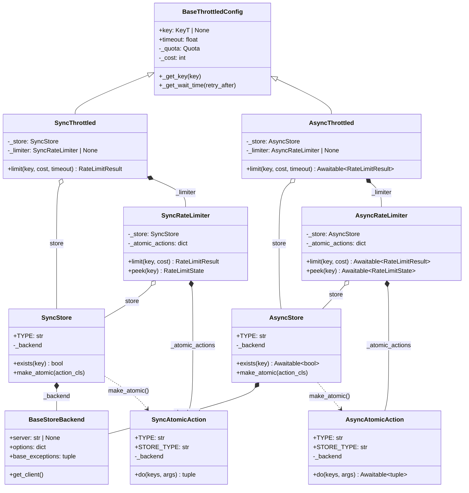
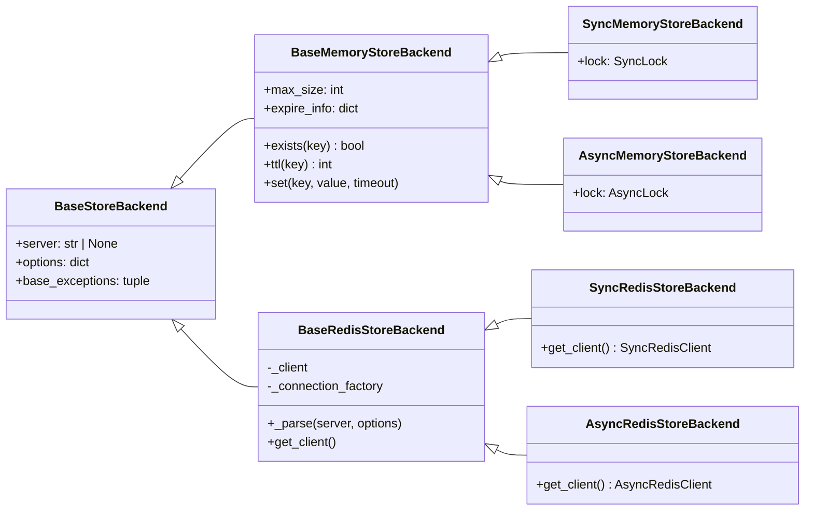
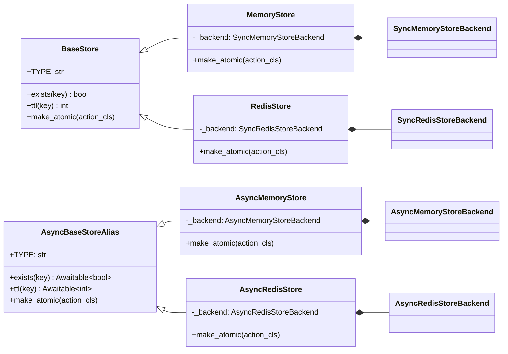
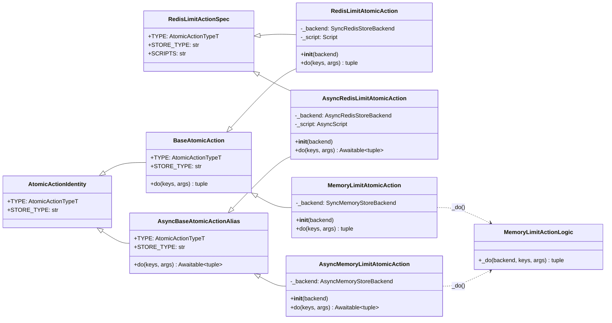
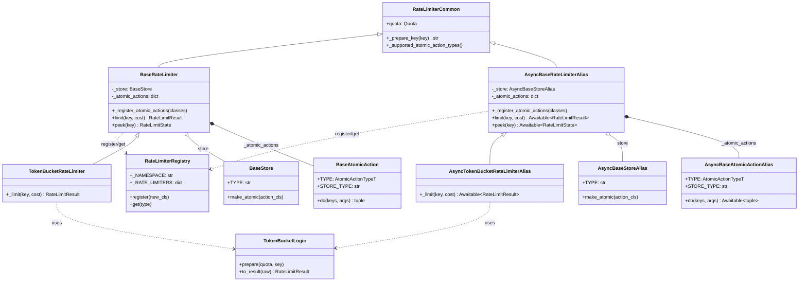
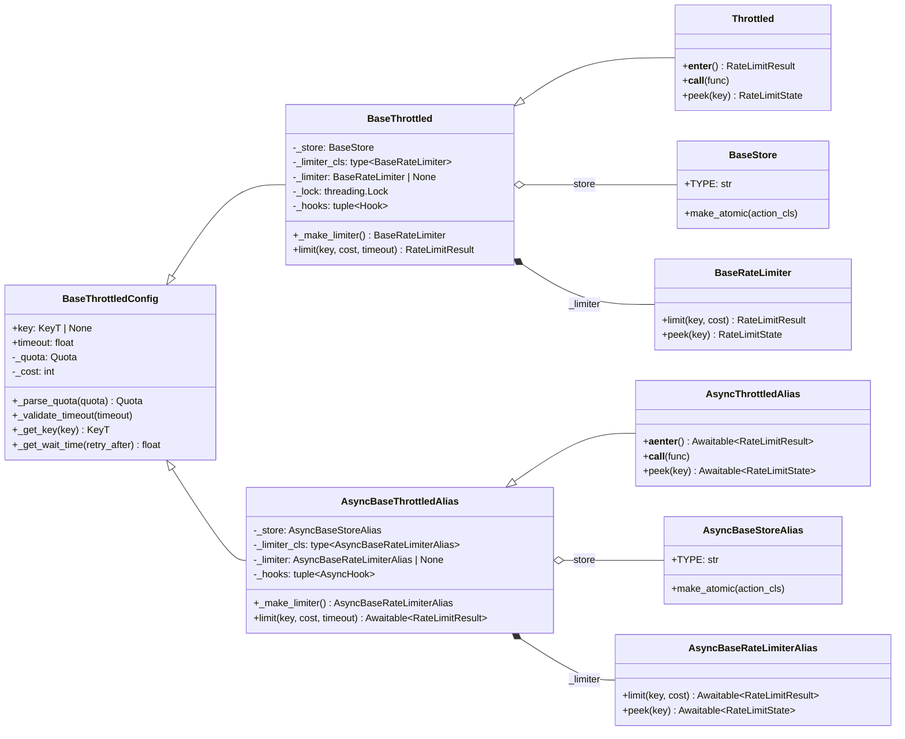

# Store 类型抽象边界优化 —— 实施方案

> 基于 [README.md](./README.md) 制定。

## 0x01 调研与约束

### a. 症状

`mypy strict` 改造后，`BaseStore` 由零泛型公共边界变为 `BaseStore[_BackendT]`。

用户在表达「返回一个同步 `Store`」时被迫回答「这个 `Store` 绑定哪个 `StoreBackend`」：

| 用户写法 | 结果 | 阻断原因 |
| --- | --- | --- |
| `_get_store() -> BaseStore` | 不通过 | 裸 `BaseStore` 缺泛型实参。 |
| `_get_store() -> BaseStore[BaseStoreBackend[object]]` | 不通过 | 具体 `Store` 返回值类型不匹配。 |
| `_get_store() -> BaseStore[types.StoreBackendP]` | 不通过 | `StoreBackend` 协议不能代表具体 `Store`。 |
| `_get_store() -> types.SyncStoreP` | 通过 | 用户被迫理解内部协议类型。 |

### b. 复杂度来源

入口症状由 `3` 条复用轴在公共边界交叉造成：

| 复用轴 | 当前形态 | 边界泄漏 |
| --- | --- | --- |
| sync / async 执行模型 | `SyncStoreP` / `AsyncStoreP`、`SyncAtomicActionP` / `AsyncAtomicActionP` 与 `BaseThrottledMixin` 全部带泛型。 | 执行模型差异扩散到核心泛型链。 |
| 公共 API 能力边界 | `BaseStore[_BackendT]` 同时充当用户注解与实现基类。 | 内部 `StoreBackend` 类型泄漏到用户侧。 |
| `StoreBackend` / `AtomicAction` 配对 | `BaseStore.make_atomic()` 与 `BaseAtomicAction[_BackendT]` 共享同一 `StoreBackend` 类型变量。 | 配对关系真实存在，但被提升到过高层。 |

结论从「让 `BaseStore` 不带泛型」的局部止血，升级为自底向上重画 sync / async 分界。

### c. 复用判定

设计原则：

> 仅在无 I/O 形态差异的纯逻辑层复用，出现 `def` / `async def`、锁、Redis script、client 协议或构造生命周期差异即分叉。

满足共享需同时具备 `2` 个条件：

1. 不区分 `def` / `async def`。
2. 不直接持有锁、Redis script、client 协议或懒加载资源。

按此标准对每层重新划分：

| 层 | 可共享 | 必须分叉 |
| --- | --- | --- |
| `StoreBackend` | URL 解析、options 归一化、异常族声明。 | sync / async Redis client 协议、连接默认值。 |
| `AtomicAction` | Redis Lua 脚本常量、Memory 纯计算函数。 | `Script` / `AsyncScript`、`do()` / `async do()`、锁进入方式。 |
| `Store` | 命令名称、参数校验、异常包装规则。 | 公共基类、`make_atomic()` 构造、sync / async 方法签名。 |
| `RateLimiter` | `Quota` 结构、key 生成、结果解释纯函数。 | `limit()` / `peek()` 执行入口、`Store` / `AtomicAction` 类型、await 边界。 |
| `Throttled` | `Quota` 解析、`timeout` / `cost` 校验、等待时间计算。 | `RateLimiter` 懒加载、`Hook`、context manager、装饰器执行形态。 |

## 0x02 架构设计

目标结构按「`StoreBackend` 资源层 → `Store` / `AtomicAction` 执行层 → `RateLimiter` 组合层 → `Throttled` 用户入口层」自底向上分层，遵循以下约束：

- `Base*` 只表达公共能力，具体类自持 `_backend`。
- `BackendBoundStore` 与 `BackendBoundAtomicAction` 不进入目标结构。

### a. 整体类图



### b. 不变量

| 维度 | 不变量 |
| --- | --- |
| 公共边界 | `BaseStore` 是零泛型公共边界。 |
| `Store` 持有 | 具体 `Store` 拥有 `_backend`、`_BACKEND_CLASS` 与 `make_atomic()`。 |
| `AtomicAction` 持有 | 具体 `AtomicAction` 拥有 `_backend` 与构造函数。 |
| `RateLimiter` 配对 | `RateLimiter` 不接收另一端 `Store` / `AtomicAction`。 |
| 共享层访问 | 共享层不能访问 `_backend`、锁、`Script`、`await` 或 registry 返回类。 |

### c. 命名约定

执行端命名：

| 项 | 约定 |
| --- | --- |
| 源码类名 | sync / async 同名，通过模块路径区分（`throttled.*` 与 `throttled.asyncio.*`）。 |
| 文中称呼 | 默认指当前执行端的同名类，例如 `MemoryStoreBackend`、`BaseStore`、`BaseRateLimiter`。 |
| 类图别名 | 同时展示两端时使用 `Sync*` / `Async*` 作为图内别名，不代表源码类名带该前缀。 |

类图关系：

| 符号 | 关系 | 含义 |
| --- | --- | --- |
| `<|--` | 继承 | 子类直接继承父类能力边界。 |
| `*--` | 组合 | 左侧持有右侧，且右侧生命周期由左侧收口。 |
| `o--` | 关联 | 右侧由外部注入或独立存在，左侧仅长期持有引用。 |
| `..>` | 依赖 | 左侧只在工厂、注册或纯逻辑调用中使用右侧，不持有其生命周期。 |

抽象命名：

| 名称 | 含义 | 使用边界 |
| --- | --- | --- |
| `Base*` | 对外可继承或可注解的能力边界。 | 不能携带 `StoreBackend` 泛型进入用户签名。 |
| `*Common` | 跨 sync / async 共享的纯逻辑。 | 不能访问 I/O、锁、`Script`、registry 或生命周期状态。 |
| `*Spec` / `*Logic` | 常量、Lua 脚本声明或纯计算函数。 | 只能被执行层调用，不能反向依赖 `Store` / `RateLimiter`。 |

## 0x03 开发方案

自底向上推进，每层一个责任，统一按「职责分配 → 协议三问 → 收敛结果」节奏展开。

| 层 | 责任 |
| --- | --- |
| `StoreBackend` | 固定资源形态。 |
| `Store` | 固定公共能力与 `StoreBackend` 所有权。 |
| `AtomicAction` | 固定原子执行入口。 |
| `RateLimiter` | 固定组合关系。 |
| `Throttled` | 固定用户生命周期。 |

### a. `StoreBackend` 改造

`StoreBackend` 只承担资源接入，不替 `Store` / `AtomicAction` 表达执行能力，也不向上游透出 Redis client 协议。



**职责分配**

| 责任 | 所属对象 | 说明 |
| --- | --- | --- |
| 通用配置 | `BaseStoreBackend` | 收敛 `server`、`options`、`base_exceptions`。 |
| Memory 数据结构 | `BaseMemoryStoreBackend` | 暴露 `exists()` / `ttl()` / `set()` 等无 I/O 形态差异的操作。 |
| Memory 锁 | sync / async `MemoryStoreBackend` | 各自持有本端锁，不通过公共协议判断锁形态。 |
| Redis 连接解析 | `BaseRedisStoreBackend` | URL、options、连接工厂在 Redis 端内部收敛。 |
| Redis client | `BaseRedisStoreBackend` 与具体子类 | 仅 Redis 一侧暴露 `get_client()`。 |

**协议三问**

| 问 | 回答 |
| --- | --- |
| 在哪声明 | [1] 通用配置在 `BaseStoreBackend`。<br />[2] Memory / Redis 各自子类承载本端资源与 client。 |
| 上层如何取用 | `Store` 与 `AtomicAction` 直接持有具体 `StoreBackend`，不再绕公共协议。 |
| 如何收敛 | [1] 异常包装读取 backend 声明的异常族。<br />[2] `get_client()` 仅落在 Redis 一侧。 |

**收敛结果**

| 移除对象 | 移除原因 | 替代边界 |
| --- | --- | --- |
| `types.StoreBackendP` | 公共异常包装无需借公共协议读取 backend。 | `BaseStoreBackend` 或私有局部协议。 |
| `types.MemoryStoreBackendP` | Memory 纯逻辑可直接接收 `BaseMemoryStoreBackend`。 | `BaseMemoryStoreBackend`。 |
| `types.SyncRedisClientP` / `types.AsyncRedisClientP` | Redis client 结构类型不再进入公共 `*P` 命名体系。 | 私有类型模块或具体 backend 内部声明。 |

### b. `Store` 改造

`Store` 是用户、`Throttled`、`RateLimiter` 共同依赖的能力边界，遵循以下分层：

- `BaseStore` 只表达「能做什么」，不表达「绑定哪种 `StoreBackend`」。
- `StoreBackend` 类型由具体 `Store` 持有。



**职责分配**

| 责任 | 所属对象 | 说明 |
| --- | --- | --- |
| 公共能力 | `BaseStore` | 只声明命令、`TYPE` 与 `make_atomic()`，不带 `StoreBackend` 泛型。 |
| `StoreBackend` 持有 | `MemoryStore` / `RedisStore` 与 async 同名类 | 各自持有 `_backend`，不向基类上移泛型。 |
| `AtomicAction` 构造 | 具体 `Store` 的 `make_atomic()` | 按 `STORE_TYPE` 校验匹配后注入自身 `StoreBackend`。 |
| 校验与异常包装 | 私有函数或具体 `Store` 显式调用 | 不通过 mixin 注入。 |

**协议三问**

| 问 | 回答 |
| --- | --- |
| 在哪声明 | [1] 公共能力在 `BaseStore`。<br />[2] `StoreBackend` 类型在具体 `Store`。 |
| 上层如何取用 | 用户、`Throttled`、`RateLimiter` 把 `Store` 视为 `BaseStore`。 |
| 如何收敛 | `RateLimiter` 通过 `store.make_atomic(action_cls)` 取 `AtomicAction`，不直接读 `_backend`。 |

**收敛结果**

| 移除对象 | 移除原因 | 替代边界 |
| --- | --- | --- |
| `BackendBoundStore` | 中间层抵消具体 `Store` 自定义 `__init__` 的收益。 | 具体 `Store` 直接持有 `_backend`。 |
| `BaseStoreMixin` | mixin 隐藏基类对 `_backend` 的假设。 | 私有函数或具体 `Store` 显式调用。 |
| `types.SyncStoreP` / `types.AsyncStoreP` / `types.StoreP` | `BaseStore` 已表达上层所需 `Store` 能力。 | `BaseStore`。 |

**`_BACKEND_CLASS` 边界**

- `_BACKEND_CLASS` 只是具体 `Store` 创建 `StoreBackend` 的便捷写法，不是本方案核心约束。
- 只要具体 `Store` 自持 `_backend` 且自行实现 `make_atomic()`，方案即成立。

### c. `AtomicAction` 改造

`AtomicAction` 是 `StoreBackend` 配对真正发生的位置：`Store` 注入 `StoreBackend`，`AtomicAction` 完成原子操作。

**复用边界**

- 共享：身份字段、Redis Lua 脚本常量、Memory 纯计算。
- 分叉：`do()`、`Script` 实例、锁进入方式、异常包装。



**职责分配**

| 责任 | 所属对象 | 说明 |
| --- | --- | --- |
| 身份字段 | `AtomicActionIdentity` | 只放 `TYPE` 与 `STORE_TYPE`，不声明 `do()`。 |
| 执行能力 | `BaseAtomicAction` | 仅被 `RateLimiter` 消费。 |
| Redis 脚本 | `RedisLimitActionSpec` 等 `*Spec` | 只放 identity 与脚本常量，不持有 `Script` 实例。 |
| Memory 纯逻辑 | `MemoryLimitActionLogic` 等 `*Logic` | 只执行与锁无关的纯计算。 |
| `StoreBackend` 与异常包装 | 具体 `AtomicAction` | 自行声明 `__init__(backend)`、`_backend`、`Script` 实例与异常包装。 |

**协议三问**

| 问 | 回答 |
| --- | --- |
| 在哪声明 | [1] 身份在 `AtomicActionIdentity`。<br />[2] 执行能力在 `BaseAtomicAction`。 |
| 上层如何取用 | `Store.make_atomic()` 选择 `AtomicAction` 类并注入 `StoreBackend`。 |
| 如何收敛 | `RateLimiter` 仅保存 `AtomicAction` 实例，只调用 `do()`。 |

**收敛结果**

| 移除对象 | 移除原因 | 替代边界 |
| --- | --- | --- |
| `BackendBoundAtomicAction` | 具体 `AtomicAction` 已自持 `StoreBackend` / `Script` / `do()`，中间类只会引入第二层构造协议。 | 具体 `AtomicAction` 直接定义构造函数。 |
| `BaseAtomicActionMixin` | mixin 同时承担身份与包装，容易把 `_backend` 假设回到公共层。 | identity 基类、`*Spec`、`*Logic` 各自承担。 |
| `types.SyncAtomicActionP` / `types.AsyncAtomicActionP` | `BaseAtomicAction` 已表达执行能力。 | `BaseAtomicAction`。 |

### d. `RateLimiter` 改造

`RateLimiter` 把 `Store`、`AtomicAction` 与算法组合起来。

**复用边界**

- 共享：算法准备、结果解释。
- 分叉：执行入口。



**职责分配**

| 责任 | 所属对象 | 说明 |
| --- | --- | --- |
| 注册表 | `RateLimiterRegistry` | sync / async 各自维护，可同名 `type` 但不混表。 |
| 算法公共部分 | `RateLimiterCommon` 与 `*Logic` | 只放 `Quota`、key 准备、结果构造、脚本结果解释。 |
| `AtomicAction` 注册 | `BaseRateLimiter` | 先给出本算法所需 `AtomicAction` 类列表，再交由当前 `Store` 创建实例。 |

**协议三问**

| 问 | 回答 |
| --- | --- |
| 在哪声明 | `BaseRateLimiter` 声明组合状态与执行入口。 |
| 上层如何取用 | `Throttled` 在 `RateLimiterRegistry` 取 `RateLimiter` 类，构造时传入本端 `Store`。 |
| 如何收敛 | 通过 `store.make_atomic()` 获取 `AtomicAction`，算法只调用 `do()`。 |

`AtomicAction` 注册流程：

1. `RateLimiter` 声明本算法所需的 `AtomicAction` 类列表。
2. 按 `STORE_TYPE` 过滤掉与当前 `Store` 不匹配的项。
3. 由 `store.make_atomic(action_cls)` 决定该类能否落到当前 `Store`。
4. `_supported_atomic_action_types()` 给出算法最低需求集合。

**收敛结果**

| 移除对象 | 移除原因 | 替代边界 |
| --- | --- | --- |
| `BaseRateLimiterMixin` | 把跨端 `Store`、`AtomicAction` 与执行入口压进同一泛型模板。 | `BaseRateLimiter` 各自声明组合状态。 |
| `types.StoreForLimiterP` | `RateLimiter` 不再通过协议猜测 `Store` 能力。 | `BaseStore`。 |
| `types.StoreT` / `types.ActionT` | 跨端 `TypeVar` 仅服务 mixin。 | 字段类型与 `BaseAtomicAction`。 |

**`AtomicAction` 注册边界**

不引入全局 `AtomicAction` 注册表，每个 `RateLimiter` 自声明所需 `AtomicAction`。

### e. `Throttled` 改造

`Throttled` 是用户入口，只消费下层已收口的 `Store` 与 `RateLimiter`。

**复用边界**

- 共享：配置解析。
- 分叉：`RateLimiter` 懒加载、`Hook` 执行、context manager、装饰器调用形态。



**职责分配**

| 责任 | 所属对象 | 说明 |
| --- | --- | --- |
| 配置解析 | `BaseThrottledConfig` | 处理 `Quota`、`cost`、`key`、`timeout` 与等待时间计算。 |
| 组合状态 | `BaseThrottled` | 持有以下组合：<br />[1] `Store`<br />[2] `RateLimiter` 类与实例<br />[3] `Hook`<br />[4] `threading.Lock`（仅 sync 端） |
| 用户入口 | `Throttled` | 保留公开调用路径，执行形态在本端完成。 |

**协议三问**

| 问 | 回答 |
| --- | --- |
| 在哪声明 | [1] 配置在 `BaseThrottledConfig`。<br />[2] 组合状态在 `BaseThrottled`。 |
| 上层如何取用 | 用户实例化 `Throttled` 或 `throttled.asyncio.Throttled`，构造期只接收本端 `Store`。 |
| 如何收敛 | [1] `_make_limiter()` 只返回本端 `RateLimiter`。<br />[2] `_limiter` 首次访问时构造，构造后复用。 |

**收敛结果**

| 移除对象 | 移除原因 | 替代边界 |
| --- | --- | --- |
| `BaseThrottledMixin` | 把 `Store`、`RateLimiter`、`Hook` 与生命周期统一为跨端泛型。 | `BaseThrottledConfig` 只共享配置，组合状态落在本端基类。 |
| `_make_limiter()` 跨端 `cast` | `RateLimiter` 类与 `Store` 已在本端确定，无需 `TypeVar` 反推。 | 各自实现 `_make_limiter()` 返回 `RateLimiter`。 |
| `types.StoreP` 默认 store 类型 | 默认 `Store` 仅属于本端入口。 | 构造签名使用 `BaseStore`。 |

**生命周期**

- `Throttled` 实例创建后不再修改配置。
- `_limiter` 缓存仅解决懒加载与并发安全，不承担热更新。
- 切换 `Store` / `Quota` / `RateLimiter` 类型时新建 `Throttled` 实例。

## 0x04 验收与验证

### a. 外部契约

只列方案对外可观测的契约，内部 invariant 见 `0x02.b`。

| 维度 | 契约 |
| --- | --- |
| 用户类型流 | 同步 `_get_store() -> BaseStore` 与异步 `_get_store() -> asyncio.store.BaseStore` 都能返回 `MemoryStore` 或 `RedisStore`。 |
| `Throttled` 组合 | `Throttled(store=_get_store())` 与 async `Throttled(store=...)` 在 mypy strict 下通过。 |
| 异常透出 | 持有 `_backend` 的内建 `Store` / `AtomicAction` 仍统一抛 `StoreUnavailableError`，公共基类不隐式要求 `_backend`。 |

### b. 类型验收用例

类型验收文件放在 `typing_checks/` 这类非 `tests.*` 包下，避开 `pyproject.toml` 中对 `tests.*` 放宽的 mypy strict 配置。

同步用例：

```python
# typing_checks/store_boundary_sync.py
from throttled import BaseStore, MemoryStore, RedisStore, Throttled


def get_store(use_redis: bool) -> BaseStore:
    if use_redis:
        return RedisStore(server="redis://127.0.0.1:6379/0")
    return MemoryStore()


throttled = Throttled(store=get_store(False))
```

异步用例：

```python
# typing_checks/store_boundary_async.py
from throttled.asyncio import BaseStore, MemoryStore, RedisStore, Throttled


def get_store(use_redis: bool) -> BaseStore:
    if use_redis:
        return RedisStore(server="redis://127.0.0.1:6379/0")
    return MemoryStore()


throttled = Throttled(store=get_store(False))
```

### c. 回归口径

- `uv run --no-sync mypy throttled typing_checks` 通过。
- 项目既有测试入口与文档示例通过。

## 0x05 实施进展

| 时间 | 对应设计片段 | 结论调整概要 | 改动 / 验证 |
| --- | --- | --- | --- |
| `2026-05-10 22:30` | `0x01` 至 `0x04` | [1] 推倒旧的 `BaseStore` 局部止血方案，改为自底向上重画 sync / async 分界<br />[2] 架构设计保留整体类图与不变量，开发方案按 `StoreBackend` / `Store` / `AtomicAction` / `RateLimiter` / `Throttled` 对象分层<br />[3] 明确 sync / async 采用同名类，通过模块路径区分执行端<br />[4] 判定 `BackendBoundStore` 与 `BackendBoundAtomicAction` 不进入目标结构<br />[5] 公共 `*P` 协议、跨端 `TypeVar` 与 `*Mixin` 均从目标结构移除<br />[6] 基于源码补充 backend `get_client()` 下沉、`Store` 最终配对校验、分端 registry、`RateLimiter` 自声明 action 目录与 `Throttled` 单次懒加载约束<br />[7] 全文统一名词大小写为 `StoreBackend` / `Store` / `AtomicAction` / `RateLimiter` / `Throttled` / `Quota` / `Hook`<br />[8] 每层统一「职责分配 → 协议三问 → 收敛结果」节奏，删除「取用路径」「补充说明」异构小节<br />[9] `0x02` 拆为「整体类图 / 不变量 / 命名约定」，`0x04` 拆为「外部契约 / 类型验收用例 / 回归口径」<br />[10] 删除职责分配 / 协议三问 / 收敛结果中 sync / async 镜像行，把分端结构留给类图表达<br />[11] `0x04.a` 表只保留外部可观测契约（用户类型流、`Throttled` 组合、异常透出），内部 invariant 信任 `0x02.b` 表达<br />[12] 按 `0x02.c` 命名约定「文中称呼默认指当前执行端」，清理「本端 `Base*`」冗余前缀，仅保留表达分端约束的「本端 + 普通名词」<br />[13] `Throttled` 组合状态由长句改为列表（`Store` / `RateLimiter` / `Hook` / `threading.Lock`） | [1] 已对照 `throttled/store/base.py`、`throttled/types.py`、`throttled/rate_limiter/base.py`、`throttled/throttled.py` 与 async 端同构源码核对术语<br />[2] 已重新核对 `Store`、`AtomicAction`、`RateLimiter`、`Throttled` 继承链<br />[3] 已统一类图箭头与标签<br />[4] `pre-commit run --files` 通过<br />[5] `git diff --check` 通过 |
| `2026-05-06 00:00` | `0x01` 至 `0x04` | [1] 旧方案形成 `BaseStore` + `BackendBoundStore[_BackendT]` 两层结构<br />[2] 该方案后续被判定为局部止血，不能覆盖 `RateLimiter` / `AtomicAction` 的复用边界问题 | [1] 已核对 HTTPX `BaseTransport` 与 openai-python `_base_client.py` / `_client.py` / `__init__.py` 源码<br />[2] 已复现 `BaseStore` 裸用失败与公共类零泛型需求 |

## 0x06 参考

- [mypy strict 模式合规改造方案](../2026-04-06-mypy-strict-compliance/PLAN.md)
- [优化存储不可用时的异常处理方案](../2026-05-03-store-unavailable-error-handling/PLAN.md)
- [同步异步共用 Mixin 的泛型类型窄化](../../troubleshooting/generic-mixin-type-narrowing.md)
- [HTTPX Transports 文档](https://www.python-httpx.org/advanced/transports/)
- [HTTPX `BaseTransport` 源码](https://github.com/encode/httpx/blob/master/httpx/_transports/base.py)
- [HTTPX `Client` 源码](https://github.com/encode/httpx/blob/master/httpx/_client.py)
- [openai-python `OpenAI` / `AsyncOpenAI` 源码](https://github.com/openai/openai-python/blob/main/src/openai/_client.py)
- [openai-python `BaseClient` 源码](https://github.com/openai/openai-python/blob/main/src/openai/_base_client.py)

## 0x07 版本锚点

- 建议分支：`refactor/260510_sync_async_boundary`
- PR：待创建。
