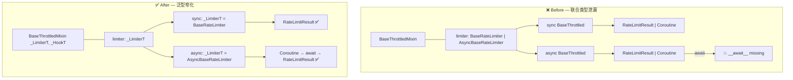

# 同步异步共用 Mixin 的泛型类型窄化

## 0x01 关键信息

### a. 现象

PyCharm / mypy 在三处报类型错误：

1. `await self.limiter.limit(key, cost)` — `RateLimitResult` 没有 `__await__` 属性
2. `Throttled.__call__()` 签名不匹配基类 `BaseThrottled`
3. `RedisStore` 不满足 `StoreP` 协议（`make_atomic` 参数名不一致）

### b. 环境

- Python 3.10+，mypy 1.15+，ruff，PyCharm
- 项目：throttled-py（限流库）

### c. 根因

三个问题各有独立根因，但第一个最具通用性：

**问题 1：联合类型泄漏**。`BaseThrottledMixin` 被同步和异步 `BaseThrottled` 共用，`limiter` 属性返回 `BaseRateLimiter | AsyncBaseRateLimiter`。类型检查器看到联合类型后，`.limit()` 的返回变成 `RateLimitResult | Coroutine[...]`，`await` 作用于前者时触发 `__await__` 缺失。

**问题 2：`@overload` + `@abstractmethod` 冲突**。基类抽象方法上叠加 `@overload` 后，子类的实现签名被逐个 overload 分支比对，必然不匹配。

**问题 3：Protocol 参数名不对齐**。`_SyncStoreP.make_atomic(action: ...)` 与所有实现类的 `make_atomic(action_cls: ...)` 参数名不一致，结构化类型检查（Protocol）按参数名匹配时判定不兼容。

### d. 问题与解法概览



## 0x02 排查过程

### a. 联合类型溯源

从报错点 `await self.limiter.limit()` 回溯：

1. `self.limiter` → `BaseThrottledMixin.limiter` 属性，返回 `RateLimiterP`
2. `RateLimiterP = BaseRateLimiter | AsyncBaseRateLimiter`
3. `.limit()` 在同步版返回 `RateLimitResult`，异步版返回 `Coroutine[Any, Any, RateLimitResult]`
4. 联合后类型检查器无法确定是否可 `await`

异步子类曾通过覆写 `limiter` 属性 + `cast` 来窄化类型，但这只是补丁，每次访问 `limiter` 都需 `cast`。

### b. overload 与 abstractmethod 的交互

Python 规范允许 `@overload` + `@abstractmethod` 组合，但 PyCharm 的检查器会将子类实现签名逐一与基类 overload 分支比对。第一个 overload `func: AsyncFunc[P, R]`（必传）与基类 `func: ... | None = None`（可选）参数结构不同，触发告警。

### c. Protocol 参数名检查

Protocol 是结构化子类型，参数名也是签名的一部分。`action` vs `action_cls` 的差异足以让类型检查器判定不兼容。

## 0x03 解决方案

### a. 泛型参数化消除联合类型（核心方案）

将 `BaseThrottledMixin` 改为 `Generic[_LimiterT, _HookT]`，同步/异步子类各自具象化：

```python
_LimiterT = TypeVar("_LimiterT", bound=RateLimiterP)
_HookT = TypeVar("_HookT", bound=HookP)

class BaseThrottledMixin(Generic[_LimiterT, _HookT]):
    @property
    def limiter(self) -> _LimiterT: ...

class BaseThrottled(BaseThrottledMixin[BaseRateLimiter, Hook], abc.ABC): ...
# async 侧
class BaseThrottled(BaseThrottledMixin[AsyncBaseRateLimiter, Hook], abc.ABC): ...
```

效果：`self.limiter` 在同步上下文返回 `BaseRateLimiter`，异步返回 `AsyncBaseRateLimiter`。`.limit()` 返回类型不再是联合，`cast` 从 6 处降至 2 处（均在泛型边界）。

**注意事项**：

- `type[_LimiterT]` 调用构造函数时 mypy 无法推导返回 `_LimiterT`，需在构造点用 `cast`
- `Generic` 与 `__slots__` 兼容，`Generic` 本身有 `__slots__ = ()`
- 类变量（如 `_ALLOWED_HOOK_TYPES`）的注解保持使用具体联合类型而非 TypeVar

### b. 分离抽象声明与 overload

将 `@overload` 从抽象基类移至具体实现类，并从基类移除 `__call__` 的抽象声明：

- 基类不声明 `__call__`（避免签名冲突根源）
- 具体类 `Throttled.__call__` 使用 `@overload` 提供精确的类型窄化

这样 PyCharm 无基类签名可比对，不会误报；mypy 通过 overload 正确推断装饰器返回类型。

`@overload` 配合 `ParamSpec` + `TypeVar` 保留被装饰函数的完整签名：

```python
P = ParamSpec("P")
R = TypeVar("R")
AsyncFunc = Callable[P, Coroutine[Any, Any, R]]

@overload
def __call__(self, func: AsyncFunc[P, R]) -> AsyncFunc[P, R]: ...
@overload
def __call__(self, func: None = None) -> Callable[[AsyncFunc[P, R]], AsyncFunc[P, R]]: ...
```

- `P`（`ParamSpec`）：捕获原函数的参数列表（参数名、类型、默认值）
- `R`（`TypeVar`）：捕获原函数的返回值类型

装饰后类型检查器能推导出完整签名。若退化为 `Callable[..., Coroutine[Any, Any, Any]]`，IDE 的自动补全和类型校验全部失效。

### c. 对齐 Protocol 参数名

将 Protocol 的 `make_atomic(action: ...)` 改为 `make_atomic(action_cls: ...)`，与所有实现一致。

## 0x04 参考

- [Python typing — Generic](https://docs.python.org/3/library/typing.html#typing.Generic)
- [mypy — Protocols and structural subtyping](https://mypy.readthedocs.io/en/stable/protocols.html)
- [PEP 544 — Protocols](https://peps.python.org/pep-0544/)
